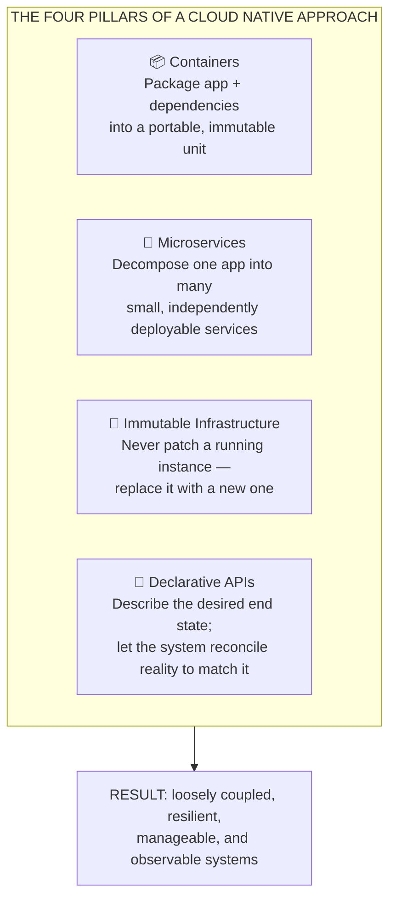
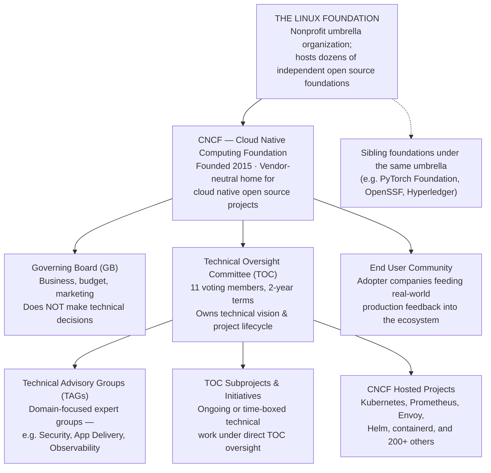
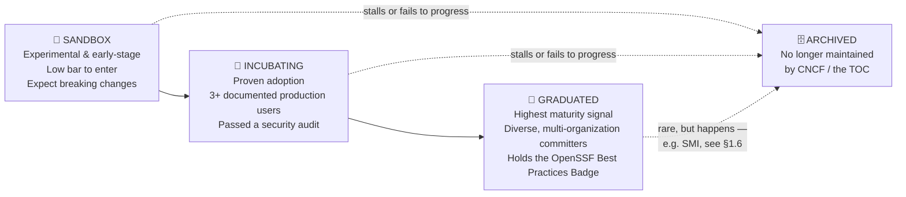
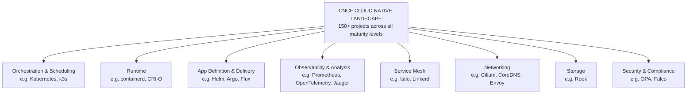
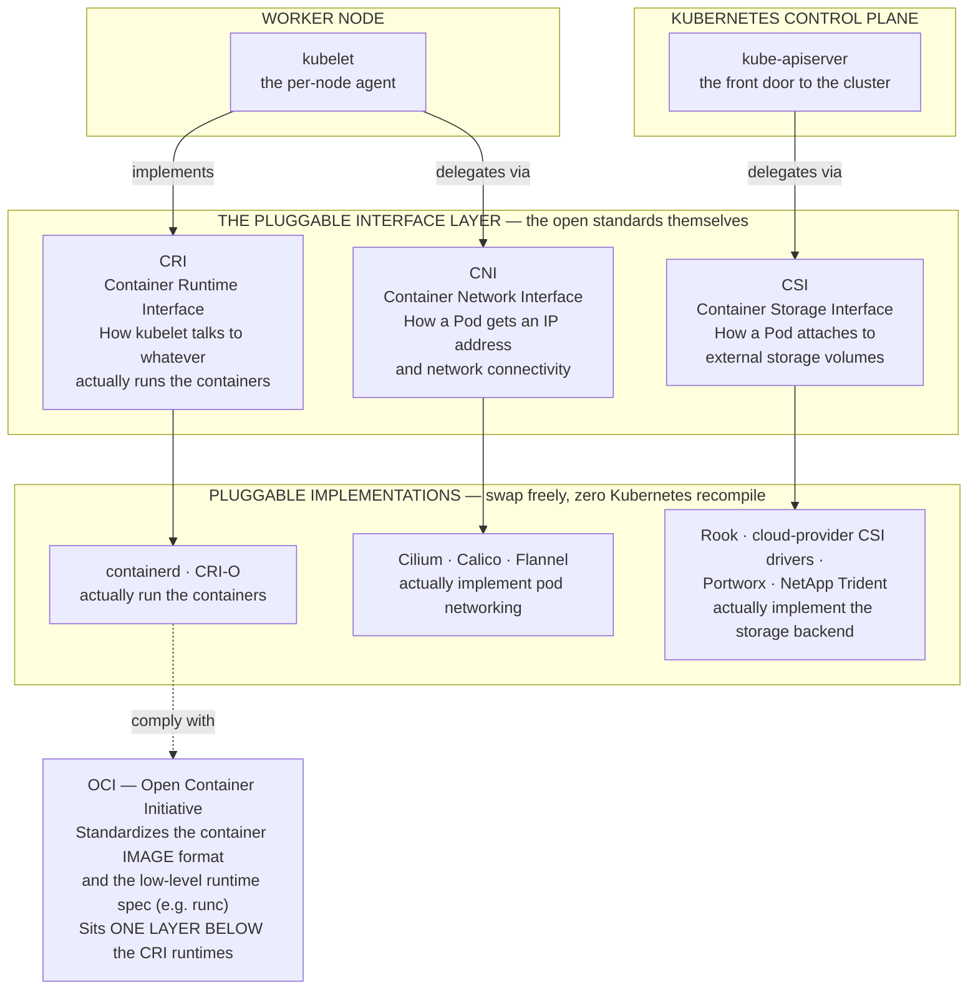
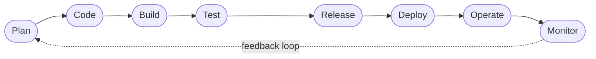
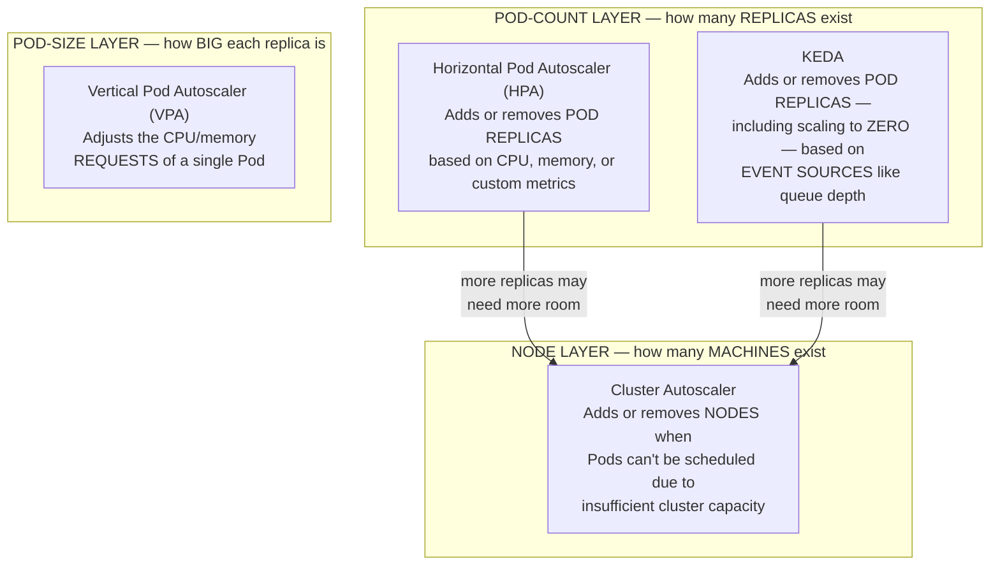
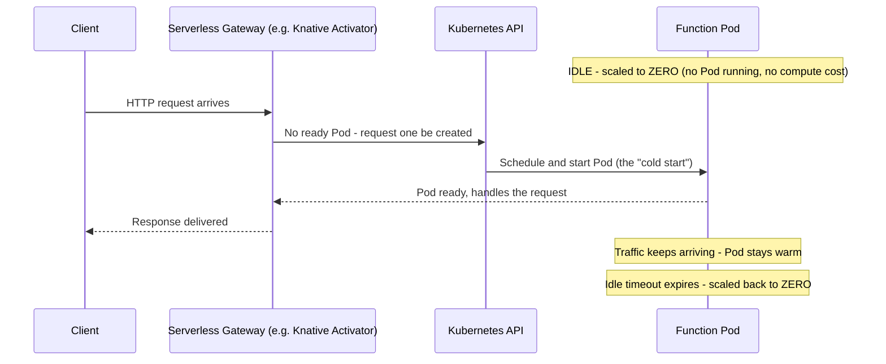

# Chapter 1: Cloud Native Architecture — The Ecosystem Kubernetes Lives In

*KCNA Prep Guide Writer | Facts re-verified live against official CNCF/Linux Foundation sources on the date this chapter was written. The cloud native landscape changes continuously — treat every project-maturity claim below as "true as of writing" and re-check [landscape.cncf.io](https://landscape.cncf.io/) before your exam.*

---

## 1.0 Chapter Orientation

### What this chapter covers, and why it matters more than its weight suggests

On the live [official KCNA exam page](https://training.linuxfoundation.org/certification/kubernetes-cloud-native-associate/) (re-fetched while writing this chapter), the **Cloud Native Architecture** domain is officially defined as:

> **Cloud Native Architecture — 12%** — covering three competencies: *Observability*, *Cloud Native Ecosystem and Principles*, and *Cloud Native Community and Collaboration*.

Twelve percent might look like the domain to deprioritize. Resist that instinct. This is arguably the **highest-leverage-per-hour** domain in the whole exam:

- It is almost entirely **conceptual** — no YAML, no `kubectl`, no memorizing flag syntax. If you can read a diagram and remember what a handful of acronyms stand for, you can bank these points quickly.
- It gives you the **vocabulary and mental map** you'll silently rely on throughout the other three domains. When a Kubernetes Fundamentals question mentions "the container runtime," or a Container Orchestration question mentions "the CNI plugin," this chapter is why those words won't stop you cold.
- It's the domain most beginners under-study, because it "feels like trivia." It isn't. It's **systems thinking about how a whole ecosystem is governed and assembled** — a skill that transfers directly to your job.

**A note on how this guide reorganizes the material:** the official domain bundles *Observability* in with Cloud Native Architecture. This guide treats Observability as its own dedicated chapter (**Chapter 5**) because there's enough substance there — metrics, logs, traces, Prometheus, OpenTelemetry — to deserve focused treatment rather than a rushed subsection. The 12% exam weight for this domain *does* include observability content; just know you'll find the deep dive on that specific piece later in the guide, not here.

### How to view the diagrams in this chapter

Every diagram below is written in **Mermaid** syntax, inside a fenced ` ```mermaid ` code block. Mermaid is the standard for diagrams-as-text in technical Markdown:

- It renders automatically in GitHub, GitLab, Obsidian, Notion, and VS Code (with the free "Markdown Preview Mermaid Support" extension).
- If your current viewer shows raw text instead of a picture, copy the code block into **[mermaid.live](https://mermaid.live)** to render it instantly, or open this file in VS Code / GitHub.
- I've additionally hand-drawn the two most architecturally dense diagrams in plain ASCII as a backup, so the component labels are legible even in a plain-text-only environment.

Every diagram is numbered and captioned (Figure 1-1, 1-2, …) like a textbook, and every component in every diagram carries **both a label and a one-line purpose** — not just a name — because a name without a purpose is trivia, and a purpose without a name is useless on a multiple-choice exam that will show you the name.

---

## 1.1 What "Cloud Native" Actually Means

Before CNCF, before Kubernetes, before any of the acronyms — what problem is all of this solving?

The [CNCF's own definition](https://glossary.cncf.io/cloud-native-technologies/), paraphrased rather than quoted: cloud native technologies let organizations build and run applications that scale in environments like public, private, and hybrid clouds. The approach is characterized by four pillars working together — no single one of them *is* "cloud native" on its own.

**Figure 1-1: The Four Pillars of a Cloud Native Approach**



| Pillar | Plain-language purpose | Where you'll meet it again |
|---|---|---|
| **Containers** | The unit of packaging and deployment — code + runtime + libraries, bundled once, run anywhere | Chapter 2 (Kubernetes Fundamentals) |
| **Microservices** | The unit of *architecture* — split a monolith into small, independently scalable services | Chapter 4 (Application Delivery) |
| **Immutable infrastructure** | The unit of *change management* — you don't SSH in and patch a server; you build a new image and replace the old one | Chapter 2 & 3 |
| **Declarative APIs** | The unit of *control* — you say "I want 3 replicas," not "start a 3rd replica"; a controller makes it true and keeps it true | Chapter 2 |

> **Confusion alert — "Cloud Computing" vs. "Cloud Native" are not the same thing.**
> This trips up almost everyone new to the space, because the words overlap. **Cloud computing** is about *where* your infrastructure lives and *who* manages the physical hardware (a CSP like AWS, Azure, or GCP, instead of your own data center). **Cloud native** is about *how* you architect and operate the software running on that infrastructure (containers, microservices, declarative control, automation). You can run a cloud native application entirely on-premises (no public cloud at all), and you can run a badly-designed monolith on a public cloud and call it "in the cloud" without it being cloud native in any meaningful sense. The exam does test this distinction directly, so hold the two concepts apart deliberately.

---

## 1.2 Where Kubernetes and CNCF Fit Inside the Linux Foundation

Kubernetes doesn't exist in a vacuum — it's the flagship project of a specific nonprofit foundation, which itself sits inside a larger umbrella organization. Getting this nesting straight is worth doing once, carefully, because exam questions about "who governs what" depend entirely on you knowing which layer does which job.

**Figure 1-2: The Governance Hierarchy**



**Reading this diagram, component by component:**

| Component | What it is | Its purpose | What it is *not* |
|---|---|---|---|
| **The Linux Foundation** | A large nonprofit that provides a neutral, trusted home for open source projects across many industries | Legal, financial, and operational scaffolding so projects don't have to build that infrastructure themselves | Not Kubernetes-specific — hosts projects far outside cloud native too |
| **CNCF** | One of the Linux Foundation's sub-foundations, founded in 2015 | The vendor-neutral home specifically for cloud native projects; governs Kubernetes and its surrounding ecosystem | Not a company, not a single product — a foundation hosting many independent projects |
| **Governing Board (GB)** | CNCF's business-side leadership | Budget, marketing, member relations, high-level scope with the TOC | **Explicitly does not make technical decisions** — this is the #1 governance fact the exam likes to test |
| **Technical Oversight Committee (TOC)** | CNCF's technical governing body — 11 voting members serving 2-year terms | Approves/archives projects, defines technical vision, owns the project maturity lifecycle described in §1.4 | Not a rubber stamp — it runs a formal due-diligence process for every lifecycle transition |
| **End User Community** | A group of practitioner companies that have adopted cloud native tech in production | Feeds real production experience back to the TOC and projects; also appoints some TOC seats | Not the same as "the general public" — it's a structured group of adopter organizations |
| **Technical Advisory Groups (TAGs)** | Standing, domain-focused expert groups operating under the TOC | Provide deep technical review in a specific problem domain (e.g., TAG Security reviews every project's security posture during graduation) | **Not the same thing as a project-level SIG** — see the confusion alert immediately below |

> **Confusion alert — TAG (foundation-level) vs. SIG (project-level) are two different layers, and both terms are legitimately in use.**
> This is one of the most common points of confusion in cloud native governance, and the reference material you'll find online is genuinely inconsistent about it, so let's be precise:
> - **TAGs (Technical Advisory Groups)** operate at the **CNCF-foundation level**. They advise the TOC across the *entire* landscape of projects on a shared concern — for example, TAG Security reviews the security posture of Kubernetes, Prometheus, Argo, and every other project going through graduation.
> - **SIGs (Special Interest Groups)** operate at the **individual-project level**, most visibly inside Kubernetes itself — SIG-Networking, SIG-Storage, SIG-Scheduling, and dozens more, each owning one slice of the Kubernetes codebase.
> - Historically, CNCF *did* use the term "SIG" at the foundation level too, before renaming those groups to "TAGs" around 2019 to reduce exactly this ambiguity. If you read an older blog post or an older edition of any study guide referring to "CNCF SIGs," it is talking about what are now called TAGs.
> - As of a **May 2025 TOC restructuring**, the TAG/subproject/initiative structure itself was reorganized (old TAG Slack channels were archived and new groups stood up) — a good reminder that even governance structure is a living thing, not exam trivia frozen in time. If a resource you're studying from feels stale on this point, trust [contribute.cncf.io/community/governance](https://contribute.cncf.io/community/governance/) over anything older.
> - **Bottom line for the exam:** if a question is about Kubernetes-the-project's internal working groups, think SIG. If it's about CNCF-the-foundation's advisory structure spanning many projects, think TAG.

---

## 1.3 The CNCF Project Lifecycle (Maturity Levels)

Every project entering the CNCF — including Kubernetes itself, once upon a time — moves through a defined, TOC-governed lifecycle. This lifecycle exists to answer one practical question for adopters: *"How much risk am I taking on if I build my production system on top of this?"*

**Figure 1-3: The Project Maturity Lifecycle**



| Stage | Entry criteria (what it takes to arrive here) | What it signals to an adopter | Real, current example |
|---|---|---|---|
| **Sandbox** | Adopt the CNCF Code of Conduct, get TOC sponsorship, use an open source license | "Promising idea, but treat it as genuinely experimental" | Cedar (AWS's policy language) joined as Sandbox in 2026 |
| **Incubating** | Sandbox criteria *plus* demonstrated adoption — at least three independent production users, healthy multi-organization contribution, a passed security audit | "Real teams run this in production; APIs are stabilizing" | Several TAG-reviewed projects sit here at any given time — check the live landscape for the current roster |
| **Graduated** | Incubating criteria *plus* long-term sustainability, diverse governance, the CII/OpenSSF Best Practices Badge maintained over time | "This is the CNCF's strongest production-readiness endorsement" | Kubernetes, Prometheus, Envoy, Helm — and, very recently, **OpenTelemetry (graduated May 2026)** and **Dragonfly (graduated January 2026)** |
| **Archived** | A project's maintainers, or the TOC, determine it's inactive, superseded, or no longer recommended | "Do not start new work on this — look for its successor" | **Service Mesh Interface (SMI)**, archived October 2023 — full story in §1.6 |

> **Why this teaching example matters more than it looks:** OpenTelemetry graduating in May 2026 is a genuinely useful data point for you as a learner, not just trivia — it's living proof that this landscape moves under your feet even during the weeks you're studying. A study resource that confidently calls OpenTelemetry "incubating" was accurate a year ago and is wrong today. The skill the exam actually wants you to have isn't "memorize today's maturity list" — it's "understand what each maturity level *means* well enough to reason about any project, current or future, that you encounter." Learn the ladder, not just the roster.

---

## 1.4 Reading the CNCF Cloud Native Landscape

The **[CNCF Cloud Native Landscape](https://landscape.cncf.io/)** is an interactive map of the entire ecosystem — well over 150 projects and products, organized into categories, filterable by maturity level. You are not expected to memorize the whole thing. You *are* expected to recognize the major categories and correctly match well-known graduated projects to what they actually do — this is squarely in the "Cloud Native Ecosystem and Principles" competency.

**Figure 1-4: Landscape Categories at a Glance**



### Must-know projects, organized by category

This table deliberately favors **breadth over exhaustive completeness** — these are the names you're most likely to be asked to identify by purpose. Maturity levels are noted as accurately as researched at time of writing; **verify anything you plan to bet exam points on against the live landscape**, since — as just demonstrated — that status is not frozen in time.

| Category | Project | One-line purpose |
|---|---|---|
| Orchestration & Scheduling | **Kubernetes** | Automates deployment, scaling, and self-healing of containerized applications |
| Orchestration & Scheduling | **k3s** | A lightweight, fully conformant Kubernetes distribution for constrained environments |
| Runtime | **containerd** | An industry-standard, CRI-compliant container runtime (originally extracted from Docker) |
| Runtime | **CRI-O** | A lightweight, CRI-compliant runtime built specifically to run OCI containers under Kubernetes |
| Networking | **Cilium** | eBPF-based networking, observability, and security for containers |
| Networking | **CoreDNS** | The default, pluggable DNS server providing cluster service discovery |
| Networking | **Envoy** | A high-performance proxy for edge and service-to-service traffic |
| Service Mesh | **Istio** | A full-featured service mesh: traffic management, mTLS security, telemetry |
| Service Mesh | **Linkerd** | A lightweight, security-focused service mesh emphasizing simplicity |
| Storage | **Rook** | A cloud native storage orchestrator (commonly fronting Ceph) |
| Observability | **Prometheus** | Pull-based metrics collection, storage, and alerting |
| Observability | **OpenTelemetry** | Vendor-neutral instrumentation standard unifying traces, metrics, and logs *(graduated May 2026)* |
| Observability | **Jaeger** | Distributed tracing for diagnosing latency across microservices |
| Observability | **Fluentd** | A unified, pluggable logging layer between data sources and backends |
| App Definition & Delivery | **Helm** | The de facto package manager for Kubernetes, using "charts" |
| App Definition & Delivery | **Argo** (CD, Workflows, Rollouts, Events) | GitOps continuous delivery and workflow orchestration for Kubernetes |
| App Definition & Delivery | **Flux** | GitOps continuous delivery, keeping cluster state in sync with a Git repo |
| Image / Artifact Distribution | **Harbor** | A secure container registry with built-in vulnerability scanning |
| Image / Artifact Distribution | **Dragonfly** | P2P-based image and file distribution at scale *(graduated January 2026)* |
| Database | **etcd** | The distributed key-value store that is Kubernetes' own backing store for cluster state |
| Database | **Vitess** | A horizontally scalable, MySQL-compatible database system |
| Security | **Open Policy Agent (OPA)** | A general-purpose policy engine usable across Kubernetes, APIs, and CI/CD |
| Security | **Falco** | Runtime security — detects anomalous behavior inside containers and hosts |
| Autoscaling | **KEDA** | Event-driven autoscaling for Kubernetes workloads (see §1.7) |

> **Study tactic, not just a fact list:** don't try to brute-force memorize this table top to bottom. Instead, for each project, ask yourself *"if I had this exact problem, which category would I search the landscape under?"* — that's the actual cognitive move the exam is testing. Knowing that Fluentd is about *logging* and Jaeger is about *tracing* matters more than being able to recite the full list from memory.

---

## 1.5 Open Standards: The Pluggable Interface Architecture

This is the section where "architecture" stops being a metaphor and becomes literal — these are real interface boundaries inside a running cluster, and understanding them is what separates someone who's memorized acronyms from someone who understands *why* Kubernetes can run on top of wildly different networking, storage, and runtime vendors without ever needing to be recompiled.

### The core idea

Kubernetes itself does not implement container execution, pod networking, or storage attachment. Instead, it defines **standard interfaces** and delegates the actual implementation to pluggable, swappable components. This is precisely why you can run the same Kubernetes on AWS with the AWS EBS CSI driver, or on-prem with Rook, or with Cilium instead of Flannel for networking — without Kubernetes itself changing at all.

**Figure 1-5: The Pluggable Interface Architecture**



**ASCII fallback of the same architecture**, for viewers without Mermaid support:

```
┌──────────────────────────────────────────────────────────────────────┐
│                     KUBERNETES CONTROL PLANE                         │
│                    ┌─────────────────────┐                           │
│                    │    kube-apiserver   │                           │
│                    │  (front door / API) │                           │
│                    └──────────┬──────────┘                           │
└───────────────────────────────┼───────────────────────────────────────┘
                                 │ delegates via CSI
                                 ▼
                    ┌────────────────────────┐
                    │  CSI - Container        │   "How does a Pod
                    │  Storage Interface       │    attach external
                    └────────────┬────────────┘    storage?"
                                 ▼
             Rook · cloud CSI drivers · Portworx · NetApp Trident
             (actually implement the storage backend)

┌──────────────────────────────────────────────────────────────────────┐
│                          WORKER NODE                                 │
│                    ┌─────────────────────┐                           │
│                    │       kubelet        │                          │
│                    │   (per-node agent)   │                          │
│                    └──┬────────────────┬──┘                          │
│           implements  │                │  delegates via              │
│              CRI       ▼                ▼    CNI                     │
│         ┌───────────────────┐   ┌───────────────────┐               │
│         │  CRI - Container   │   │  CNI - Container   │               │
│         │  Runtime Interface │   │  Network Interface │               │
│         └─────────┬─────────┘   └─────────┬─────────┘               │
│      "How does kubelet run       "How does a Pod get an IP           │
│       and manage containers?"     address & connectivity?"           │
│                   ▼                         ▼                        │
│      containerd · CRI-O           Cilium · Calico · Flannel          │
│      (actually run containers)    (actually implement networking)   │
│                   │                                                  │
│                   ▼ comply with                                      │
│      ┌───────────────────────────┐                                  │
│      │  OCI - Open Container      │  "What does a container IMAGE   │
│      │  Initiative                │   and low-level runtime         │
│      └───────────────────────────┘   (e.g. runc) look like?"        │
│      Sits ONE LAYER BELOW the CRI runtimes                          │
└──────────────────────────────────────────────────────────────────────┘
```

### Component-by-component reference table

| Interface | Full name | The exact question it answers | Who implements it | Where it sits |
|---|---|---|---|---|
| **OCI** | Open Container Initiative | "What does a container image and its low-level runtime look like, in a vendor-neutral format?" | `runc`, `crun` implement the runtime spec; nearly every registry and builder follows the image spec | Beneath CRI runtimes — CRI-compliant runtimes typically call an OCI-compliant low-level runtime under the hood |
| **CRI** | Container Runtime Interface | "How does the `kubelet` start, stop, and inspect containers, regardless of which runtime is installed?" | `containerd`, `CRI-O` | Between `kubelet` and the actual container runtime |
| **CNI** | Container Network Interface | "How does a Pod get assigned an IP address and become network-reachable?" | `Cilium`, `Calico`, `Flannel` | Invoked by `kubelet` when a Pod is created |
| **CSI** | Container Storage Interface | "How does a Pod dynamically attach to a storage volume from any vendor?" | `Rook`, cloud-provider CSI drivers (AWS EBS, Azure Disk, etc.), `Portworx`, `NetApp Trident` | Between the Kubernetes storage subsystem and the actual storage backend |

> **Confusion alert — you may see a fifth interface, "SMI," mentioned in older material. It is archived. Do not study it as a current standard.**
> This is worth spelling out carefully because it's a genuine trap: some otherwise excellent, well-regarded KCNA study material — including a widely used 2024 study guide book — lists **SMI (Service Mesh Interface)** alongside OCI/CRI/CNI/CSI as one of the current open standards you should know. When this chapter was written, I checked that claim against CNCF's own announcements and found the actual, current status:
> - SMI was accepted as a CNCF Sandbox project in March 2020, intended to provide a standard interface for service meshes on Kubernetes.
> - **CNCF's Technical Oversight Committee formally archived SMI in October 2023.** The maintainers themselves recommended archival, stating that further work had consolidated under a different initiative.
> - The functional successor is the **GAMMA initiative** (Gateway API for Mesh Management and Administration) — a workstream inside the Kubernetes **Gateway API** subproject (not a standalone CNCF project) that extends Gateway API's routing model to cover service-mesh (east-west) traffic in addition to its original ingress (north-south) focus.
> - **What this means for your exam prep:** know that OCI, CRI, CNI, and CSI are the four active pluggable-interface standards worth memorizing cold. If you encounter "SMI" in a practice question or an older resource, recognize it as a **historical** standard, now archived, superseded by Gateway API / GAMMA — don't spend study time treating it as current. Always cross-check the [official curriculum PDF](https://github.com/cncf/curriculum/blob/master/KCNA_Curriculum.pdf) for what's actually in scope this cycle, since even a good book can go stale on a fast-moving fact like this one.

---

## 1.6 Cloud Native Personas

The "Cloud Native Community and Collaboration" competency includes recognizing that cloud native software isn't built and run by one undifferentiated group of "engineers" — it's built and run by people in distinct roles, each owning a different slice of the lifecycle. The exam expects you to recognize these roles by name and responsibility.

**Figure 1-6: The DevOps Lifecycle Loop, Mapped to Personas**



| Lifecycle stage | Persona most responsible | What they're actually doing |
|---|---|---|
| Plan | Product manager, Business analyst | Turning customer needs into concrete requirements |
| Code | **Software developer** | Writing and unit-testing microservice code |
| Build / Test | **QA engineer** | Automated testing, quality gates, CI pipelines |
| Release / Deploy | **Platform engineer**, **DevOps engineer** | Building and using the internal developer platform to ship safely |
| Operate | **SRE (Site Reliability Engineer)**, **Operations engineer** | Keeping the running system available, scaled, and healthy |
| Monitor | **SRE**, **Observability engineer** | Watching metrics/logs/traces, feeding learnings back into Plan |
| Cross-cutting, every stage | **Security engineer** | Threat modeling, policy enforcement, vulnerability management throughout |
| Cross-cutting, every stage | **FinOps engineer** | Optimizing cloud spend and resource efficiency throughout |

### Quick persona reference

| Persona | Primary concern | Typical tools they touch |
|---|---|---|
| **Software developer** | Does the application logic work correctly? | Language runtimes, Helm, CI pipelines |
| **Solutions architect** | Is the overall system well-designed and integrated? | Architecture diagrams, API contracts |
| **Operations engineer / SRE** | Is the system available, scaled, and self-healing? | Kubernetes, Prometheus, alerting |
| **Platform engineer** | Can developers self-serve infrastructure safely? | Internal developer platforms, GitOps tooling, Kubernetes APIs, Backstage-style portals |
| **Security engineer** | Are we protected from threats at every layer? | OPA, Falco, image scanners, RBAC |
| **FinOps engineer** | Are we spending cloud budget efficiently? | Cost-visibility tools like Kubecost/OpenCost |
| **QA engineer** | Is quality validated before release? | Automated test suites, CI gates |
| **Business/sales professional** | Is the product meeting customer and market needs? | Non-technical, works across the whole loop |

> **Why this matters beyond the exam:** the "personas" competency isn't filler. It reflects a genuinely important cloud native idea — that **platform engineering exists specifically to reduce the cognitive load on developers** by giving operations and security concerns a self-service interface, instead of requiring every developer to become a Kubernetes expert. If a question describes a scenario ("a team wants developers to deploy without needing deep Kubernetes knowledge"), the answer they're fishing for is usually "platform engineering" or "internal developer platform," not "hire more SREs."

---

## 1.7 Autoscaling Architecture in the Cloud Native Ecosystem

Autoscaling sits at the intersection of "Cloud Native Ecosystem and Principles" and Kubernetes mechanics — you'll see it referenced again with hands-on YAML in Chapter 3, but the *conceptual architecture* of who scales what belongs here.

The single most important thing to internalize: **there are three different "what" being scaled, at three different layers, and they are not interchangeable.**

**Figure 1-7: The Autoscaler Layer Architecture**



| Autoscaler | Layer it operates on | What it changes | Ships with Kubernetes by default? |
|---|---|---|---|
| **Horizontal Pod Autoscaler (HPA)** | Pod count | Number of Pod **replicas**, driven by CPU/memory/custom metrics | Yes — built in |
| **Vertical Pod Autoscaler (VPA)** | Pod size | CPU/memory **requests** of an existing Pod, based on historical usage | No — separate project, installed on top |
| **Cluster Autoscaler (CA)** | Node count | Number of **worker nodes** in the cluster itself | No — separate project, cloud-provider aware |
| **KEDA (Kubernetes Event-Driven Autoscaler)** | Pod count | Number of Pod **replicas**, including scaling all the way **to zero**, driven by external event sources (queue depth, message backlog, etc.) rather than just CPU/memory | No — CNCF graduated project, installed on top |

> **Confusion alert — HPA and VPA cannot safely control the same Pod's CPU/memory at the same time.**
> A natural instinct is "why not run both HPA and VPA together for maximum efficiency?" In practice, they can fight each other: HPA is reacting to current resource pressure by changing replica *count*, while VPA is simultaneously trying to change the resource *requests* of each replica — each one's action can trigger a reaction from the other. This is a real operational gotcha, and recognizing "these two are architecturally at different layers and can conflict" is exactly the kind of conceptual understanding a well-written KCNA question is checking for.

---

## 1.8 Serverless & Function-as-a-Service in the Cloud Native Ecosystem

The last piece of the ecosystem-principles puzzle: serverless computing, and specifically how it's implemented *on top of* Kubernetes rather than as a replacement for it.

**The core idea:** "serverless" doesn't mean there are no servers — it means the developer never thinks about them. The platform (Knative, OpenFaaS, or a managed cloud FaaS offering) handles provisioning, scaling, and — critically — **scaling all the way down to zero** when there's no traffic, so idle code costs nothing.

**Figure 1-8: The Scale-to-Zero Request Lifecycle**



| Concept | Plain-language meaning |
|---|---|
| **Scale to zero** | When there's no traffic, the platform removes the last running Pod entirely — you pay nothing while idle |
| **Cold start** | The latency penalty incurred when a request arrives to a scaled-to-zero function and a new Pod must be scheduled and started before it can respond |
| **Knative** | A CNCF project providing serverless building blocks (Serving, Eventing) on top of Kubernetes |
| **OpenFaaS** | A popular open source FaaS framework, also deployable on Kubernetes |
| **FaaS (Function as a Service)** | The most granular "as-a-service" model — you deploy a single function; the platform handles everything below it |

> **How this connects back to §1.7:** notice that KEDA's ability to scale a workload *to zero based on an event source* is architecturally the same idea that powers serverless platforms — this is not a coincidence. KEDA is, in fact, commonly used as the scaling engine underneath serverless-style workloads on Kubernetes. Seeing that connection is a good sign you're building real understanding rather than memorizing isolated facts.

---

## 1.9 Chapter Cheat Sheet

A single-glance review page for the night before your exam.

| Term | One-line definition |
|---|---|
| CNCF | Vendor-neutral foundation (under the Linux Foundation) governing cloud native open source projects |
| Governing Board | CNCF's business/budget/marketing leadership — **not** technical decisions |
| TOC | CNCF's technical governing body — owns project lifecycle and technical vision |
| TAG | Foundation-level technical advisory group spanning many projects (distinct from a project-level SIG) |
| SIG | Project-level special interest group (e.g., Kubernetes SIG-Networking) |
| End User Community | Adopter companies feeding production feedback into CNCF |
| Sandbox → Incubating → Graduated → Archived | The four CNCF project maturity stages, in order |
| OCI | Standardizes container image format & low-level runtime |
| CRI | Standardizes how `kubelet` talks to the container runtime |
| CNI | Standardizes how Pods get networked |
| CSI | Standardizes how Pods attach to storage |
| SMI | **Archived** (Oct 2023) — historical service-mesh standard, superseded by Gateway API's GAMMA initiative |
| HPA | Scales Pod **replica count** based on metrics |
| VPA | Scales a Pod's CPU/memory **request size** |
| Cluster Autoscaler | Scales the number of **nodes** |
| KEDA | Event-driven scaling of Pod replicas, including to/from **zero** |
| Knative / OpenFaaS | Serverless / FaaS frameworks built on Kubernetes |
| Platform engineer | Builds the self-service internal platform other personas consume |

---

## 1.10 Practice Questions (Original, Unofficial)

**These are original questions written for this guide, in the style and difficulty range of the public KCNA curriculum. They are not real exam questions, and reproducing or soliciting actual exam content would violate the Linux Foundation's Certification Agreement — don't go looking for "real" versions of these online.**

---

**Q1.** Which CNCF governance body is explicitly responsible for approving a project's transition from Incubating to Graduated status?

A. The Governing Board
B. The End User Community
C. The Technical Oversight Committee (TOC)
D. The CNCF marketing team

<details>
<summary>Answer & explanation</summary>

**Correct answer: C.** The TOC is CNCF's technical governing body and owns the project lifecycle process, including graduation decisions. The Governing Board (A) handles business/budget matters, not technical ones. The End User Community (B) provides feedback but doesn't cast the lifecycle decision itself.
</details>

---

**Q2.** A Pod needs to attach to a persistent storage volume provided by a third-party storage vendor. Which standard interface makes this possible without modifying Kubernetes itself?

A. CRI
B. CNI
C. CSI
D. OCI

<details>
<summary>Answer & explanation</summary>

**Correct answer: C.** CSI (Container Storage Interface) is specifically the standard for how Kubernetes delegates storage attachment to pluggable, vendor-specific drivers. CRI (A) is about the container runtime, CNI (B) is about networking, and OCI (D) is about the container image/runtime spec, not Kubernetes-to-storage communication.
</details>

---

**Q3.** Which of the following is true about the Service Mesh Interface (SMI)?

A. It is a currently maintained CNCF Incubating project
B. It was archived by the CNCF TOC and its functionality has moved toward the Gateway API's GAMMA initiative
C. It is one of the four core pluggable interfaces alongside OCI, CRI, and CNI
D. It replaced CSI as the standard for storage

<details>
<summary>Answer & explanation</summary>

**Correct answer: B.** SMI was archived by the CNCF TOC in October 2023; further service-mesh standardization work continues under the Gateway API project's GAMMA initiative, which is not itself a standalone CNCF project. Options A, C, and D describe a status SMI does not currently hold.
</details>

---

**Q4.** A platform team wants their Pods to automatically scale their replica count based on the depth of a message queue, including scaling down to zero replicas when the queue is empty. Which project is purpose-built for this?

A. The Horizontal Pod Autoscaler (HPA) alone
B. The Vertical Pod Autoscaler (VPA)
C. KEDA
D. The Cluster Autoscaler

<details>
<summary>Answer & explanation</summary>

**Correct answer: C.** KEDA is specifically designed for event-driven autoscaling, including scaling to and from zero based on external event sources like queue depth — something the standard HPA (A) cannot natively do on its own, since HPA is metrics-driven (CPU/memory/custom metrics) rather than event-source-driven. VPA (B) resizes individual Pods rather than changing replica count, and the Cluster Autoscaler (D) scales nodes, not Pods.
</details>

---

**Q5.** Within CNCF governance, what is the key distinction between a foundation-level TAG and a project-level SIG?

A. There is no difference — the terms are interchangeable
B. TAGs are elected by shareholders; SIGs are appointed by the TOC
C. TAGs provide domain expertise across the whole CNCF ecosystem; SIGs operate within a single project, such as Kubernetes' own SIG-Networking
D. SIGs only exist for archived projects

<details>
<summary>Answer & explanation</summary>

**Correct answer: C.** TAGs (Technical Advisory Groups) operate at the foundation level, advising the TOC across many projects on a shared domain like security or observability. SIGs (Special Interest Groups) operate inside a single project — most visibly within Kubernetes itself. The terms were historically more blended (CNCF used "SIG" at the foundation level before renaming those groups to "TAG"), which is exactly why this distinction is worth knowing precisely.
</details>

---

**Q6.** Which statement correctly distinguishes "cloud computing" from "cloud native"?

A. They are synonyms and can be used interchangeably
B. Cloud computing describes where infrastructure is hosted; cloud native describes how software is architected and operated
C. Cloud native requires a public cloud provider; cloud computing does not
D. Cloud computing only applies to serverless workloads

<details>
<summary>Answer & explanation</summary>

**Correct answer: B.** Cloud computing is about the delivery/hosting model for infrastructure (public, private, hybrid). Cloud native is about the architectural and operational approach (containers, microservices, declarative APIs, immutable infrastructure) — and it's possible to have either one without the other.
</details>

---

**Q7.** In the CNCF project maturity lifecycle, what is a minimum adoption criterion typically expected for a project to reach Incubating status?

A. Zero production users, since Incubating is still experimental
B. At least three independent, documented production users
C. Acquisition by a major cloud provider
D. A minimum of ten years since the project's first commit

<details>
<summary>Answer & explanation</summary>

**Correct answer: B.** Incubating status specifically requires demonstrated real-world adoption — documented independent production users — along with a passed security audit and healthy multi-organization contribution, distinguishing it from the more experimental Sandbox stage.
</details>

---

**Q8.** A Kubernetes cluster frequently has Pods stuck in a `Pending` state because there isn't enough available node capacity to schedule them, even though the Horizontal Pod Autoscaler has already requested more replicas. Which component is responsible for resolving this specific situation?

A. The Vertical Pod Autoscaler
B. KEDA
C. The Cluster Autoscaler
D. CoreDNS

<details>
<summary>Answer & explanation</summary>

**Correct answer: C.** The Cluster Autoscaler operates at the node layer — it adds nodes when Pods can't be scheduled due to insufficient cluster capacity. The HPA can request more replicas, but if there's no room to place them, only the Cluster Autoscaler can grow the cluster itself to make room.
</details>

---

## 1.11 Sources & Further Reading

**Tier 1 — Official, authoritative for exam facts**
- [KCNA certification page — domains, weights, price, policy](https://training.linuxfoundation.org/certification/kubernetes-cloud-native-associate/) *(re-verified live while writing this chapter)*
- [Official CNCF curriculum PDF](https://github.com/cncf/curriculum/blob/master/KCNA_Curriculum.pdf)
- [CNCF Project Lifecycle and Process](https://contribute.cncf.io/projects/lifecycle/)
- [CNCF Governance overview](https://contribute.cncf.io/community/governance/)
- [CNCF Technical Oversight Committee (GitHub)](https://github.com/cncf/toc)
- [CNCF Governing Board](https://www.cncf.io/people/governing-board/)

**Tier 2 — Primary technical/ecosystem documentation**
- [CNCF Cloud Native Landscape](https://landscape.cncf.io/)
- [CNCF Cloud Native Glossary](https://glossary.cncf.io/)
- [CNCF Projects directory](https://www.cncf.io/projects/)
- [Open Container Initiative](https://opencontainers.org/)
- [Kubernetes Gateway API — GAMMA / service mesh support](https://gateway-api.sigs.k8s.io/mesh/)
- [KEDA documentation](https://keda.sh/)
- [Knative documentation](https://knative.dev/docs/)

**Real-time examples cited in this chapter (accountable, dated sources)**
- ["CNCF Announces Dragonfly's Graduation," CNCF, January 14, 2026](https://www.cncf.io/announcements/2026/01/14/cloud-native-computing-foundation-announces-dragonflys-graduation/)
- ["OpenTelemetry has graduated… Now what?" CNCF Blog](https://www.cncf.io/blog/2026/07/24/opentelemetry-has-graduated-now-what/)
- ["CNCF Archives the Service Mesh Interface (SMI) Project," CNCF, October 3, 2023](https://www.cncf.io/blog/2023/10/03/cncf-archives-the-service-mesh-interface-smi-project/)
- ["10 Years in Cloud Native: TOC Restructures Technical Groups," CNCF, May 7, 2025](https://www.cncf.io/blog/2025/05/07/10-years-in-cloud-native-toc-restructures-technical-groups/)

---

## 1.12 What I Assumed, and Questions Back to You

In the interest of transparency rather than silently guessing: here's exactly where I made a judgment call, and where your input would let me sharpen this chapter (or the ones that follow) further.

1. **Diagram format:** I used Mermaid (with an ASCII backup for the densest diagram) because it's the standard for version-controllable, text-based technical diagrams. If you're going to read this primarily inside claude.ai's chat/file preview rather than GitHub or VS Code, and Mermaid isn't rendering as pictures for you there, tell me and I'll convert the diagrams to a different format — for example, I could generate them as actual inline SVG images using the visual diagramming tool available in this conversation, in addition to or instead of the Mermaid source.
2. **Scope boundary with Chapter 3:** I deliberately kept autoscaling (§1.7) high-level and conceptual, saving hands-on HPA YAML for Chapter 3 (Container Orchestration) where it belongs alongside networking/storage/security mechanics. Let me know if you'd rather I front-load more YAML here instead.
3. **Depth calibration:** This chapter runs long and dense on purpose, given your instruction to treat "architecture of every component" seriously. If that's more depth than you want chapter-over-chapter (an 8-chapter guide at this density would be substantial), tell me now and I'll dial subsequent chapters to a lighter pace — or keep this exact depth if it's landing well.
4. **Chapter 0 wasn't saved as a file** — only this chapter was, per your request. Since the project brief calls for Markdown-file output generally, want me to also save Chapter 0 as a matching `.md` file for a consistent, growing folder of the whole guide?

Tell me which way to go on any of these, or just say "continue" and I'll proceed to **Chapter 2: Kubernetes Fundamentals** using the same standard.
