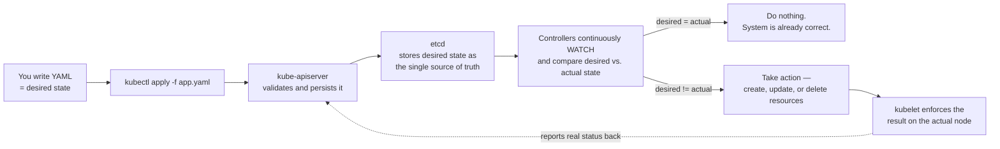
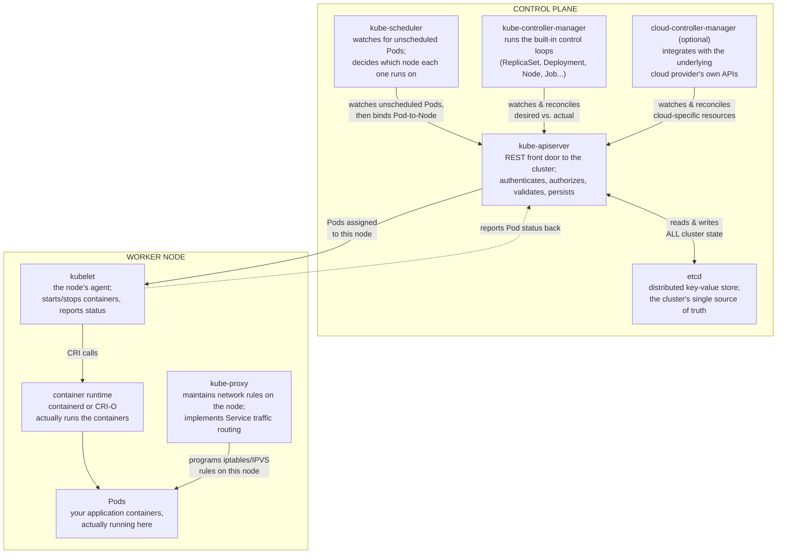
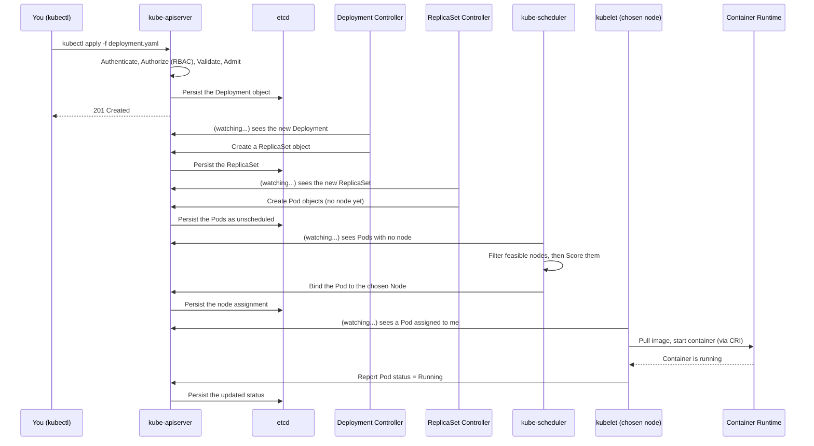
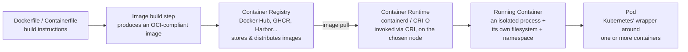
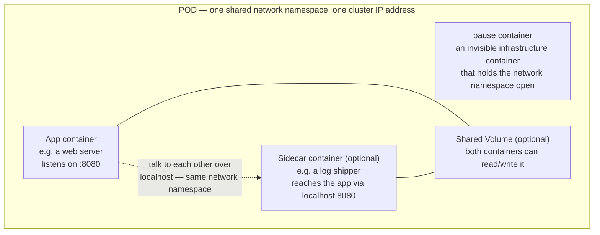
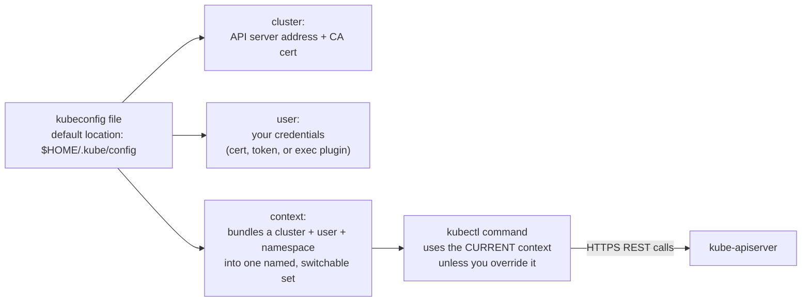
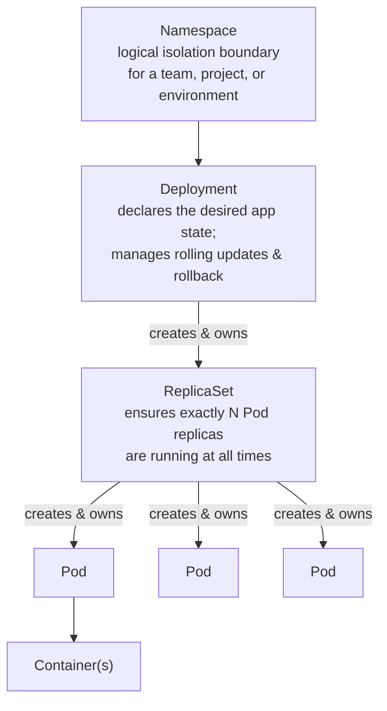
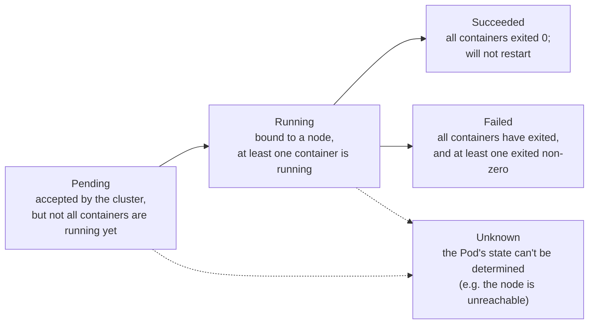
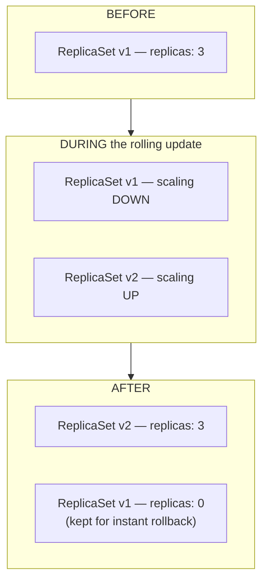
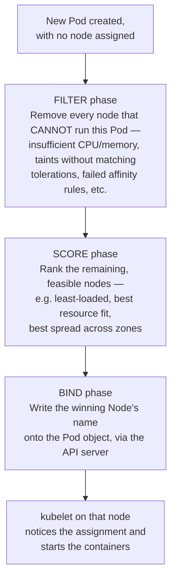

# Chapter 2: Kubernetes Fundamentals — How the Cluster Actually Works

*KCNA Prep Guide Writer | Facts re-verified live against official Kubernetes and CNCF documentation on the date this chapter was written. Kubernetes ships a new minor version roughly every 4 months — treat exact version numbers as a snapshot, and treat the architecture and mechanics below as the durable, exam-relevant part.*

---

## 2.0 Chapter Orientation

### What this chapter covers

This is the big one. On the live [official KCNA exam page](https://training.linuxfoundation.org/certification/kubernetes-cloud-native-associate/), **Kubernetes Fundamentals is worth 44% of the exam** — more than the other three domains combined — spanning four official competencies:

> **Kubernetes Fundamentals — 44%** — *Kubernetes Core Concepts*, *Administration*, *Scheduling*, *Containerization*.

If Chapter 1 was about the neighborhood Kubernetes lives in, this chapter is about the house itself — every room, every wall, every wire. By the end of it you should be able to close your eyes and draw the control plane and a worker node from memory, trace exactly what happens between typing `kubectl apply` and a container starting, and know precisely which object is responsible for which job in the Namespace → Deployment → ReplicaSet → Pod chain.

**What's deliberately out of scope here, and where it actually lives:**
- Deep networking (Services in full, Ingress, NetworkPolicy), storage (PersistentVolumes, StorageClasses), and security (RBAC in depth) belong to the **Container Orchestration** domain — **Chapter 3**. You'll see Services mentioned here only enough to make Pods and Deployments make sense.
- GitOps, CI/CD, and Helm belong to **Cloud Native Application Delivery** — **Chapter 4**.
- Deep observability (metrics, logs, traces, Prometheus) belongs to **Chapter 5**.

**A quick, verified currency note:** as of writing, Kubernetes' latest stable release is the **1.36** line, with the project shipping **3 minor releases per year** (roughly every 4 months, on a ~15-week cycle), and each minor version receiving **~14 months of support** (12 months standard + 2 months maintenance) under an **N-2 support policy** — meaning the three most recent minor versions are supported at any given time. You don't need to memorize the exact current version number for KCNA (it will be stale again in a few months), but the *shape* of the release policy — regular cadence, limited support window, "don't skip more than one minor version when upgrading" — is the kind of durable operational fact that does show up.

### How to view the diagrams in this chapter

As in Chapter 1, diagrams are written in **Mermaid** syntax inside fenced ` ```mermaid ` code blocks — they render automatically in GitHub, GitLab, Obsidian, and VS Code (with the Mermaid preview extension), or you can paste any block into **[mermaid.live](https://mermaid.live)** to render it instantly. The single most architecturally dense diagram in this chapter (Figure 2-2, the full cluster map) also has a plain-ASCII twin immediately beneath it, so the component labels stay legible no matter what's reading this file.

---

## 2.1 The Declarative Control Loop — the One Idea Underneath Everything

Before touching a single component, internalize this one mechanism, because it's the reason literally every other part of Kubernetes behaves the way it does.

You do not tell Kubernetes *"start a container."* You tell it *"I want 3 replicas of this container running, forever, until I say otherwise."* Kubernetes then spends the rest of its existence continuously comparing what you asked for (**desired state**) against what's actually happening (**actual state**), and taking action whenever the two disagree. This pattern is called a **reconciliation loop** (or **control loop**), and it's the mechanism behind every controller you'll meet in this chapter.

**Figure 2-1: The Declarative Reconciliation Loop**



| Model | What you say | Who figures out the "how" | Where you'll use it |
|---|---|---|---|
| **Imperative** | "Do this specific thing, right now" — e.g. `kubectl run nginx --image=nginx` | You do — you issue each step | Quick tests, debugging, learning, one-off tasks |
| **Declarative** | "Make the world look like this file" — e.g. `kubectl apply -f app.yaml` | Kubernetes does — continuously, forever | Production, CI/CD, version-controlled infrastructure (GitOps — Chapter 4) |

> **Confusion alert — "declarative" doesn't mean "one-time."** A common misread is thinking `kubectl apply` runs once and is done, the same way an imperative command is. It isn't. Once your desired state is stored in etcd, the relevant controller keeps enforcing it *indefinitely* — kill a Pod by hand right now, and the ReplicaSet controller will notice within moments and create a replacement, with no human involved. That persistent, always-on enforcement is what "declarative" actually buys you, and it's the reason Kubernetes is *self-healing* by default rather than merely automated.

---

## 2.2 Kubernetes Cluster Architecture — the Full Component Map

This is the single most exam-critical diagram in the entire guide. Every control plane and worker node component below can, and does, show up as its own multiple-choice question — "which component is responsible for X" is one of the most common KCNA question shapes.

**Figure 2-2: The Complete Cluster Architecture**



**ASCII fallback of the same architecture**, for viewers without Mermaid support:

```
╔════════════════════════════════════════════════════════════════════╗
║                          CONTROL PLANE                              ║
║                                                                      ║
║   ┌─────────────────┐        ┌──────────────────────────┐          ║
║   │  kube-apiserver  │◄──────►│           etcd            │          ║
║   │  REST front door │  R/W   │  distributed key-value    │          ║
║   │  auth/validate/  │  all   │  store — cluster's single  │          ║
║   │  persist         │  state │  source of truth           │          ║
║   └────────┬─────────┘        └──────────────────────────┘          ║
║            │                                                        ║
║   ┌────────┴─────────┬────────────────────┬─────────────────┐      ║
║   ▼                  ▼                    ▼                 │      ║
║ ┌──────────────┐ ┌──────────────────┐ ┌────────────────────┐│      ║
║ │kube-scheduler │ │kube-controller-  │ │cloud-controller-   ││      ║
║ │               │ │manager           │ │manager (optional)  ││      ║
║ │Watches for    │ │Runs built-in     │ │Talks to the cloud  ││      ║
║ │unscheduled    │ │control loops:    │ │provider's own APIs ││      ║
║ │Pods, decides   │ │ReplicaSet ctrl,  │ │(load balancers,    ││      ║
║ │which node runs│ │Deployment ctrl,  │ │node provisioning...)││      ║
║ │each one       │ │Node ctrl, etc.   │ │                    ││      ║
║ └──────────────┘ └──────────────────┘ └────────────────────┘│      ║
╚════════════════════════════════│═════════════════════════════╝      
                                  │ Pods assigned to this node
                                  ▼
╔════════════════════════════════════════════════════════════════════╗
║                            WORKER NODE                               ║
║                                                                      ║
║  ┌────────────────────────────────────────────────────────────┐    ║
║  │                          kubelet                             │    ║
║  │  • The node's agent — registers the node with the API server │    ║
║  │  • Watches for Pods assigned to this node                    │    ║
║  │  • Tells the container runtime to start/stop containers      │    ║
║  │  • Reports Pod status back to the API server                 │    ║
║  └───────────────────────────┬────────────────────────────────┘    ║
║                               │ CRI calls                            ║
║                               ▼                                     ║
║  ┌────────────────────────────────────────────────────────────┐    ║
║  │          container runtime (containerd / CRI-O)              │    ║
║  │          pulls images, creates and runs containers           │    ║
║  └────────────────────────────────────────────────────────────┘    ║
║                                                                      ║
║  ┌────────────────────────────────────────────────────────────┐    ║
║  │                         kube-proxy                           │    ║
║  │  • Maintains iptables/IPVS rules on this node                │    ║
║  │  • Implements Service virtual-IP routing                     │    ║
║  │  • Enables Pod-to-Pod and Pod-to-Service traffic              │    ║
║  └────────────────────────────────────────────────────────────┘    ║
║                                                                      ║
║  ┌────────────────────────────────────────────────────────────┐    ║
║  │   Pod A          Pod B          Pod C     ← your app runs   │    ║
║  │   [container]    [container]    [container]      here       │    ║
║  └────────────────────────────────────────────────────────────┘    ║
╚════════════════════════════════════════════════════════════════════╝
```

### Control plane components, one at a time

| Component | Binary / process name | Its one job | What happens if it's down |
|---|---|---|---|
| **API server** | `kube-apiserver` | The single REST entry point for every read/write to the cluster — `kubectl`, controllers, `kubelet`, and every other component all talk to it, never to each other directly | Nothing can read or change cluster state; existing Pods keep running, but nothing new can be scheduled or updated |
| **etcd** | `etcd` | A distributed, consistent key-value store holding *all* cluster state — every Pod spec, Secret, ConfigMap, Node record | The cluster loses its memory; the API server can't persist or retrieve anything reliably |
| **Scheduler** | `kube-scheduler` | Watches for Pods with no node assigned, decides which node each one should run on (see §2.6) | New Pods stay stuck `Pending` forever — nothing decides where they should go |
| **Controller manager** | `kube-controller-manager` | Runs the built-in control loops — one per resource type — that continuously reconcile desired vs. actual state | Self-healing stops: a crashed Pod won't be replaced, a scaled Deployment won't create new replicas |
| **Cloud controller manager** | `cloud-controller-manager` | *Optional.* Integrates Kubernetes with a specific cloud provider's own APIs — provisioning load balancers, tagging nodes, etc. | Cloud-specific automation (like auto-creating a `LoadBalancer` Service) stops working; core cluster functions are unaffected |

### Worker node components, one at a time

| Component | Binary / process name | Its one job | What happens if it's down |
|---|---|---|---|
| **kubelet** | `kubelet` | The node's own agent — registers the node, watches for Pods assigned to it, tells the runtime to start/stop containers, reports status back | The node stops reporting; Kubernetes eventually marks it `NotReady`, and its Pods get rescheduled elsewhere |
| **kube-proxy** | `kube-proxy` | Maintains the network rules (via `iptables` or `IPVS`) that implement Service virtual-IP routing on that node | Pods on that node lose the ability to reach Services by their stable virtual IP |
| **Container runtime** | `containerd`, `CRI-O`, etc. | Actually pulls images and creates/runs the containers, invoked by `kubelet` through the CRI (see Chapter 1, §1.5) | No containers can start or stop on that node at all |

> **Confusion alert — the "master node" terminology you'll still see everywhere is outdated.** Older material — including plenty of still-circulating diagrams and even some legacy internal notes — labels the control plane machine as the "**Master** node." The Kubernetes project moved away from that term years ago as part of a broader industry shift toward more precise, inclusive terminology; the `node-role.kubernetes.io/master` label itself was deprecated in favor of `node-role.kubernetes.io/control-plane`. Current official documentation and the current KCNA curriculum consistently say **"control plane"** or **"control plane node."** If you see "master" in an older diagram (including some older training material still floating around), mentally translate it to "control plane" — the underlying components and their jobs haven't changed, just the label.

> **Confusion alert — the scheduler *decides*, it does not *do*.** A very natural misunderstanding: assuming `kube-scheduler` is the thing that actually starts a container once it picks a node. It isn't. The scheduler's entire job ends the moment it writes the chosen node's name onto the Pod object (the "bind" step). From that point on, it's **`kubelet`**, running on that specific node, that notices the assignment and actually tells the container runtime to pull the image and start the container. Scheduler = decision-maker. Kubelet = executor. Keep those two verbs — *decide* vs. *execute* — pinned to the right component and a whole category of exam questions gets much easier.

### The full request-flow: what really happens on `kubectl apply`

Static diagrams are useful, but seeing the *sequence* of events is what makes the architecture click. Here is exactly what happens, component by component, between you pressing Enter and a container actually running — using a Deployment as the example, since it touches nearly every control plane component in one pass.

**Figure 2-3: Anatomy of `kubectl apply -f deployment.yaml`**



Notice the pattern repeating four separate times: **Deployment Controller → ReplicaSet Controller → Scheduler → kubelet.** Each one is *independently watching* the API server, and each one only does its own narrow job before handing off. No single component "orchestrates" the whole sequence top-down — the orchestration **emerges** from many small, independent control loops all reacting to the same shared state in etcd. That emergent, decentralized behavior is precisely what people mean when they call Kubernetes "declarative" and "self-healing," and it's worth sitting with this diagram until that idea feels concrete rather than abstract.

---

## 2.3 Containerization: From Image to Running Pod

The "Containerization" competency asks you to understand the journey from a built image to a container actually running inside a Pod — and how Kubernetes' own object model (the Pod) relates to the container underneath it.

**Figure 2-4: From Image to Running Pod**



*(For the deeper architecture of OCI, CRI, and how they relate — the standards that make this pipeline vendor-neutral — see Chapter 1, §1.5.)*

### Why the Pod, not the container, is Kubernetes' smallest unit

This is one of the single most important conceptual facts in all of Kubernetes, and it's worth being precise about. **Kubernetes never schedules a bare container.** It schedules a **Pod** — a thin wrapper that can hold one or more containers which are meant to be tightly coupled and always deployed, scaled, and destroyed together.

**Figure 2-5: What's Actually Inside a Pod**



| Fact about Pods | Why it matters |
|---|---|
| A Pod gets **one IP address**, shared by every container inside it | Containers in the same Pod reach each other over `localhost` — no network hop needed |
| Containers in a Pod can share **storage volumes** | Two containers (e.g., an app and a log-shipping sidecar) can read/write the same files |
| A Pod is **ephemeral** — if it dies, it is not resurrected; a *new* Pod with a *new* identity is created | This is exactly why bare Pods aren't used in production — see the callout below |
| The most common Pod shape by far is **single-container** | Multi-container Pods (sidecar, adapter, ambassador patterns) are a deliberate, less-common design choice for tightly coupled processes |

> **Confusion alert — a "restarted" Pod is not the same Pod.** People often say "Kubernetes restarted my Pod" when what actually happened is more precise and matters for how you reason about failures: if a container inside a Pod crashes, `kubelet` restarts *that container* in place (the Pod itself survives, same IP, same identity) — this is what `restartPolicy` governs. But if the entire Pod is deleted (node failure, eviction, or a controller replacing it during a rollout), what replaces it is a **brand-new Pod object** with a **new name and usually a new IP address**. This distinction is exactly why Pods are never addressed directly by IP in real applications — that's what a **Service** exists to solve, with its own stable virtual IP that doesn't change even as the Pods behind it come and go. (Full Service mechanics are in Chapter 3 — the one thing to bank here is *why* Services need to exist at all.)

---

## 2.4 The Kubernetes API & Administration

The "Administration" competency covers how you, as a human (or a CI/CD pipeline), actually talk to a cluster.

### The API server's vocabulary

Every object you've seen so far — Pod, Deployment, Namespace — is formally an instance of a **resource type**, described by a **kind**, versioned under an **API group**. Getting this vocabulary straight matters because `kubectl explain` and the exam both use it precisely.

| Term | Meaning | Example |
|---|---|---|
| **Resource type** | The name used in the URL / on the CLI | `pods`, `deployments`, `namespaces` |
| **Kind** | The schema name for a resource type, as written in YAML | `Pod`, `Deployment`, `Namespace` |
| **API group** | A named collection of related resource types | `apps`, `batch`, `networking.k8s.io`, or the unnamed **core/legacy group** (just `v1`) |
| **API version** | The stability tier of that group's API — `v1` (stable), `v1beta1` (beta), `v1alpha1` (alpha) | `apps/v1`, `batch/v1` |
| **Resource** | One specific instance of a resource type | the Pod named `my-app-abc123` |
| **Collection** | A list of instances of a resource type | the result of `kubectl get pods` |

### Common `apiVersion` values worth recognizing on sight

| Object | apiVersion |
|---|---|
| Pod, Service, ConfigMap, Secret, Namespace, ServiceAccount | `v1` (the core group has no prefix) |
| Deployment, ReplicaSet, DaemonSet, StatefulSet | `apps/v1` |
| Job, CronJob | `batch/v1` |
| Ingress, NetworkPolicy | `networking.k8s.io/v1` |
| HorizontalPodAutoscaler | `autoscaling/v2` |
| Role, ClusterRole, RoleBinding, ClusterRoleBinding | `rbac.authorization.k8s.io/v1` |

> **Confusion alert — why does `Pod` have no group prefix, but `Deployment` needs `apps/`?** This trips people up because it looks inconsistent, but there's a clean historical reason: `v1` by itself refers to the original **core (or "legacy") API group** — the handful of resource types (Pod, Service, ConfigMap, Namespace...) that existed in Kubernetes before the API was organized into named groups at all. Everything added *after* that reorganization lives in an explicitly named group like `apps` or `batch`. There's no deeper logic to memorize beyond "the earliest objects are grouped under plain `v1`; everything since has an explicit group name" — and `kubectl explain <resource>` will always tell you the correct value if you forget.

### How `kubectl` actually talks to a cluster

`kubectl` is not magic — it's a REST client, and it needs to know three things before it can send you anywhere: **which cluster**, **which user identity**, and **which namespace**. All three live in a file called the **kubeconfig**.

**Figure 2-6: kubectl and the kubeconfig**



| kubectl administration command | What it does |
|---|---|
| `kubectl config get-contexts` | List all known cluster/user/namespace combinations |
| `kubectl config use-context <name>` | Switch which cluster you're pointed at |
| `kubectl config set-context --current --namespace=<ns>` | Change your default namespace for future commands |
| `kubectl api-resources` | List every resource type the cluster supports, with its shortname and API group |
| `kubectl explain <resource>` | Show the schema/fields for a resource type — the fastest way to learn a new object |
| `kubectl explain deployment.spec.strategy` | Drill into a specific nested field |
| `kubectl get <resource> -A` | List a resource across **every** namespace at once |

### Imperative vs. declarative `kubectl`, side by side

| Task | Imperative command | Declarative equivalent |
|---|---|---|
| Create a Pod | `kubectl run nginx --image=nginx:1.25` | `kubectl apply -f pod.yaml` |
| Create a Deployment | `kubectl create deployment my-app --image=myapp:v1 --replicas=3` | `kubectl apply -f deployment.yaml` |
| Scale a Deployment | `kubectl scale deployment my-app --replicas=5` | Edit `replicas: 5` in the YAML, then `kubectl apply -f deployment.yaml` |
| Update an image | `kubectl set image deployment/my-app app=myapp:v2` | Edit `image: myapp:v2` in the YAML, then `kubectl apply -f deployment.yaml` |

> **A genuinely useful hybrid trick, worth knowing for both the exam and real life:** you can use an imperative command to *generate* a starting YAML file without actually creating anything, via `--dry-run=client -o yaml`. For example: `kubectl create deployment my-app --image=myapp:v1 --replicas=3 --dry-run=client -o yaml > deployment.yaml`. This gives you a correctly structured declarative manifest in seconds, which you then edit and commit to version control — the fastest on-ramp from "I don't remember the YAML schema" to "I have a production-ready manifest."

---

## 2.5 The Core Workload Hierarchy: Namespace → Deployment → ReplicaSet → Pod

Now that you know the architecture and the API vocabulary, let's build the object hierarchy you'll interact with most. Each layer exists to solve a specific problem the layer below it can't solve on its own.

**Figure 2-7: The Workload Object Hierarchy**



### 2.5.1 Namespace — the isolation boundary

**Purpose:** a virtual cluster within the physical cluster. Namespaces let you carve up one cluster among teams, projects, or environments without those groups' resource names colliding.

```
Cluster
├── namespace: default        ← created automatically; where things land if unspecified
├── namespace: kube-system    ← Kubernetes' own internal components live here
├── namespace: kube-public    ← readable by everyone, even unauthenticated users
├── namespace: production     ← your team's namespace
└── namespace: staging        ← another environment, fully isolated by name
```

```yaml
# ── DECLARATIVE ──
apiVersion: v1
kind: Namespace
metadata:
  name: production        # 🔴 required
  labels:
    environment: production   # 🟢 optional but useful for policy targeting
```

```bash
# ── IMPERATIVE ──
kubectl create namespace production
kubectl get namespaces
kubectl get pods -n production                 # work within a namespace
kubectl config set-context --current --namespace=production   # make it the default
```

> **Confusion alert — namespaces do *not* provide network isolation by default.** A very common assumption: "if two apps are in different namespaces, they can't reach each other." False, out of the box. A namespace is purely a *naming and organizational* boundary — Pods in `staging` can talk to Pods in `production` over the network with zero restriction unless you explicitly add a **NetworkPolicy** to prevent it (Chapter 3). Namespace isolation is about *names, RBAC scope, and resource quotas* — not network reachability.

### 2.5.2 Pod — the smallest deployable unit

Covered architecturally in §2.3 — here's the object itself.

```yaml
# ── DECLARATIVE ──
apiVersion: v1
kind: Pod
metadata:
  name: my-pod
  namespace: default
  labels:
    app: my-app             # 🟡 needed later for Service/Deployment selectors
spec:
  containers:
    - name: app
      image: nginx:1.25     # 🔴 avoid :latest — not reproducible
      ports:
        - containerPort: 80
      resources:
        requests:
          cpu: "100m"
          memory: "128Mi"
        limits:
          cpu: "500m"
          memory: "256Mi"
  restartPolicy: Always     # Always (default) | OnFailure | Never
```

```bash
# ── IMPERATIVE ──
kubectl run my-pod --image=nginx:1.25 --port=80

kubectl get pods
kubectl get pod my-pod -o wide          # shows node + IP
kubectl describe pod my-pod             # full details + recent events
kubectl logs my-pod                     # container logs
kubectl exec -it my-pod -- /bin/bash    # shell into the running container
```

> **⚠️ Common mistake, and the reason the next two objects exist at all:** a bare Pod is **not self-healing**. If the node it's on dies, or the Pod is deleted, nothing recreates it — it's simply gone. That single limitation is the entire reason ReplicaSet and Deployment exist. In real applications, you almost never create a Pod directly; you create a Deployment, and it creates and supervises Pods on your behalf.

### Pod lifecycle — the phases you'll be asked to recognize

**Figure 2-8: Pod Lifecycle Phases**



| Phase | Plain meaning |
|---|---|
| **Pending** | Accepted by the API server, but still waiting — for scheduling, or for an image to finish pulling |
| **Running** | Bound to a node, at least one container is up | 
| **Succeeded** | Every container exited with status 0 and won't be restarted — normal for a one-shot Job Pod |
| **Failed** | Every container has exited, and at least one exited with a non-zero status |
| **Unknown** | The control plane has lost contact with the node and can't determine the Pod's real state |

*(Detailed troubleshooting states you'll actually see in `kubectl describe` output — `CrashLoopBackOff`, `ImagePullBackOff`, `OOMKilled` — belong to the Troubleshooting competency in Chapter 3, since they require diagnosing *why* a Pod is stuck, not just recognizing the five phases above.)*

### 2.5.3 ReplicaSet — guaranteeing a replica count

**Purpose:** ensure a specified number of identical Pods are running at all times. If one dies, the ReplicaSet controller notices (via the reconciliation loop from §2.1) and creates a replacement.

```yaml
apiVersion: apps/v1
kind: ReplicaSet
metadata:
  name: my-rs
spec:
  replicas: 3                # 🔴 required
  selector:                  # 🔴 required — how it identifies "its" Pods
    matchLabels:
      app: my-app
  template:                  # 🔴 required — the Pod blueprint
    metadata:
      labels:
        app: my-app          # must match selector above!
    spec:
      containers:
        - name: app
          image: nginx:1.25
```

```bash
kubectl get replicasets
kubectl scale replicaset my-rs --replicas=5
```

> ⚠️ In practice, you will almost never write a bare ReplicaSet YAML. **Use a Deployment instead — it creates and manages the ReplicaSet for you**, and adds the one capability a plain ReplicaSet fundamentally lacks: safe, controlled updates.

### The label-selector rule that breaks things when violated

This single mechanical rule underlies Deployments, ReplicaSets, and Services alike, and it's a very frequent source of "why isn't this working" in both real clusters and exam scenarios.

```
Deployment.spec.selector.matchLabels  ──────► MUST MATCH ──────► Pod template's metadata.labels
ReplicaSet.spec.selector.matchLabels  ──────► MUST MATCH ──────► Pod template's metadata.labels
Service.spec.selector                 ──────► MUST MATCH ──────► actual running Pods' metadata.labels
```

> **Confusion alert — mismatched labels don't cause an error; they cause silent nothing.** If a Deployment's `selector` doesn't match its own `template.metadata.labels`, Kubernetes will actually **reject the object at creation time** with a validation error, because a Deployment can't own Pods it can't select. But if a **Service's** selector doesn't match any existing Pod's labels — which is a separate, looser relationship — you get no error at all. The Service is created successfully, it just... routes to nothing. `kubectl get endpoints <service-name>` showing `<none>` is the tell-tale sign, and it's one of the most common real-world (and exam-scenario) debugging traps in all of Kubernetes.

### 2.5.4 Deployment — safe, declarative rollouts

**Purpose:** manage ReplicaSets on your behalf to provide rolling updates, rollback, and scaling for stateless applications — the object you'll actually use nearly all the time.

```yaml
# ── DECLARATIVE ──
apiVersion: apps/v1
kind: Deployment
metadata:
  name: my-app
  namespace: default
  labels:
    app: my-app
spec:
  replicas: 3                    # 🟡 default: 1
  selector:                      # 🔴 required — must match template labels
    matchLabels:
      app: my-app
  strategy:                      # 🟡 how Pods get replaced during an update
    type: RollingUpdate          # RollingUpdate (default) | Recreate
    rollingUpdate:
      maxSurge: 1                # extra Pods allowed above `replicas` during rollout
      maxUnavailable: 0          # Pods allowed to be unavailable during rollout
  template:                      # 🔴 required — identical shape to a Pod spec
    metadata:
      labels:
        app: my-app              # must match selector above!
    spec:
      containers:
        - name: app
          image: myapp:v2
          ports:
            - containerPort: 8080
```

```bash
# ── IMPERATIVE ──
kubectl create deployment my-app --image=myapp:v1 --replicas=3

kubectl rollout status deployment/my-app          # watch a rollout in progress
kubectl rollout history deployment/my-app         # see revision history
kubectl rollout undo deployment/my-app            # roll back to the previous revision
kubectl scale deployment my-app --replicas=5
kubectl set image deployment/my-app app=myapp:v2  # triggers a rolling update
```

**Figure 2-9: What a Rolling Update Actually Does Underneath**



| `maxSurge` / `maxUnavailable` | What it controls |
|---|---|
| `maxSurge` | How many *extra* Pods beyond the target `replicas` count are allowed to exist temporarily during a rollout |
| `maxUnavailable` | How many Pods are allowed to be *unavailable* at once during a rollout |
| Both default to `25%` | A `maxUnavailable: 0` setting, as shown above, guarantees a true zero-downtime rollout at the cost of briefly running slightly more Pods than usual |

> **Why a Deployment doesn't delete the old ReplicaSet:** notice in Figure 2-9 that `ReplicaSet v1` is kept around at `replicas: 0` rather than being deleted outright. This is deliberate — it's exactly *how* `kubectl rollout undo` can be instantaneous. Rolling back isn't a new deployment cycle at all; it's simply scaling the old ReplicaSet back up and the new one back down. The `revisionHistoryLimit` field controls how many of these old, zeroed-out ReplicaSets Kubernetes keeps around before garbage-collecting the oldest ones.

---

## 2.6 Scheduling — How the Scheduler Actually Places Pods

The "Scheduling" competency is entirely about `kube-scheduler`'s decision process, introduced briefly in §2.2. Let's open it up fully.

**Figure 2-10: The Scheduler's Filter → Score → Bind Pipeline**



### The tools you give the scheduler to make its decision

| Mechanism | What it does | Strength of the rule |
|---|---|---|
| **`nodeSelector`** | The simplest constraint — only schedule on nodes carrying an exact label (e.g. `disktype: ssd`) | Hard requirement, no partial matches |
| **Node affinity** | A more expressive version of `nodeSelector` — supports `In`, `NotIn`, `Exists` operators and multiple conditions | Can be `required` (hard) or `preferred` (soft, best-effort) |
| **Pod affinity / anti-affinity** | Schedule a Pod *near* (affinity) or *away from* (anti-affinity) Pods matching a given label — e.g., spread replicas across failure domains | Can also be `required` or `preferred` |
| **Taints** (on a Node) | A Node "repels" Pods unless they explicitly tolerate the taint — e.g., reserving GPU nodes for GPU workloads only | Node-side: "don't schedule here unless you say it's okay" |
| **Tolerations** (on a Pod) | A Pod declares it's okay to be scheduled on a tainted node | Pod-side: the explicit "permission slip" that matches a taint |
| **Resource `requests`** | What the scheduler treats as the Pod's *guaranteed minimum* need — this is the number actually used for the Filter phase | Determines whether a node has "room" for the Pod at all |
| **Resource `limits`** | The *maximum* the Pod is allowed to consume once running — enforced by the kubelet/runtime, **not** used by the scheduler for placement | Irrelevant to where the Pod lands; relevant to what happens once it's running |

```yaml
# A Pod that will only be scheduled on nodes labeled disktype=ssd,
# and that tolerates the "gpu" taint if such a node also happens to carry it.
spec:
  nodeSelector:
    disktype: ssd
  tolerations:
    - key: "gpu"
      operator: "Exists"
      effect: "NoSchedule"
```

> **Confusion alert — "taints and tolerations" is often paired incorrectly with "which node runs my Pod."** Taints/tolerations don't *attract* a Pod to a node; they only ever *repel* Pods that don't tolerate them. If you actually want a Pod to *prefer* or *require* a specific set of nodes, that's node affinity's job (or the simpler `nodeSelector`). A very common exam-style scenario — "we need to reserve certain nodes exclusively for a specific team's workloads" — is a taints/tolerations problem (repel everyone else); "we need this workload to run on nodes with a GPU" is more naturally a node-affinity or `nodeSelector` problem (attract this workload there). The two mechanisms are frequently used *together* in production (taint the GPU nodes *and* give the GPU Pods a matching toleration *and* a node affinity rule targeting them), which is exactly why the distinction matters.

> **Confusion alert — `requests` vs. `limits` behave completely differently when exceeded, and this is a favorite exam gotcha.** Both look like plain numbers in the YAML, but what happens when a container tries to exceed them is not symmetric at all:
> - Exceed a **CPU limit** → the container is **throttled** (slowed down), never killed. CPU is a *compressible* resource — the kernel can simply give it less.
> - Exceed a **memory limit** → the container is **killed** (`OOMKilled` — Out Of Memory Killed), then restarted per its `restartPolicy`. Memory is *incompressible* — there's no way to "slow down" a process's memory usage, so the only lever is termination.
> - **Requests**, meanwhile, are never about a running container being punished at all — they're purely an input to the **scheduler's Filter phase** in Figure 2-10, determining whether a node has enough declared headroom to accept the Pod in the first place.
> Remembering "CPU throttles, memory kills" as a fixed pair is one of the highest-value single facts you can memorize for this domain.

---

## 2.7 Chapter Cheat Sheet

| Term | One-line definition |
|---|---|
| Control plane | The cluster's "brain" — API server, etcd, scheduler, controller manager (+ optional cloud controller manager) |
| Worker node | Where Pods actually run — kubelet, kube-proxy, container runtime |
| kube-apiserver | The single REST front door; every other component talks *through* it |
| etcd | Distributed key-value store; the cluster's single source of truth |
| kube-scheduler | Decides *which node* a Pod runs on (Filter → Score → Bind) — never starts containers itself |
| kube-controller-manager | Runs the built-in reconciliation loops (ReplicaSet, Deployment, Node, Job controllers, etc.) |
| kubelet | The node's own agent; the component that actually starts/stops containers and reports status |
| kube-proxy | Programs network rules on each node to implement Service routing |
| Container runtime | `containerd`/`CRI-O`; pulls images and runs containers, invoked via CRI |
| Pod | Kubernetes' smallest deployable unit; one or more containers sharing a network namespace and IP |
| ReplicaSet | Guarantees N Pod replicas are running; rarely created directly |
| Deployment | Manages ReplicaSets to provide rolling updates, rollback, and scaling |
| Namespace | A naming/organizational boundary — **not** a network boundary by default |
| Reconciliation loop | The core mechanism: compare desired vs. actual state, act only on mismatch, repeat forever |
| Requests | What the scheduler uses to decide if a node has room (Filter phase) |
| Limits | The runtime-enforced ceiling — CPU is throttled, memory is OOMKilled, when exceeded |
| Taints / Tolerations | Node-side repulsion / Pod-side permission slip — pairs, doesn't attract |
| Node affinity / `nodeSelector` | The mechanisms that actually attract a Pod toward specific nodes |

---

## 2.8 Practice Questions (Original, Unofficial)

**These are original questions written for this guide, in the style and difficulty range of the public KCNA curriculum. They are not real exam questions, and reproducing or soliciting actual exam content would violate the Linux Foundation's Certification Agreement.**

---

**Q1.** Which control plane component is the *only* one that reads from and writes to `etcd` directly, with every other component going through it instead?

A. `kube-scheduler`
B. `kube-controller-manager`
C. `kube-apiserver`
D. `kubelet`

<details>
<summary>Answer & explanation</summary>

**Correct answer: C.** The API server is the sole component with direct access to etcd. Every other component — the scheduler, the controller manager, `kubelet` on every node — reads and writes cluster state exclusively through the API server, never touching etcd directly.
</details>

---

**Q2.** A Pod has been sitting in the `Pending` phase for several minutes. Which component's job is it to notice this and decide where the Pod should run?

A. `kubelet`
B. `kube-proxy`
C. The container runtime
D. `kube-scheduler`

<details>
<summary>Answer & explanation</summary>

**Correct answer: D.** `kube-scheduler` watches specifically for Pods that exist but have no node assigned, and is responsible for the Filter → Score → Bind decision. Once bound, it's `kubelet` (A) on the chosen node — not the scheduler — that actually starts the containers.
</details>

---

**Q3.** A container's memory usage exceeds its configured `limits.memory`. What happens?

A. The container is throttled but keeps running
B. The container is killed (OOMKilled) and restarted per its restart policy
C. Nothing — memory limits are advisory only
D. The Pod is immediately evicted from the cluster permanently

<details>
<summary>Answer & explanation</summary>

**Correct answer: B.** Memory is an incompressible resource — when a container exceeds its memory limit, it is killed (OOMKilled), then restarted according to its `restartPolicy`. This is different from CPU, where exceeding a limit results in throttling rather than termination, since CPU is compressible.
</details>

---

**Q4.** Which object should you create directly in a production application, given the choice between a bare Pod, a ReplicaSet, or a Deployment?

A. A bare Pod, since it's the simplest option
B. A ReplicaSet, since it directly guarantees replica count
C. A Deployment, since it manages ReplicaSets and adds safe rolling updates and rollback
D. It doesn't matter — they're functionally identical

<details>
<summary>Answer & explanation</summary>

**Correct answer: C.** A bare Pod isn't self-healing. A ReplicaSet adds self-healing (replica count enforcement) but has no safe update mechanism. A Deployment adds rolling updates and rollback on top of a ReplicaSet's guarantees, which is why it's the standard choice for stateless production workloads.
</details>

---

**Q5.** A Deployment's `spec.selector.matchLabels` does not match the labels in its own `spec.template.metadata.labels`. What happens?

A. The Deployment is created successfully but manages zero Pods
B. Kubernetes rejects the Deployment object at creation time with a validation error
C. Kubernetes automatically fixes the mismatched labels
D. The Deployment creates Pods with random labels instead

<details>
<summary>Answer & explanation</summary>

**Correct answer: B.** Unlike a Service's looser selector-to-Pod relationship, a Deployment's selector must match its own Pod template's labels, or the object is invalid and rejected outright — because a Deployment must be able to identify and own the Pods it creates.
</details>

---

**Q6.** Which of the following is the correct purpose of a Node taint paired with a Pod toleration?

A. The taint attracts specific Pods to the node
B. The toleration forces the scheduler to place the Pod on that specific node
C. The taint repels Pods from the node unless they carry a matching toleration
D. Taints and tolerations control storage access, not scheduling

<details>
<summary>Answer & explanation</summary>

**Correct answer: C.** Taints are a repulsion mechanism on the node side — "don't schedule Pods here unless explicitly permitted." A toleration on a Pod is the matching permission slip that allows (but does not force) scheduling there. Attracting a Pod toward specific nodes is the job of `nodeSelector` or node affinity instead.
</details>

---

**Q7.** Which apiVersion is correct for a `Deployment` object?

A. `v1`
B. `apps/v1`
C. `batch/v1`
D. `deployments/v1`

<details>
<summary>Answer & explanation</summary>

**Correct answer: B.** Deployment, ReplicaSet, DaemonSet, and StatefulSet all live in the `apps/v1` API group. Plain `v1` (A) is reserved for the original core group objects like Pod, Service, and ConfigMap; `batch/v1` (C) is for Job and CronJob.
</details>

---

**Q8.** Two containers in the same Pod need to communicate with each other. What is the simplest, correct way for them to do so?

A. Through a Kubernetes Service
B. Over `localhost`, since they share a network namespace
C. Through an Ingress controller
D. They cannot communicate directly; they must use a shared volume only

<details>
<summary>Answer & explanation</summary>

**Correct answer: B.** All containers within a single Pod share one network namespace and one IP address, so they can reach each other directly over `localhost` using whatever ports they expose — no Service or Ingress is needed for this intra-Pod case.
</details>

---

**Q9.** During a Deployment's rolling update, what is the purpose of keeping the old ReplicaSet around at `replicas: 0` instead of deleting it?

A. It's a bug that will be fixed in a future release
B. It enables an instant rollback via `kubectl rollout undo`, by scaling it back up
C. It allows the old and new versions to run simultaneously forever
D. Kubernetes requires at least two ReplicaSets per Deployment at all times

<details>
<summary>Answer & explanation</summary>

**Correct answer: B.** Keeping the previous ReplicaSet at zero replicas means a rollback doesn't require rebuilding anything — it's simply a matter of scaling the old ReplicaSet back up and the new one back down, which is exactly what `kubectl rollout undo` does under the hood.
</details>

---

**Q10.** A team wants to organize their cluster so that the `billing` team's resources and the `analytics` team's resources use the same object names (e.g., both can have a Service called `api`) without conflict, but they are fine with the two teams' Pods being able to freely reach each other over the network. Which Kubernetes feature addresses the naming requirement on its own, without needing anything else?

A. NetworkPolicy
B. RBAC
C. Namespace
D. Taints and tolerations

<details>
<summary>Answer & explanation</summary>

**Correct answer: C.** A Namespace exists specifically to provide a naming/organizational boundary, allowing identically named objects to coexist in different namespaces. Since the scenario explicitly says free network communication between the teams is acceptable, no NetworkPolicy (A) is needed — which also reinforces that Namespaces alone don't restrict network traffic by default.
</details>

---

## 2.9 Sources & Further Reading

**Tier 1 — Official, authoritative for exam facts**
- [KCNA certification page — domains, weights, price, policy](https://training.linuxfoundation.org/certification/kubernetes-cloud-native-associate/)
- [Official CNCF curriculum PDF](https://github.com/cncf/curriculum/blob/master/KCNA_Curriculum.pdf)

**Tier 2 — Primary technical documentation**
- [Kubernetes Components overview](https://kubernetes.io/docs/concepts/overview/components/)
- [Kubernetes Architecture concepts](https://kubernetes.io/docs/concepts/architecture/)
- [Pods](https://kubernetes.io/docs/concepts/workloads/pods/)
- [Pod Lifecycle](https://kubernetes.io/docs/concepts/workloads/pods/pod-lifecycle/)
- [Deployments](https://kubernetes.io/docs/concepts/workloads/controllers/deployment/)
- [ReplicaSet](https://kubernetes.io/docs/concepts/workloads/controllers/replicaset/)
- [Namespaces](https://kubernetes.io/docs/concepts/overview/working-with-objects/namespaces/)
- [kube-scheduler](https://kubernetes.io/docs/concepts/scheduling-eviction/kube-scheduler/)
- [Assigning Pods to Nodes (nodeSelector, affinity)](https://kubernetes.io/docs/concepts/scheduling-eviction/assign-pod-node/)
- [Taints and Tolerations](https://kubernetes.io/docs/concepts/scheduling-eviction/taint-and-toleration/)
- [Managing Resources for Containers (requests & limits)](https://kubernetes.io/docs/concepts/configuration/manage-resources-containers/)
- [kubectl Cheat Sheet](https://kubernetes.io/docs/reference/kubectl/cheatsheet/)
- [Organizing Cluster Access with kubeconfig](https://kubernetes.io/docs/concepts/configuration/organize-cluster-access-kubeconfig/)
- [Kubernetes Release cadence policy](https://kubernetes.io/releases/)

---

## 2.10 What I Assumed, and Questions Back to You

1. **Depth calibration held steady from Chapter 1:** I kept the same density — full architecture diagrams with an ASCII fallback for the busiest one, confusion-alert callouts wherever a concept has a well-known trap, and 10 practice questions given this domain's outsized 44% weight (vs. 8 for Chapter 1's 12%). Let me know if that scaling (more questions for heavier domains) is the right instinct, or if you'd rather every chapter carry the same fixed number.
2. **I deliberately kept Services to a bare forward-reference** (§2.3, §2.5.1) rather than explaining ClusterIP/NodePort/LoadBalancer here, since that's explicitly Chapter 3's territory (Container Orchestration → Networking). If you'd rather Chapter 2 be fully self-contained even at the cost of some overlap with Chapter 3, say so and I'll fold in a Services primer here too.
3. **I introduced but did not deeply resolve `CrashLoopBackOff` / `ImagePullBackOff`** — I flagged them as belonging to Chapter 3's Troubleshooting competency rather than the Pod-phase discussion here, since they're diagnostic states layered on top of, not part of, the five formal Pod phases. Confirm that split makes sense, or tell me if you'd rather see them here since they're such common real-world (and exam) sights.
4. **Multi-container Pod design patterns** (sidecar, adapter, ambassador) were mentioned only in passing in §2.3 — full pattern-by-pattern treatment felt like it belonged in a more applied/advanced chapter rather than "Fundamentals." Flag it if you want that expanded here instead.

Say "continue" and I'll move on to **Chapter 3: Container Orchestration** — Networking, Security, Troubleshooting, and Storage, at the same standard.
