# Chapter 3: Container Orchestration — Reachable, Safe, Persistent, Debuggable

*KCNA Prep Guide Writer | Facts re-verified against official Kubernetes documentation and cross-checked against production-grade reference patterns. As always: the mechanics below are durable; specific defaults and field names should be spot-checked against `kubectl explain` on the version you actually run.*

---

## 3.0 Chapter Orientation

### What this chapter covers

On the live [official KCNA exam page](https://training.linuxfoundation.org/certification/kubernetes-cloud-native-associate/), **Container Orchestration is worth 28% of the exam** — the second-largest domain — spanning four official competencies:

> **Container Orchestration — 28%** — *Networking*, *Security*, *Troubleshooting*, *Storage*.

Chapter 2 built the skeleton: a Pod, wrapped and supervised by a ReplicaSet, wrapped and safely updated by a Deployment, placed on a node by the scheduler. That skeleton, on its own, is mute, unguarded, forgetful, and opaque. This chapter gives it a voice (**Networking**), a lock on the door (**Security**), a memory that survives a restart (**Storage**), and — because all of the above *will* eventually break in some way — a way to figure out what went wrong (**Troubleshooting**).

**A promise kept from Chapter 2:** at the end of §2.5, I deliberately deferred `CrashLoopBackOff` and `ImagePullBackOff` to this chapter, since they're diagnostic *reasons* layered on top of a Pod's formal lifecycle phases rather than phases themselves. That distinction gets its own confusion alert in §3.4 — this chapter is where that promise gets paid off.

---

## 3.1 Networking — How Traffic Actually Reaches a Pod

### The problem this whole section exists to solve

Recall from Chapter 2, §2.3: **a "restarted" Pod is not the same Pod.** When a Deployment replaces a failed Pod, the replacement gets a brand-new IP address. If another Pod (or an external client) had hardcoded that old IP, it's now talking to nothing. Multiply this by dozens of Pods scaling up and down constantly, and you have an addressing problem that needs a permanent fix — not a workaround. That fix is the **Service**.

### The Service: a stable front door for an unstable set of Pods

**Figure 3-1: Why a Service Exists**

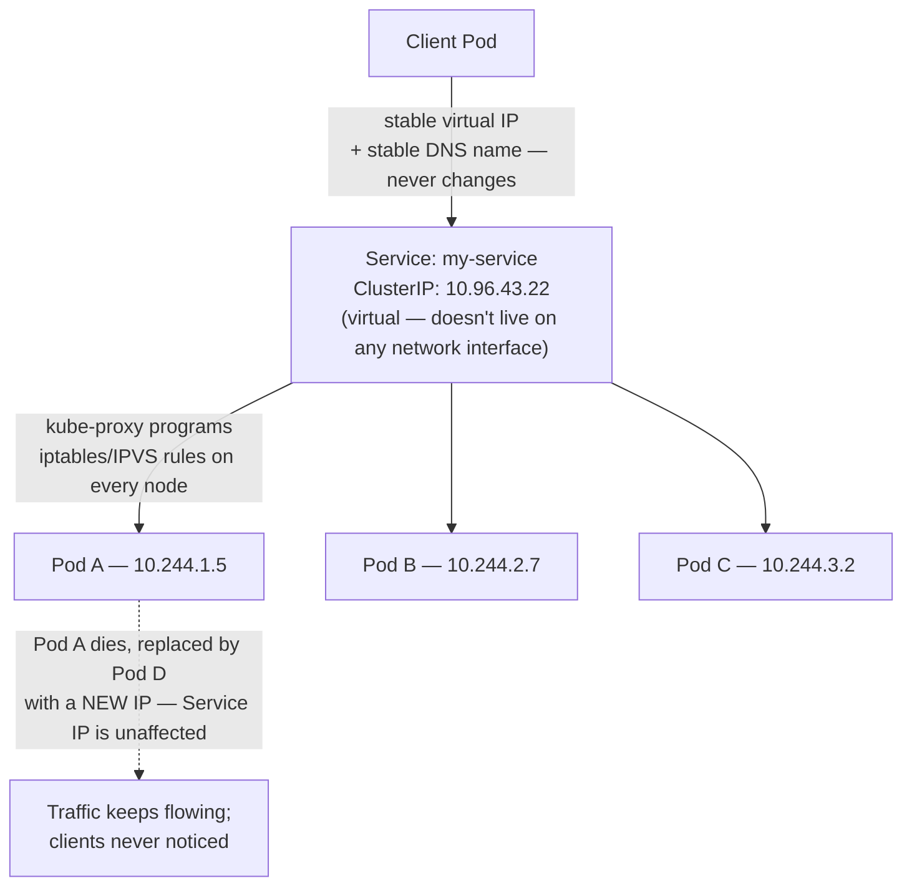

A Service is a Kubernetes object that gives a *set* of Pods (identified by a label selector — the same mechanism from Chapter 2, §2.5) one permanent virtual IP address and one permanent DNS name. `kube-proxy`, introduced architecturally in Chapter 2 §2.2, is the component that actually makes this real, by continuously programming `iptables` or `IPVS` rules on every node so that traffic sent to the Service's virtual IP gets silently rewritten to one of the currently-healthy Pod IPs behind it.

```yaml
apiVersion: v1
kind: Service
metadata:
  name: web-app-service
  namespace: production
spec:
  type: ClusterIP              # 🟡 default — internal-only
  selector:                    # 🔴 required — which Pods receive traffic
    app: web-app
  ports:
    - port: 80                 # 🔴 the port clients connect to
      targetPort: 8080         # 🟡 the port the container actually listens on
      protocol: TCP
```

### The four Service types, and how they build on each other

This is one of the most consistently tested relationships in the whole Networking competency: the four Service types are not four unrelated options — three of them are *strict supersets* of each other.

**Figure 3-2: Service Types Build on Each Other**

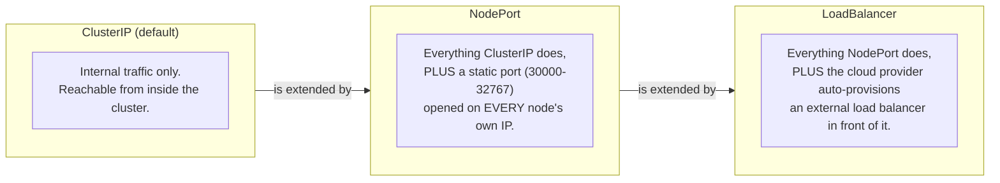

| Type | Reachable from | Typical use case |
|---|---|---|
| **ClusterIP** | Inside the cluster only | The default — internal service-to-service traffic (e.g., a backend a frontend calls) |
| **NodePort** | `<AnyNodeIP>:<NodePort>` from outside the cluster too | Simple external access without a cloud load balancer, often for dev/test |
| **LoadBalancer** | A dedicated external IP the cloud provider gives you | Production external access on a managed cloud (AWS, GCP, Azure) |
| **ExternalName** | Not proxied at all — it's a DNS **CNAME** to an external address | Referencing an external database or API by an internal, cluster-style name |
| **Headless** (`clusterIP: None`) | No virtual IP; DNS returns each Pod's IP directly | StatefulSets, where clients need to address *individual* Pods, not a load-balanced pool |

> **Confusion alert — a Headless Service isn't "no Service," it's a different kind of Service.** Setting `clusterIP: None` doesn't turn off Service discovery; it turns off *load balancing*. Instead of one virtual IP fronting the whole set, DNS returns the individual IP of every matching Pod (e.g., `postgres-0.postgres-headless.database.svc.cluster.local`). This is exactly what a clustered database like PostgreSQL or Kafka needs — clients often need to talk to a *specific* replica (the primary, for writes), not a randomly load-balanced one.

### How a Service actually finds its Pods: Endpoints

This directly resolves the Chapter 2 label-selector confusion alert: a Service's selector doesn't magically wire up to Pods — it's continuously resolved into a separate, watchable object called an **Endpoints** (or the modern, scalable **EndpointSlice**) object, listing the actual IPs currently matching the selector.

```bash
kubectl get endpoints my-service
# NAME         ENDPOINTS                         AGE
# my-service   10.244.1.5:8080,10.244.2.7:8080   3d
#
# If this shows <none> instead of IPs, the Service's selector
# does not match any running Pod's labels — the #1 real-world
# and exam-scenario cause of "the Service exists but nothing works."
```

### DNS: how every Service actually gets its name

Kubernetes runs an internal DNS service — **CoreDNS**, introduced in Chapter 1's landscape table — which watches the API server and automatically creates a DNS record for every Service.

```
Full form:      my-service.my-namespace.svc.cluster.local
Same namespace: just "my-service" works (DNS search-path shortcut)
Cross-namespace: "my-service.other-namespace" is enough
```

### Ingress: the piece Services alone can't do

A Service gives you *reachability*. It doesn't give you **HTTP-aware routing** — sending `shop.example.com/api` to one backend and `shop.example.com/` to another, or terminating TLS in one place instead of on every Service. That's the **Ingress** object's job: a single, HTTP/HTTPS-aware entry point sitting in front of many Services.

**Figure 3-3: Ingress Sits Above Services, Not Instead of Them**

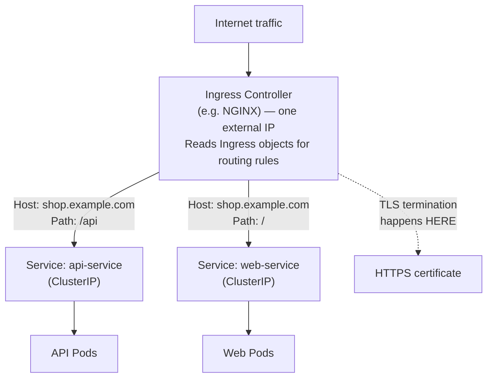

```yaml
apiVersion: networking.k8s.io/v1
kind: Ingress
metadata:
  name: web-ingress
  annotations:
    nginx.ingress.kubernetes.io/ssl-redirect: "true"
spec:
  ingressClassName: nginx       # 🔴 which Ingress controller implements this
  tls:
    - hosts: ["shop.example.com"]
      secretName: shop-tls      # a TLS Secret — see §3.2
  rules:
    - host: shop.example.com
      http:
        paths:
          - path: /api
            pathType: Prefix
            backend:
              service:
                name: api-service
                port: { number: 8080 }
          - path: /
            pathType: Prefix
            backend:
              service:
                name: web-service
                port: { number: 80 }
```

> **Confusion alert — an Ingress *object* does nothing on its own; it needs an Ingress *controller*.** Creating an Ingress YAML with no Ingress controller running in the cluster is like writing a routing rule for a router that doesn't exist — `kubectl apply` will succeed, and the Ingress object will just sit there, inert. The controller (NGINX Ingress Controller, Traefik, HAProxy, and others are common choices — none of them ship with Kubernetes by default) is a separate workload you must deploy yourself, which then watches for Ingress objects and configures itself accordingly. This is a favorite "why isn't this working" exam scenario.

### NetworkPolicy: turning off the default "everyone can talk to everyone"

**Figure 3-4: The Default-Allow-to-Default-Deny Journey**

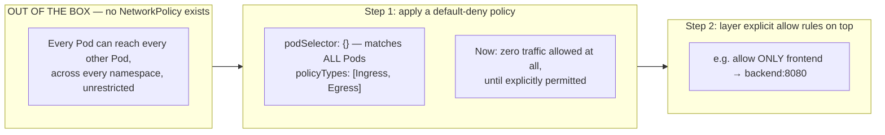

```yaml
# Step 1 — deny everything by default
apiVersion: networking.k8s.io/v1
kind: NetworkPolicy
metadata:
  name: default-deny-all
  namespace: production
spec:
  podSelector: {}                # {} = matches every Pod in the namespace
  policyTypes: ["Ingress", "Egress"]
---
# Step 2 — explicitly re-allow only what's needed
apiVersion: networking.k8s.io/v1
kind: NetworkPolicy
metadata:
  name: allow-frontend-to-backend
  namespace: production
spec:
  podSelector:
    matchLabels: { tier: backend }
  policyTypes: ["Ingress"]
  ingress:
    - from:
        - podSelector:
            matchLabels: { tier: frontend }
      ports:
        - protocol: TCP
          port: 8080
```

> **Confusion alert — this is the single most important fact in the entire Networking competency, and it directly contradicts most people's instinct.** By default, with **zero** NetworkPolicies applied anywhere in a cluster, **all Pod-to-Pod traffic is allowed** — flat, open, cluster-wide, even across namespaces. NetworkPolicies are **allow-list only in aggregate effect, but individually additive** — the moment even *one* NetworkPolicy selects a given Pod, that Pod's traffic becomes **default-deny** for whichever direction (ingress/egress) that policy covers, and only the traffic explicitly allowed by *any* policy selecting it gets through. Two consequences worth memorizing: (1) a brand-new cluster is wide open until someone deliberately locks it down, and (2) "add a NetworkPolicy" is almost always about *restricting* something that already works, never about *enabling* something from scratch.

*(Full CNI plugin architecture — Cilium, Calico, Flannel — and how they implement the actual packet-level plumbing behind all of this were covered in Chapter 1, §1.5. NetworkPolicy enforcement itself depends on the CNI plugin supporting it — not every CNI plugin does.)*

---

## 3.2 Security — The 4 Cs, RBAC, and Pod-Level Hardening

### The 4 Cs of Cloud Native Security

A standard framework you're expected to recognize: security in a cloud native system is layered, and each layer is a prerequisite for the one inside it — a hardened application still fails if the cluster underneath it is wide open.

**Figure 3-5: The 4 Cs — Each Layer Secures the One Inside It**

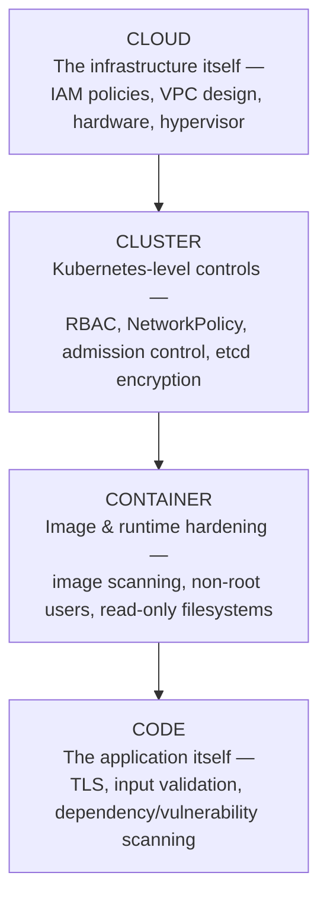

| Layer | What it protects against | Typical controls |
|---|---|---|
| **Cloud** | A compromised host, hypervisor, or cloud account | IAM least privilege, private networking, hardware/firmware trust |
| **Cluster** | A compromised or over-privileged workload affecting the whole cluster | RBAC, NetworkPolicy, admission controllers, encrypted etcd |
| **Container** | A malicious or vulnerable image, or a container escaping its boundary | Image scanning (recall Harbor/Trivy from Chapter 1's landscape), non-root `securityContext`, minimal base images |
| **Code** | Application-level vulnerabilities | Dependency scanning, TLS everywhere, secure coding practices |

### Extending the API server's request pipeline from Chapter 2

Chapter 2, §2.2 briefly mentioned the API server authenticates, authorizes, and admits every request. Here's that pipeline, in full, because Security-competency questions live almost entirely inside these three steps.

**Figure 3-6: Authentication → Authorization → Admission**

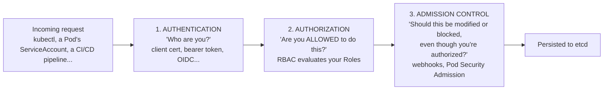

| Step | Answers | Example failure |
|---|---|---|
| **Authentication** | Who is making this request? | Invalid or expired token → `401 Unauthorized` |
| **Authorization** | Is this identity permitted to perform this specific verb on this specific resource? | Valid user, but no RBAC grant → `403 Forbidden` |
| **Admission** | Should this otherwise-valid request be mutated (e.g., inject defaults) or rejected on policy grounds? | Pod requests `privileged: true` in a namespace enforcing the `restricted` Pod Security Standard → rejected |

### RBAC: who can do what, and where

**Figure 3-7: How the RBAC Objects Relate**

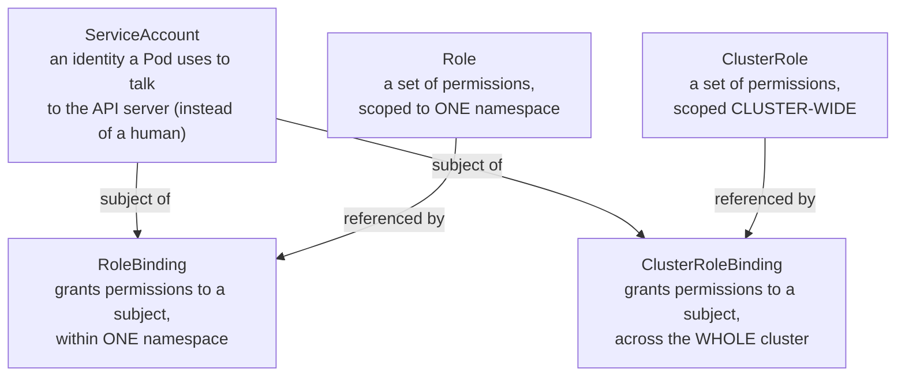

```yaml
apiVersion: v1
kind: ServiceAccount
metadata:
  name: my-app-sa
  namespace: my-namespace
---
apiVersion: rbac.authorization.k8s.io/v1
kind: Role
metadata:
  name: my-app-role
  namespace: my-namespace
rules:
  - apiGroups: [""]
    resources: ["configmaps"]
    verbs: ["get", "list"]        # 🔴 grant only what's actually needed
---
apiVersion: rbac.authorization.k8s.io/v1
kind: RoleBinding
metadata:
  name: my-app-rolebinding
  namespace: my-namespace
subjects:
  - kind: ServiceAccount
    name: my-app-sa
    namespace: my-namespace
roleRef:
  kind: Role
  name: my-app-role
  apiGroup: rbac.authorization.k8s.io
```

```bash
# Verify what an identity can actually do — invaluable for both real debugging
# and for reasoning through RBAC exam scenarios
kubectl auth can-i get pods --as=system:serviceaccount:my-namespace:my-app-sa
kubectl auth can-i --list --as=system:serviceaccount:my-namespace:my-app-sa
```

> **Confusion alert — a `ClusterRole` doesn't automatically mean cluster-wide access.** This is the single most missed nuance in RBAC. A `ClusterRole` is just a *reusable, portable definition* of permissions — where it actually *applies* depends entirely on how it's bound:
> - `ClusterRole` + `ClusterRoleBinding` → the permissions genuinely apply cluster-wide, across every namespace.
> - `ClusterRole` + `RoleBinding` → the permissions apply **only within the one namespace the RoleBinding lives in**, even though the underlying `ClusterRole` is defined once and could be reused this way in many different namespaces.
> This second pattern exists specifically so platform teams can define a permission set once (e.g., "view all pods, configmaps, and services") and hand it out namespace-by-namespace without duplicating the rules. A plain `Role`, by contrast, can **only** ever be bound via a `RoleBinding` in its own namespace — there's no such thing as binding a `Role` cluster-wide.

> **Confusion alert — never deploy an application using the default ServiceAccount.** Every namespace automatically gets a `default` ServiceAccount, and every Pod that doesn't explicitly specify `serviceAccountName` uses it silently. That default account typically has minimal permissions out of the box — but "minimal by default" is not the same as "intentionally scoped," and it's shared by *every* unconfigured Pod in that namespace. Best practice — and the pattern shown above — is to create a dedicated ServiceAccount per application with only the exact permissions it needs, which is precisely the "least privilege" principle from the Cluster layer of the 4 Cs.

### Pod-level hardening: `securityContext`

```yaml
spec:
  securityContext:              # Pod-level defaults
    runAsNonRoot: true
    runAsUser: 1000
    fsGroup: 2000
  containers:
    - name: app
      securityContext:          # container-level, can override Pod-level
        allowPrivilegeEscalation: false
        readOnlyRootFilesystem: true
        capabilities:
          drop: ["ALL"]         # start from zero Linux capabilities, add back only what's needed
```

| Setting | What it prevents |
|---|---|
| `runAsNonRoot: true` | The container refuses to start if its image tries to run as UID 0 (root) |
| `readOnlyRootFilesystem: true` | The container can't write to its own filesystem — limits what a compromise can persist or tamper with |
| `allowPrivilegeEscalation: false` | A process inside the container can't gain more privileges than it started with |
| `capabilities.drop: ["ALL"]` | Strips every Linux capability by default, forcing you to explicitly re-add only what's genuinely required |

### Pod Security Admission: the cluster-wide enforcement layer

> **Confusion alert — PodSecurityPolicy (PSP) is gone. If a resource mentions it as current, that resource is outdated.** PodSecurityPolicy was Kubernetes' original built-in mechanism for enforcing exactly the kind of `securityContext` rules above at admission time. It was deprecated in Kubernetes v1.21 and **fully removed in v1.25**. Its replacement, stable since v1.25, is **Pod Security Admission (PSA)** — a built-in admission controller configured with a simple namespace label, evaluated against the **Pod Security Standards**, which define three levels:

| Pod Security Standard level | What it allows |
|---|---|
| **Privileged** | Unrestricted — effectively opts out of Pod Security Admission entirely |
| **Baseline** | Blocks known privilege-escalation paths, but stays broadly permissive for compatibility |
| **Restricted** | The hardened tier — enforces the kind of `securityContext` settings shown above (non-root, no privilege escalation, dropped capabilities) |

```yaml
apiVersion: v1
kind: Namespace
metadata:
  name: production
  labels:
    pod-security.kubernetes.io/enforce: restricted   # reject non-conforming Pods outright
    pod-security.kubernetes.io/warn: restricted       # warn on apply, without blocking
```

### Secrets: what they actually protect against, and what they don't

```yaml
apiVersion: v1
kind: Secret
metadata:
  name: app-secrets
type: Opaque
stringData:                       # plain text here — Kubernetes base64-encodes it for you
  db-password: "MySecurePassword123!"
```

> **Confusion alert — base64 is encoding, not encryption, and this is one of the most consistently tested facts in cloud native security across every certification, not just KCNA.** A `Secret` object's `data` field stores values as base64 text — trivially reversible by anyone with read access to the object (`kubectl get secret app-secrets -o jsonpath='{.data.password}' | base64 -d` decodes it in one line). Base64 exists to let arbitrary binary data survive being stored as YAML/JSON text — it provides **zero confidentiality**. The actual protections a Secret gives you over a ConfigMap are: (1) Kubernetes avoids printing Secret values in plain `kubectl get`/`describe` output by default, (2) Secrets can be encrypted *at rest in etcd* if the cluster administrator has explicitly configured [encryption at rest](https://kubernetes.io/docs/tasks/administer-cluster/encrypt-data/) — which is **not** the default — and (3) RBAC can restrict who can read Secret objects at all, same as any other resource. If you need genuine secret-management (rotation, external vaults, fine-grained access), that's what tools like the **Secrets Store CSI Driver** or external systems like HashiCorp Vault are for — Kubernetes' native Secret object is a baseline, not a vault.

---

## 3.3 Storage — Persistent Data in an Ephemeral World

### The problem this section solves

Recall from Chapter 2: Pods are ephemeral, and so is a container's own filesystem — when a container restarts, anything it wrote to its local filesystem is gone. Most applications need *some* data to survive that. Kubernetes' storage model exists to solve exactly that, with several tiers depending on how long the data needs to live and how many Pods need to touch it.

### Volume types, from most-temporary to most-durable

| Volume type | Lifespan | Typical use |
|---|---|---|
| **`emptyDir`** | Exists only as long as the Pod does; wiped if the Pod is deleted | Scratch space, or a cache shared *between containers in the same Pod* |
| **`hostPath`** | Tied to a specific node's local filesystem | Rare, use with caution — ties a Pod to one specific machine, breaks portability |
| **`configMap`** | Read-only, mirrors a ConfigMap object | Mounting configuration files into a container |
| **`secret`** | Read-only, mirrors a Secret object | Mounting credentials/certs into a container |
| **`persistentVolumeClaim`** | Outlives the Pod entirely — the whole point of this subsection | Databases, message queues, anything that must survive a Pod being replaced |

```yaml
spec:
  containers:
    - name: app
      volumeMounts:
        - name: cache
          mountPath: /cache
  volumes:
    - name: cache
      emptyDir:
        sizeLimit: 1Gi          # always set a limit — an unbounded emptyDir can fill a node's disk
```

### PersistentVolume, PersistentVolumeClaim, and StorageClass

**Figure 3-8: The Storage Provisioning Architecture**

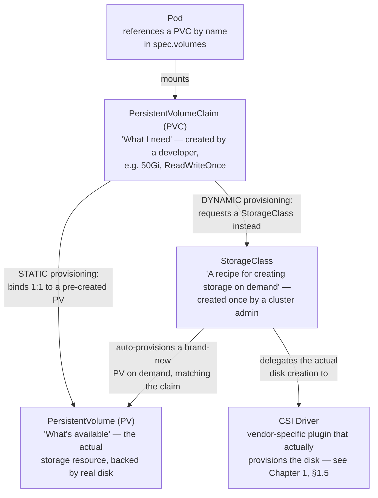

| Concept | Who creates it | What it represents |
|---|---|---|
| **PersistentVolume (PV)** | Usually the system, via dynamic provisioning (rarely a human, directly) | An actual piece of storage — a real disk, share, or cloud volume |
| **PersistentVolumeClaim (PVC)** | An application developer | A *request* for storage with certain properties (size, access mode) — the thing a Pod actually references |
| **StorageClass** | A cluster administrator, once | A named "recipe" (which CSI driver, what disk type, what parameters) that lets PVCs get fulfilled automatically instead of waiting for a human to hand-create a matching PV |

```yaml
# The developer's request — dynamic provisioning via a StorageClass
apiVersion: v1
kind: PersistentVolumeClaim
metadata:
  name: database-pvc
spec:
  accessModes: ["ReadWriteOnce"]
  storageClassName: fast-ssd      # 🔴 which "recipe" to use
  resources:
    requests:
      storage: 50Gi
---
# The Pod simply references the PVC by name — it never talks to a PV or the CSI driver directly
apiVersion: v1
kind: Pod
metadata:
  name: database-pod
spec:
  containers:
    - name: postgres
      image: postgres:15
      volumeMounts:
        - name: data
          mountPath: /var/lib/postgresql/data
  volumes:
    - name: data
      persistentVolumeClaim:
        claimName: database-pvc
```

### Access modes — a very commonly tested table

| Access mode | Meaning | Typical backing storage |
|---|---|---|
| **ReadWriteOnce (RWO)** | Mounted read-write by a single node at a time | Most cloud block storage (AWS EBS, GCP PD, Azure Disk) |
| **ReadOnlyMany (ROX)** | Mounted read-only by many nodes simultaneously | Shared, static reference data |
| **ReadWriteMany (RWX)** | Mounted read-write by many nodes simultaneously | Network filesystems only — NFS, CephFS; **not** most cloud block storage |

> **Confusion alert — "ReadWriteOnce" restricts by *node*, not by *Pod*, and this trips up even experienced practitioners.** The name suggests "one writer, period" — but RWO actually means the volume can be mounted read-write by **one node** at a time. Multiple Pods *on that same node* can, in fact, mount the same RWO volume simultaneously (as of the Kubernetes feature that made this the default expectation). If you need genuinely simultaneous read-write access from Pods spread across *different* nodes, RWO is the wrong choice entirely — you need RWX, backed by a network filesystem that actually supports concurrent multi-node access.

### Reclaim policy: what happens when the PVC is deleted

| Reclaim policy | What happens to the underlying storage when the PVC is deleted |
|---|---|
| **Retain** | The PV and its data survive; it must be manually cleaned up or reused | 
| **Delete** | The underlying storage is deleted along with the PVC — the default for most dynamically provisioned StorageClasses |
| **Recycle** *(deprecated)* | Basic scrub-and-reuse — replaced by dynamic provisioning entirely; you shouldn't see this in current material |

> **Practical rule of thumb worth internalizing for the exam:** `Retain` for anything genuinely critical (a production database), `Delete` for anything disposable (a cache, a scratch volume) — and always double-check which one a StorageClass defaults to before trusting it with important data.

### StatefulSet: when Pod *identity* matters as much as Pod data

A Deployment's Pods are interchangeable — Pod A and Pod B are identical clones, and neither has a persistent identity. Some applications — clustered databases, distributed queues — need each replica to keep the *same* name, the *same* network identity, and the *same* storage volume across restarts. That's what a **StatefulSet** provides, generally paired with a Headless Service (§3.1) for stable per-Pod DNS names and `volumeClaimTemplates` for a dedicated PVC per replica.

```yaml
apiVersion: apps/v1
kind: StatefulSet
metadata:
  name: postgres-cluster
spec:
  serviceName: postgres-headless   # must point to a Headless Service
  replicas: 3
  selector:
    matchLabels: { app: postgres }
  template:
    metadata:
      labels: { app: postgres }
    spec:
      containers:
        - name: postgres
          image: postgres:15
          volumeMounts:
            - name: data
              mountPath: /var/lib/postgresql/data
  volumeClaimTemplates:              # each replica gets its OWN PVC, automatically
    - metadata: { name: data }
      spec:
        accessModes: ["ReadWriteOnce"]
        storageClassName: fast-ssd
        resources:
          requests: { storage: 50Gi }
```

*(This is a conceptual introduction sufficient for KCNA's associate level — full hands-on StatefulSet operational practice belongs to the lab work in Chapter 6.)*

---

## 3.4 Troubleshooting — Reading the Cluster's Vital Signs

### The toolkit, in the order you should actually reach for it

**Figure 3-9: Where to Look First**

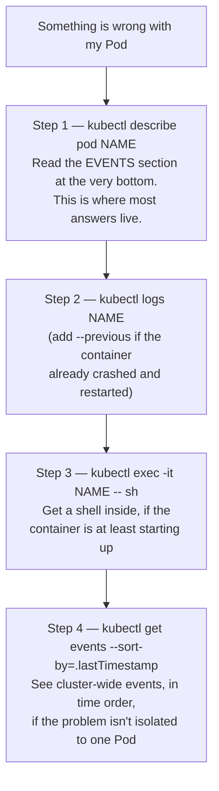

> **Confusion alert — `CrashLoopBackOff` and `ImagePullBackOff` are not Pod *phases*; they're container status *reasons* shown by `kubectl` for your convenience.** Go back to Chapter 2, §2.5's formal Pod lifecycle: `Pending`, `Running`, `Succeeded`, `Failed`, `Unknown` — that's the complete, official list. `CrashLoopBackOff` and `ImagePullBackOff` are strings `kubectl` displays in the `STATUS` column to summarize *why* a container inside a `Pending` or `Running` Pod isn't healthy yet — they describe the **container's** situation, layered underneath the Pod's own phase, not a sixth phase of the Pod itself. This is exactly the distinction promised back in Chapter 2's closing notes.

### Decision tree: Pod stuck in `Pending`

**Figure 3-10: Diagnosing a Pending Pod**

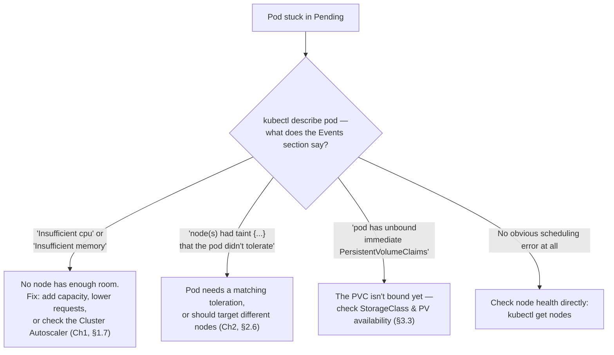

### Decision tree: `CrashLoopBackOff`

**Figure 3-11: Diagnosing a Crashing Container**

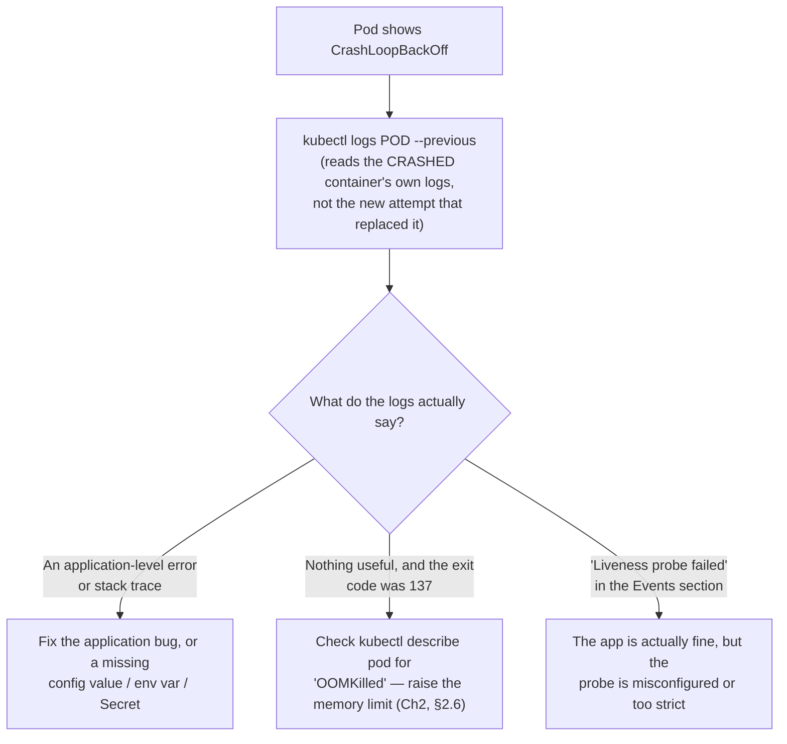

### Decision tree: `ImagePullBackOff` / `ErrImagePull`

**Figure 3-12: Diagnosing an Image Pull Failure**

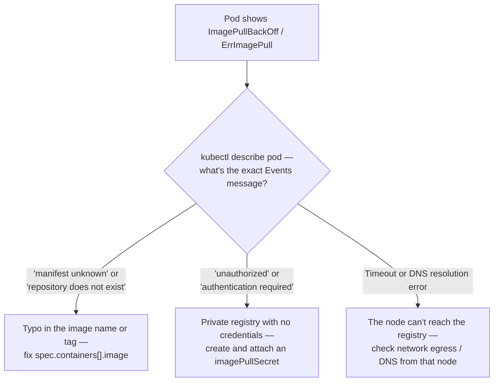

> **`ErrImagePull` vs. `ImagePullBackOff` — they're the same underlying problem, at different moments in time.** `ErrImagePull` is the immediate, first-attempt failure. If it keeps failing on retry, Kubernetes shifts to an exponential backoff retry pattern and the status becomes `ImagePullBackOff` — "I already know this is failing, and I'm waiting longer between each retry." Seeing the status flip between the two over time is completely normal and doesn't indicate two separate problems.

### Decision tree: a Service you can't reach

This one deliberately closes the loop with §3.1 and Chapter 2's label-selector confusion alert — showing exactly how that abstract warning turns into a concrete debugging step.

**Figure 3-13: Diagnosing an Unreachable Service**

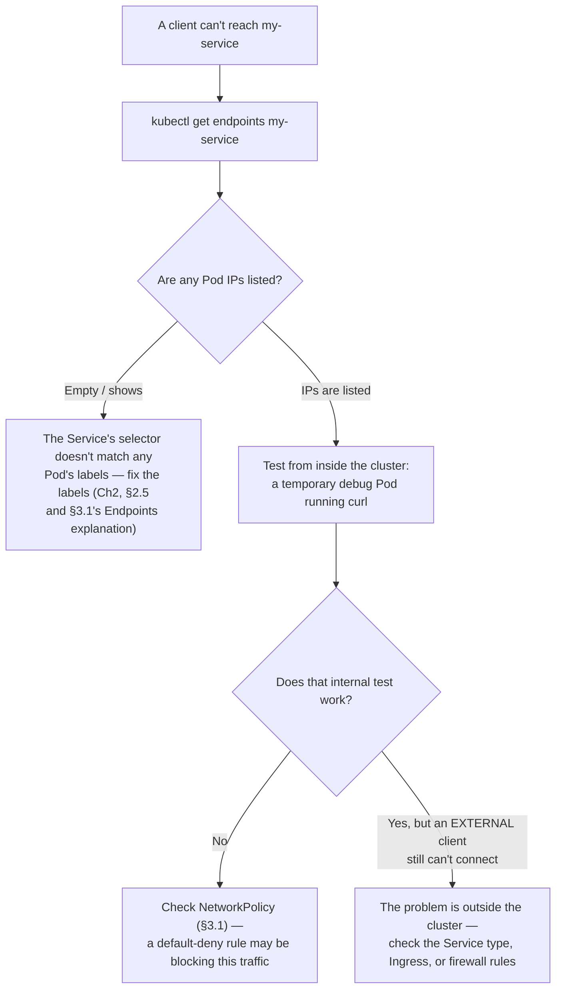

### Exit codes worth recognizing on sight

| Exit code | Meaning | What it tells you |
|---|---|---|
| **0** | Success | The container's main process completed normally |
| **1** | General application error | Something in the app itself failed — check logs |
| **137** | `SIGKILL` — most often **OOMKilled** | The container exceeded its memory limit and was forcibly killed (Chapter 2, §2.6's "memory kills" rule in action) |
| **139** | `SIGSEGV` — segmentation fault | A low-level crash, usually in native/compiled code |
| **143** | `SIGTERM` | A graceful shutdown request — normal during a rolling update or scale-down |

---

## 3.5 Chapter Cheat Sheet

| Term | One-line definition |
|---|---|
| Service | A stable virtual IP + DNS name in front of a changing set of Pods |
| ClusterIP / NodePort / LoadBalancer | Each is a superset of the previous — internal-only → +static node port → +cloud load balancer |
| Headless Service | `clusterIP: None` — DNS returns individual Pod IPs instead of load-balancing them |
| Endpoints / EndpointSlice | The live, resolved list of Pod IPs a Service's selector currently matches |
| Ingress | L7 (HTTP/HTTPS) routing and TLS termination, in front of one or more Services — needs an Ingress *controller* to do anything |
| NetworkPolicy | Additive, allow-only rules — a Pod is default-deny the moment *any* policy selects it |
| 4 Cs | Cloud → Cluster → Container → Code — each layer secures the one inside it |
| RBAC (Role/ClusterRole + RoleBinding/ClusterRoleBinding) | Role/RoleBinding = namespace-scoped; ClusterRole can be bound either cluster-wide (via ClusterRoleBinding) or namespace-scoped (via RoleBinding) |
| ServiceAccount | An identity a Pod uses to talk to the API server — never leave a Pod on the `default` one |
| Pod Security Admission | The current (post-PSP) enforcement mechanism — Privileged / Baseline / Restricted, set via a namespace label |
| Secret | Base64-**encoded**, not encrypted, by default — protects via RBAC + optional etcd encryption, not via the encoding itself |
| PV / PVC / StorageClass | PV = actual storage, PVC = a developer's request for storage, StorageClass = the admin's recipe for fulfilling PVCs automatically |
| RWO / ROX / RWX | Single-node read-write / multi-node read-only / multi-node read-write (needs a network filesystem) |
| StatefulSet | Like a Deployment, but each replica keeps a stable name, network identity, and its own dedicated PVC |
| `kubectl describe` events | The single highest-value first step in almost any troubleshooting scenario |
| CrashLoopBackOff / ImagePullBackOff | Container status *reasons*, not Pod *phases* |
| Exit code 137 / 143 | OOMKilled / graceful SIGTERM |

---

## 3.6 Practice Questions (Original, Unofficial)

**These are original questions written for this guide, in the style and difficulty range of the public KCNA curriculum. They are not real exam questions, and reproducing or soliciting actual exam content would violate the Linux Foundation's Certification Agreement.**

---

**Q1.** Which Service type is a strict superset of `NodePort`, additionally provisioning an external load balancer through the underlying cloud provider?

A. ClusterIP
B. ExternalName
C. LoadBalancer
D. Headless

<details>
<summary>Answer & explanation</summary>

**Correct answer: C.** The three main Service types build on each other: ClusterIP (internal only) → NodePort (adds a static port on every node) → LoadBalancer (adds a cloud-provisioned external load balancer on top of NodePort's behavior).
</details>

---

**Q2.** `kubectl get endpoints my-service` returns no IP addresses at all. What is the most likely cause?

A. The cluster has run out of available IP addresses
B. The Service's selector does not match the labels on any running Pod
C. NetworkPolicy is blocking all traffic to the Service
D. The Ingress controller has not been installed

<details>
<summary>Answer & explanation</summary>

**Correct answer: B.** An empty Endpoints/EndpointSlice object means the Service's label selector isn't matching any currently-running Pod's labels — this is the concrete symptom of the label-mismatch problem, and it produces no error at Service-creation time, only a silently empty routing target.
</details>

---

**Q3.** An Ingress object has been created and applied successfully with `kubectl apply`, but requests to its configured host still fail entirely. What is a likely explanation?

A. Ingress objects are deprecated in favor of Services
B. No Ingress controller is running in the cluster to act on the Ingress object
C. Ingress only works with the ClusterIP Service type
D. The Ingress object must be recreated every 24 hours

<details>
<summary>Answer & explanation</summary>

**Correct answer: B.** An Ingress object is only a set of routing rules; it requires a separately deployed Ingress controller (e.g., NGINX Ingress Controller) to actually watch for and act on it. Without one running, the Ingress object is inert.
</details>

---

**Q4.** By default, with no NetworkPolicy objects present anywhere in a cluster, what is the network behavior between two Pods in different namespaces?

A. All traffic between them is denied by default
B. All traffic between them is allowed by default
C. Only traffic on port 80 is allowed by default
D. Traffic is allowed only within the same namespace by default

<details>
<summary>Answer & explanation</summary>

**Correct answer: B.** With zero NetworkPolicies applied, Kubernetes allows all Pod-to-Pod traffic by default, even across namespace boundaries. NetworkPolicies exist specifically to restrict this open-by-default behavior — a Pod only becomes default-deny in a given direction once at least one policy selects it.
</details>

---

**Q5.** A `ClusterRole` named `viewer` is bound to a ServiceAccount using a `RoleBinding` in the `team-a` namespace. What is the effective scope of the resulting permissions?

A. Cluster-wide, across every namespace
B. Only within the `team-a` namespace
C. No permissions are granted — ClusterRoles cannot be used with RoleBindings
D. Only within the `kube-system` namespace

<details>
<summary>Answer & explanation</summary>

**Correct answer: B.** A ClusterRole is a reusable permission definition; its actual scope is determined by what binds it. Bound via a RoleBinding, its permissions apply only within that RoleBinding's own namespace — even though the same ClusterRole could be reused the same way in other namespaces. Only a ClusterRoleBinding grants truly cluster-wide scope.
</details>

---

**Q6.** What is the correct characterization of how Kubernetes Secrets store their values by default?

A. Encrypted with AES-256 automatically
B. Base64-encoded, which provides confidentiality equivalent to encryption
C. Base64-encoded, which is reversible and does not by itself provide confidentiality
D. Stored as plain, unencoded text

<details>
<summary>Answer & explanation</summary>

**Correct answer: C.** Secret values are base64-encoded, not encrypted — base64 is a reversible encoding format, not a cryptographic one. Genuine confidentiality requires additional measures like RBAC restriction and optionally encryption at rest for etcd, which is not the default configuration.
</details>

---

**Q7.** A team needs multiple Pods, scheduled across different nodes, to simultaneously read and write to the same volume. Which PersistentVolumeClaim access mode is required, and what kind of backing storage does it typically need?

A. ReadWriteOnce, backed by cloud block storage such as AWS EBS
B. ReadOnlyMany, backed by any storage type
C. ReadWriteMany, backed by a network filesystem such as NFS
D. ReadWriteOnce, which already supports multi-node access

<details>
<summary>Answer & explanation</summary>

**Correct answer: C.** Simultaneous read-write access from Pods on different nodes requires ReadWriteMany (RWX), which is only supported by network filesystems (NFS, CephFS, etc.) — most cloud block storage (EBS, Persistent Disk, Azure Disk) only supports ReadWriteOnce, limited to a single node at a time.
</details>

---

**Q8.** Which statement correctly distinguishes a `PersistentVolume` from a `PersistentVolumeClaim`?

A. A PersistentVolume is a developer's request for storage; a PersistentVolumeClaim is the actual storage resource
B. A PersistentVolumeClaim is a developer's request for storage; a PersistentVolume is the actual storage resource
C. They are interchangeable terms for the same object
D. A PersistentVolumeClaim can only be created by a cluster administrator

<details>
<summary>Answer & explanation</summary>

**Correct answer: B.** A PersistentVolumeClaim represents what an application needs ("50Gi, ReadWriteOnce"), typically created by a developer. A PersistentVolume represents the actual, real storage resource — either pre-created by an administrator (static provisioning) or automatically generated via a StorageClass (dynamic provisioning).
</details>

---

**Q9.** A Pod's status shows `CrashLoopBackOff`. What is the correct first diagnostic step, and why?

A. `kubectl delete pod` immediately, since the Pod is unrecoverable
B. `kubectl logs <pod> --previous`, to see the logs from the crashed container instance rather than a fresh, empty restart
C. `kubectl scale` the Deployment to zero replicas
D. Restart the entire cluster's control plane

<details>
<summary>Answer & explanation</summary>

**Correct answer: B.** Using `--previous` retrieves logs from the container instance that actually crashed, rather than the newly started replacement, which likely hasn't logged the error yet (or at all, if it crashes again immediately). This is the standard first step before deciding whether the issue is application-level, a resource limit, or a probe misconfiguration.
</details>

---

**Q10.** A container's process was terminated with exit code 137. What does this most likely indicate?

A. The application exited successfully
B. A segmentation fault occurred in native code
C. The container was killed for exceeding its memory limit (OOMKilled)
D. The container received a graceful shutdown signal during a rolling update

<details>
<summary>Answer & explanation</summary>

**Correct answer: C.** Exit code 137 corresponds to SIGKILL, most commonly seen in Kubernetes as the result of a container being OOMKilled after exceeding its configured memory limit — consistent with Chapter 2's rule that memory limit violations result in termination, not throttling.
</details>

---

## 3.7 Sources & Further Reading

**Tier 1 — Official, authoritative for exam facts**
- [KCNA certification page — domains, weights, price, policy](https://training.linuxfoundation.org/certification/kubernetes-cloud-native-associate/)
- [Official CNCF curriculum PDF](https://github.com/cncf/curriculum/blob/master/KCNA_Curriculum.pdf)

**Tier 2 — Primary technical documentation**
- [Services](https://kubernetes.io/docs/concepts/services-networking/service/)
- [Ingress](https://kubernetes.io/docs/concepts/services-networking/ingress/)
- [Ingress Controllers](https://kubernetes.io/docs/concepts/services-networking/ingress-controllers/)
- [Network Policies](https://kubernetes.io/docs/concepts/services-networking/network-policies/)
- [DNS for Services and Pods](https://kubernetes.io/docs/concepts/services-networking/dns-pod-service/)
- [Controlling Access to the Kubernetes API](https://kubernetes.io/docs/concepts/security/controlling-access/)
- [Using RBAC Authorization](https://kubernetes.io/docs/reference/access-authn-authz/rbac/)
- [Configure a Security Context for a Pod or Container](https://kubernetes.io/docs/tasks/configure-pod-container/security-context/)
- [Pod Security Admission](https://kubernetes.io/docs/concepts/security/pod-security-admission/)
- [Pod Security Standards](https://kubernetes.io/docs/concepts/security/pod-security-standards/)
- [Secrets](https://kubernetes.io/docs/concepts/configuration/secret/)
- [Encrypting Confidential Data at Rest](https://kubernetes.io/docs/tasks/administer-cluster/encrypt-data/)
- [Persistent Volumes](https://kubernetes.io/docs/concepts/storage/persistent-volumes/)
- [Storage Classes](https://kubernetes.io/docs/concepts/storage/storage-classes/)
- [StatefulSets](https://kubernetes.io/docs/concepts/workloads/controllers/statefulset/)
- [Debug Running Pods](https://kubernetes.io/docs/tasks/debug/debug-application/debug-running-pod/)
- [Determine the Reason for Pod Failure](https://kubernetes.io/docs/tasks/debug/debug-application/determine-reason-pod-failure/)

---

## 3.8 What I Assumed, and Questions Back to You

1. **Question count held at 10, matching Chapter 2 rather than scaling strictly by weight** (28% here vs. 44% there) — I made this call because this domain has *four* distinct competencies needing real coverage each, versus Chapter 2's tighter focus, so I prioritized breadth-per-competency (roughly 2-3 questions each) over strict proportionality. Flag it if you'd rather I hew closer to pure weight-based scaling (which would put this chapter around 6-7 questions).
2. **StatefulSets got a deliberately light, conceptual treatment** (§3.3) rather than the full field-by-field anatomy given to Deployments in Chapter 2 — I judged that appropriate for KCNA's associate-level "recognize and understand," saving full hands-on StatefulSet practice for Chapter 6's labs. Say the word if you want StatefulSets brought up to Deployment-level depth here instead.
3. **Service Mesh (Istio/Linkerd) was intentionally left out of this chapter** even though the `networking.md` reference material covered it — it's Chapter 1 landscape territory (mentioned there as graduated projects) rather than a KCNA Networking-competency requirement, and going deep on VirtualService/DestinationRule felt like it would blur this chapter's scope. Let me know if you want a dedicated service mesh subsection added.
4. **The four decision-tree diagrams in §3.4** (Pending, CrashLoopBackOff, ImagePullBackOff, unreachable Service) are the most "practical playbook" content in the guide so far — closer to real on-the-job debugging than typical exam trivia. If that's more operational depth than you want for an exam-prep guide, I can trim them down; if you'd like *more* of this practitioner-style material throughout, tell me and I'll lean into it for Chapter 4 onward.

Say "continue" and I'll move on to **Chapter 4: Cloud Native Application Delivery** — CI/CD, GitOps, and Debugging — at the same standard.
