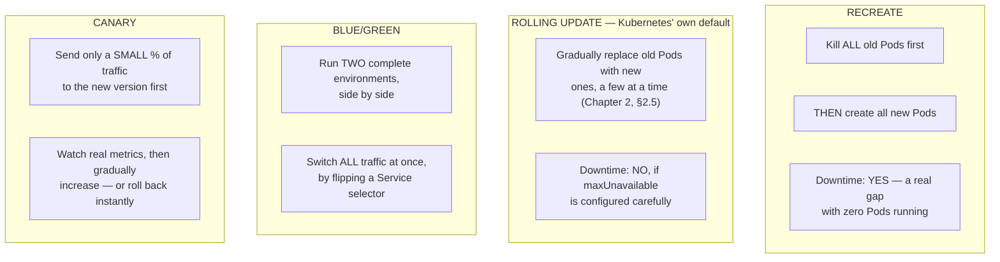
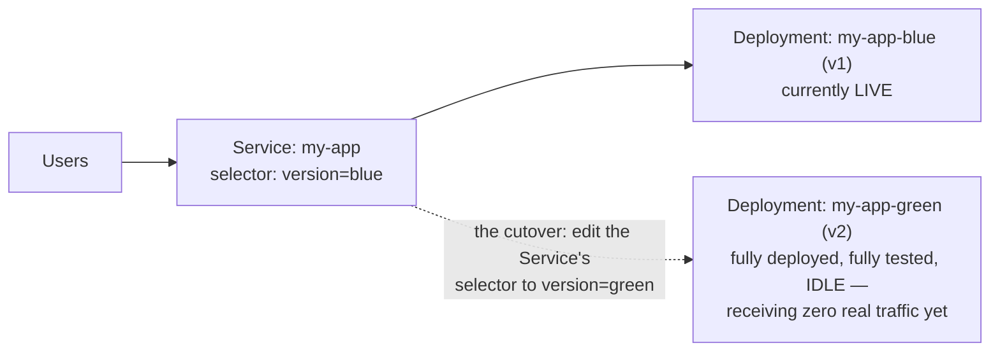
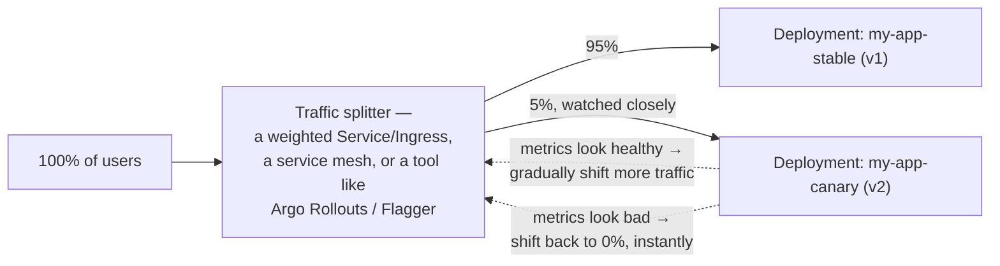
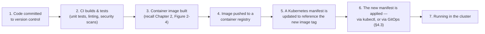
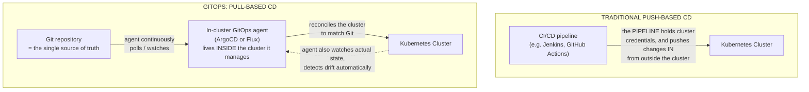
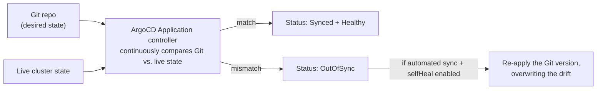
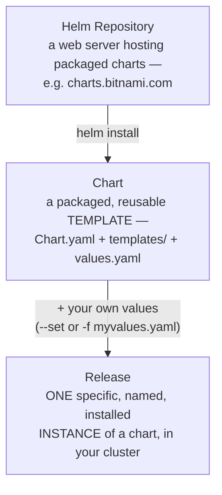
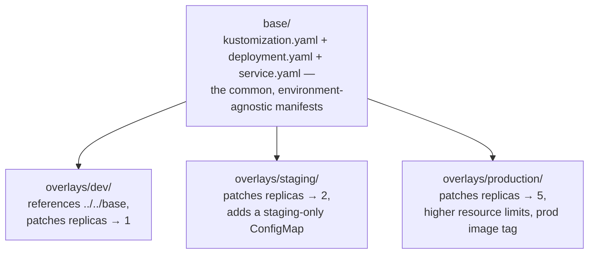
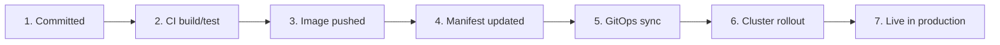

# Chapter 4: Cloud Native Application Delivery — Getting Code Safely Into Production

*KCNA Prep Guide Writer | Facts re-verified against official Kubernetes, ArgoCD, Flux, and Helm documentation. Tooling in this space (ArgoCD, Flux, Helm, Kustomize) evolves faster than core Kubernetes — treat CLI syntax as illustrative and always confirm against current docs before running it for real.*

---

## 4.0 Chapter Orientation

### What this chapter covers

On the live [official KCNA exam page](https://training.linuxfoundation.org/certification/kubernetes-cloud-native-associate/), **Cloud Native Application Delivery is worth 16% of the exam**, spanning two official competencies:

> **Cloud Native Application Delivery — 16%** — *Application Delivery*, *Debugging*.

Chapters 2 and 3 answered "how does a cluster run my application." This chapter answers a different question: "how does my code *get* into that cluster, safely, repeatedly, and in a way I can trust and reverse." That's a distinct discipline with its own vocabulary — deployment strategies, GitOps, packaging tools — and its own failure modes.

### A necessary distinction: this chapter's "Debugging" vs. Chapter 3's "Troubleshooting"

The KCNA curriculum splits diagnostic skills across two different domains, and it's worth being explicit about the split rather than letting the two blur together, since the vocabulary genuinely overlaps.

| | Chapter 3's **Troubleshooting** (Container Orchestration) | This chapter's **Debugging** (Application Delivery) |
|---|---|---|
| **The question being asked** | "Is my *running workload* healthy right now?" | "Did my *delivery process* work correctly?" |
| **Typical symptom** | A Pod is `Pending`, `CrashLoopBackOff`, or unreachable | A rollout is stuck, a GitOps sync is failing, a canary never promoted |
| **Typical first command** | `kubectl describe pod`, `kubectl logs` | `kubectl rollout status`, `argocd app get`, `flux get kustomizations` |
| **Where the root cause usually lives** | Inside the cluster — resources, scheduling, networking | Upstream of the cluster — the pipeline, the manifest, the sync process |

Keep that framing in mind as you read — this is my own organizational choice as the guide's author to keep the two competencies clearly separated rather than duplicating content, not a literal quote from the curriculum's phrasing. The underlying `kubectl` commands sometimes overlap; the *reasoning path* that gets you to them does not.

---

## 4.1 Deployment Strategies: Recreate, Rolling Update, Blue/Green, Canary

Every release strategy is answering the same underlying question — "how do I replace version 1 with version 2 without breaking things for users" — with a different trade-off between **downtime**, **rollback speed**, and **resource cost**.

**Figure 4-1: The Four Strategies, Side by Side**



### Recreate and Rolling Update: the two *native* Kubernetes strategies

These are the only two values Kubernetes' own `Deployment` object actually understands in its `spec.strategy.type` field.

```yaml
spec:
  strategy:
    type: Recreate     # the only alternative to RollingUpdate (Chapter 2, §2.5)
```

| Strategy | How it works | When it's the right call |
|---|---|---|
| **Recreate** | Scale the old ReplicaSet to 0, *then* scale the new one up | Only when the app genuinely cannot run two versions simultaneously — e.g., a schema-incompatible database migration that must complete before any new code runs |
| **RollingUpdate** | Incrementally swap Pods, governed by `maxSurge`/`maxUnavailable` (Chapter 2, Figure 2-9) | The default, sensible choice for the overwhelming majority of stateless applications |

### Blue/Green and Canary: patterns, not native Deployment strategy types

**Figure 4-2: Blue/Green — Two Full Environments, One Instant Cutover**



**Figure 4-3: Canary — a Small, Watched Slice of Traffic First**



> **Confusion alert — this is the single most common misconception in this whole domain, so read it twice.** Because `RollingUpdate` and `Recreate` are literal, documented values of a Kubernetes `Deployment`'s `spec.strategy.type` field, it's extremely natural to assume `BlueGreen` and `Canary` are two more values in that same list. **They are not.** Kubernetes core has no native concept of Blue/Green or Canary deployment at all. Both are **architectural patterns**, achieved by running **multiple independent Deployments simultaneously** and controlling which one receives traffic through something *external* to the Deployment object itself — a Service selector swap (Blue/Green), or a weighted traffic-splitting layer like a service mesh, a smarter Ingress controller, or a purpose-built progressive-delivery controller such as **Argo Rollouts** or **Flagger** (Canary). If a question asks "which `strategy.type` implements Canary deployment," the trap answer is inventing one that doesn't exist — the honest answer is that you need additional tooling beyond a plain Deployment.

| Strategy | Downtime | Rollback speed | Resource cost while transitioning | Blast radius if something's wrong |
|---|---|---|---|---|
| Recreate | Yes | Slow (must recreate old version too) | Low — never runs two versions at once | 100% of users, immediately |
| RollingUpdate | No (if tuned well) | Moderate (`kubectl rollout undo`, Chapter 2 §2.5) | Slightly elevated (extra Pods during `maxSurge`) | A shrinking % of users as the rollout proceeds |
| Blue/Green | No | **Instant** — just flip the selector back | High — two full environments running at once | 100% of users, but only after cutover, and reversible in seconds |
| Canary | No | Fast — shift weight back to 0% | Moderate — a small extra deployment | A small, deliberately limited % of users, by design |

---

## 4.2 CI/CD Fundamentals in a Cloud Native Context

### CI, Continuous Delivery, and Continuous Deployment are three different guarantees

| Term | What's automated | What still requires a human |
|---|---|---|
| **Continuous Integration (CI)** | Every code change is automatically built and tested | Everything past that — merging, releasing, deploying |
| **Continuous Delivery** | CI, plus the build is automatically packaged into a release that is *always* in a deployable state | The actual decision to push that release to production |
| **Continuous Deployment** | Continuous Delivery, plus every change that passes all checks is automatically released to production | Nothing — no human gate at all |

> **Confusion alert — "Continuous Delivery" and "Continuous Deployment" are often used interchangeably in casual conversation, but they encode a meaningfully different risk posture.** Delivery keeps a human decision point before production; Deployment removes it entirely. A team choosing "CD" needs to know which one they actually mean — the acronym alone is ambiguous, and this exact ambiguity is a realistic thing to test.

### From commit to running container: the full pipeline

Chapter 1, §1.6 introduced the DevOps lifecycle loop from a *personas* angle (who owns each stage). Here it is again, now from a *delivery mechanics* angle — connecting directly to the containerization pipeline from Chapter 2, §2.3.

**Figure 4-4: From Commit to Running Container**



---

## 4.3 GitOps — Git as the Single Source of Truth

### The four defining principles

GitOps is a specific, formalized set of properties — not just a synonym for "we keep our YAML in a Git repo." These four principles are commonly cited and have been formalized by the community-driven **OpenGitOps** initiative (`opengitops.dev`):

1. **Declarative** — the entire desired system state is expressed declaratively (recall Chapter 2, §2.1).
2. **Versioned and immutable** — that desired state is stored in a way that enforces versioning and immutability, in practice: Git.
3. **Pulled automatically** — software agents automatically pull the desired state from the source, rather than an external system pushing it in.
4. **Continuously reconciled** — those agents continuously observe actual system state and work to reconcile it toward the declared desired state.

### The architectural shift that actually matters: push vs. pull

This is the single most important diagram in this section, because it's the real reason GitOps is considered a security *and* reliability improvement over "just running `kubectl apply` from a CI pipeline" — not merely a stylistic preference.

**Figure 4-5: Push-Based CD vs. Pull-Based GitOps**



> **Confusion alert — why "pull" is genuinely more than a preference.** In the push model, *something outside the cluster* — a CI runner, a laptop, a Jenkins agent — must hold live, powerful credentials capable of writing to your production cluster. That's a real, standing attack surface: compromise the CI system, and you've compromised the cluster. In the pull model, the credential relationship is inverted: the **agent lives inside the cluster it manages**, and it is the *only* thing with write access — nothing external ever needs cluster-admin credentials at all, because nothing external ever reaches in. The agent reaches *out* to Git (a read operation) instead. This is also exactly what enables the fourth GitOps principle, **continuous reconciliation**: because the agent is a long-running, in-cluster process rather than a one-shot pipeline step, it can keep comparing live state to Git *forever*, not just at deploy time.

> **Confusion alert — this is why manually editing a GitOps-managed resource with `kubectl edit` often feels broken.** If a Deployment is managed by ArgoCD or Flux with automated sync enabled, and you manually `kubectl edit` it to make an emergency change directly against the cluster, don't be surprised when your change silently disappears moments later. That's not a bug — it's **principle 4 (continuous reconciliation) working exactly as designed**: the agent detected that live state no longer matched Git's declared state, and "self-healed" it back. The correct emergency fix in a GitOps-managed system is *always* to change Git first, never the live cluster directly — anything else is a losing battle against the reconciliation loop.

### ArgoCD architecture



```yaml
apiVersion: argoproj.io/v1alpha1
kind: Application
metadata:
  name: myapp
  namespace: argocd
spec:
  project: default
  source:
    repoURL: https://github.com/myorg/myapp-manifests.git
    targetRevision: main
    path: overlays/production        # note: a Kustomize overlay — see §4.4
  destination:
    server: https://kubernetes.default.svc
    namespace: production
  syncPolicy:
    automated:
      prune: true          # delete resources removed from Git
      selfHeal: true        # the "revert manual kubectl edits" behavior above
```

### Flux architecture

Flux takes the same underlying idea, split into a small set of composable controllers rather than one monolithic Application object.

```yaml
# 1. Where the desired state lives
apiVersion: source.toolkit.fluxcd.io/v1
kind: GitRepository
metadata:
  name: myapp
  namespace: flux-system
spec:
  interval: 1m
  url: https://github.com/myorg/myapp-manifests
  ref:
    branch: main
---
# 2. How and where to reconcile it
apiVersion: kustomize.toolkit.fluxcd.io/v1
kind: Kustomization
metadata:
  name: myapp
  namespace: flux-system
spec:
  interval: 10m
  sourceRef:
    kind: GitRepository
    name: myapp
  path: ./overlays/production
  prune: true
  targetNamespace: production
```

### ArgoCD vs. Flux, at a glance

| | ArgoCD | Flux |
|---|---|---|
| **User interface** | Built-in web UI | CLI-first; UI is a separate, third-party project |
| **Core model** | One `Application` object per app | Composable controllers (`GitRepository`, `Kustomization`, `HelmRelease`...) |
| **Multi-tenancy** | `AppProject` objects | Plain Kubernetes namespaces + RBAC |
| **Helm support** | Native, built-in | Via a dedicated `HelmRelease` controller |

*(This is intentionally a conceptual comparison, not an exhaustive feature matrix — for KCNA's purposes, knowing that both exist, both implement the same GitOps principles, and both are pull-based reconciling agents matters far more than memorizing every feature difference.)*

---

## 4.4 Packaging & Templating — Helm and Kustomize

Both tools solve a real, shared problem — "I don't want to hand-maintain near-identical YAML for dev, staging, and production" — but they solve it with philosophically different approaches, which is exactly why both exist and why teams sometimes use both together.

### Helm: templating

**Figure 4-6: Chart, Release, and Repository — three terms that get conflated constantly**



| Term | What it actually is |
|---|---|
| **Chart** | The reusable, templated *package* — think "class" |
| **Release** | One installed, running *instance* of a Chart in a cluster, with a specific set of values — think "object instance." The same Chart installed three times (dev/staging/prod) produces three distinct Releases. |
| **Repository** | Where Charts are hosted and discovered from, conceptually similar to a container registry but for Helm Charts |

```
mychart/
├── Chart.yaml           # 🔴 name, version, metadata
├── values.yaml          # 🔴 default configuration values
├── templates/           # 🔴 Go-templated Kubernetes manifests
│   ├── deployment.yaml
│   ├── service.yaml
│   └── ingress.yaml
└── charts/              # 🟢 dependency sub-charts (e.g., a bundled Redis chart)
```

```yaml
# values.yaml — plain configuration, no templating
replicaCount: 3
image:
  repository: myregistry.io/myapp
  tag: "2.5.0"
```

```yaml
# templates/deployment.yaml — {{ }} syntax pulls values in at install time
apiVersion: apps/v1
kind: Deployment
metadata:
  name: {{ .Release.Name }}-myapp
spec:
  replicas: {{ .Values.replicaCount }}
  template:
    spec:
      containers:
        - name: myapp
          image: "{{ .Values.image.repository }}:{{ .Values.image.tag }}"
```

```bash
helm install my-release ./mychart -f values-production.yaml   # create a new Release
helm upgrade my-release ./mychart --set image.tag=2.6.0        # change an existing Release
helm rollback my-release 1                                     # back to revision 1
helm uninstall my-release                                      # remove it entirely
helm template ./mychart                                        # render the YAML locally, without installing anything
helm lint ./mychart                                             # validate chart structure and syntax
```

### Kustomize: patching, not templating

Kustomize takes the opposite philosophical approach: instead of writing a *template* with placeholder variables, you write plain, complete, valid YAML once as a **base**, and layer small, targeted **patches** on top of it per environment — with no `{{ }}` syntax anywhere. It's built directly into `kubectl` (`kubectl apply -k`) and maintained under the `kubernetes-sigs` GitHub organization.

**Figure 4-7: Base and Overlays**



```yaml
# base/kustomization.yaml
apiVersion: kustomize.config.k8s.io/v1beta1
kind: Kustomization
resources:
  - deployment.yaml
  - service.yaml
```

```yaml
# overlays/production/kustomization.yaml
apiVersion: kustomize.config.k8s.io/v1beta1
kind: Kustomization
resources:
  - ../../base
replicas:
  - name: my-app
    count: 5
images:
  - name: myapp
    newTag: "2.5.0"
```

```bash
kubectl apply -k overlays/production/     # render + apply in one step, no separate tool needed
kubectl kustomize overlays/production/    # just render, to preview the final YAML
```

> **Confusion alert — "which one should I use, Helm or Kustomize?" is a legitimate, frequently-asked question, and the honest answer is that they're not strict competitors.** Helm is the better fit when you need **parameterized, reusable, distributable packages** — think installing a third-party piece of software like Redis or Prometheus, where you have no desire to hand-edit its internals, just to configure it through published `values.yaml` options. Kustomize is the better fit when you **own the YAML yourself** and want small, explicit, readable environment-specific differences layered on top of it, without introducing a templating language at all. In practice, many real-world setups use **both together** — a Helm chart's output rendered once via `helm template`, then further customized per-environment with Kustomize patches, or (as shown in ArgoCD's `Application` example in §4.3) a GitOps tool pointing at a Kustomize overlay that happens to reference an upstream Helm-rendered base.

---

## 4.5 Debugging the Delivery Pipeline

Reusing Figure 4-4's numbered stages, here's what to check at each one — the practical payoff of this chapter's competency.

**Figure 4-8: Where the Pipeline Can Fail, and Where to Look**



| Stage | Symptom of failure | Where to look |
|---|---|---|
| **2. CI build/test** | Pipeline goes red before an image is even built | CI system's own logs — this is outside Kubernetes entirely |
| **3. Image pushed** | Build succeeds, but the registry never receives the image | Registry authentication, network egress from the CI runner |
| **4. Manifest updated** | The image exists, but nothing in Git references the new tag | Whatever automation is supposed to bump the tag — a broken image-update step |
| **5. GitOps sync** | Git is correct, but the cluster hasn't changed | `argocd app get myapp` / `flux get kustomizations` — look for a sync error, not a cluster error |
| **6. Cluster rollout** | GitOps successfully applied the manifest, but the new Pods won't come up | `kubectl rollout status`, `kubectl describe pod` — this is where Chapter 3's Troubleshooting toolkit takes back over |
| **7. Live in production** | The rollout finished, but a canary/Blue-Green cutover never completed | Traffic-splitter or progressive-delivery controller status (e.g., a `Canary` object's own conditions, if using Flagger) |

```bash
# Inspect a GitOps tool's own view of reality — distinct from kubectl describe pod
argocd app get myapp                    # ArgoCD: sync status, health, last operation
argocd app diff myapp                   # ArgoCD: exactly what differs from Git

flux get kustomizations                 # Flux: reconciliation status across the fleet
flux logs --level=error                 # Flux: recent reconciliation errors

# Once you've confirmed the CORRECT manifest actually reached the cluster,
# Chapter 3's toolkit takes over from here:
kubectl rollout status deployment/myapp
kubectl describe pod <pod-name>
```

> **Confusion alert — a "healthy" `kubectl get pods` doesn't mean your delivery pipeline succeeded, and a failed rollout doesn't always mean your application is broken.** These two chapters' diagnostic lenses can point at the exact same moment in time and disagree about where to look next. A canary stuck at 5% traffic forever, with every Pod reporting perfectly healthy, is a **delivery** problem (the progressive-delivery controller's promotion criteria were never met) — not a **cluster** problem. Conversely, a GitOps tool cheerfully reporting `Synced` and `Healthy` while users see errors usually means the *manifest itself* was wrong in a way Kubernetes will happily accept (e.g., a valid but incorrect image tag) — which sends you straight back into Chapter 3's `kubectl describe`/`kubectl logs` toolkit. Knowing which lens to reach for first is most of what the Debugging competency is actually testing.

---

## 4.6 Chapter Cheat Sheet

| Term | One-line definition |
|---|---|
| Recreate | Native `strategy.type` — kill everything old, then start everything new; causes downtime |
| RollingUpdate | Native `strategy.type` and Kubernetes' default — gradual, zero-downtime replacement |
| Blue/Green | **Not** a native strategy — two full environments, instant traffic cutover via a Service selector swap |
| Canary | **Not** a native strategy — a small, watched % of traffic to the new version, via external traffic-splitting tooling |
| Continuous Integration | Automated build + test on every change |
| Continuous Delivery | CI + always-releasable artifact; a human still decides to release |
| Continuous Deployment | CI + fully automatic release, no human gate |
| GitOps | Declarative + versioned + **pulled** + continuously **reconciled** — Git as the single source of truth |
| Push-based CD | An external system holds cluster credentials and pushes changes in |
| Pull-based CD (GitOps) | An in-cluster agent holds all the write access and pulls from Git |
| Self-heal | A GitOps agent automatically reverting manual, out-of-Git cluster changes |
| ArgoCD / Flux | The two leading CNCF GitOps tools — one `Application` object vs. composable controllers |
| Chart | A reusable, templated Helm package |
| Release | One installed, named instance of a Chart |
| Helm Repository | Where Charts are hosted and discovered |
| Kustomize base/overlay | Plain YAML once, small explicit patches per environment — no templating language |
| Pipeline vs. cluster debugging | "Did delivery work?" (this chapter) vs. "Is the running workload healthy?" (Chapter 3) |

---

## 4.7 Practice Questions (Original, Unofficial)

**These are original questions written for this guide, in the style and difficulty range of the public KCNA curriculum. They are not real exam questions, and reproducing or soliciting actual exam content would violate the Linux Foundation's Certification Agreement.**

---

**Q1.** Which of the following are valid values for a native Kubernetes Deployment's `spec.strategy.type` field?

A. `BlueGreen` and `Canary`
B. `Recreate` and `RollingUpdate`
C. `Canary` and `RollingUpdate`
D. `Recreate` and `BlueGreen`

<details>
<summary>Answer & explanation</summary>

**Correct answer: B.** Kubernetes' Deployment object natively supports exactly two strategy types: `Recreate` and `RollingUpdate`. Blue/Green and Canary are architectural patterns implemented with additional tooling (multiple Deployments plus a traffic-splitting mechanism), not native strategy values.
</details>

---

**Q2.** In a Blue/Green deployment, how is traffic actually cut over from the old version to the new one?

A. Kubernetes automatically shifts traffic gradually over several minutes
B. A Service's label selector is updated to point at the new Deployment's Pods
C. The old Deployment's Pods are deleted one at a time
D. DNS records for the cluster are manually changed

<details>
<summary>Answer & explanation</summary>

**Correct answer: B.** Blue/Green relies on running two complete environments simultaneously and flipping a Service's selector from the old (blue) Deployment's labels to the new (green) Deployment's labels — an effectively instantaneous, easily reversible cutover.
</details>

---

**Q3.** What is the fundamental architectural difference between a traditional push-based CD pipeline and a GitOps pull-based approach?

A. Push-based CD is always faster than GitOps
B. In GitOps, an in-cluster agent pulls from Git; in push-based CD, an external system holds cluster credentials and pushes changes in
C. GitOps does not support container images
D. There is no meaningful difference — they are two names for the same architecture

<details>
<summary>Answer & explanation</summary>

**Correct answer: B.** In push-based CD, an external system (like a CI runner) must hold live cluster-write credentials. In GitOps, an agent running inside the cluster pulls the desired state from Git — nothing external ever needs direct cluster-write access, which is the core security and reliability improvement GitOps offers.
</details>

---

**Q4.** In a GitOps-managed cluster with automated sync and self-heal enabled, an engineer runs `kubectl edit` to make an emergency fix directly against a live Deployment. What is the most likely outcome?

A. The change persists permanently, since kubectl always takes precedence
B. The GitOps agent detects the drift from Git and reverts the manual change
C. The cluster becomes permanently out of sync until manually resynced
D. The Deployment is automatically deleted

<details>
<summary>Answer & explanation</summary>

**Correct answer: B.** With self-heal enabled, the GitOps agent continuously reconciles live state toward Git's declared state — a manual, out-of-Git change is treated as drift and gets reverted. The correct way to make a lasting change in a GitOps-managed system is to update Git itself.
</details>

---

**Q5.** Which of the following correctly lists all four commonly cited GitOps principles?

A. Imperative, mutable, pushed, one-time applied
B. Declarative, versioned and immutable, pulled automatically, continuously reconciled
C. Declarative, manual approval required, pushed, periodically checked
D. Templated, versioned, pulled, one-time applied

<details>
<summary>Answer & explanation</summary>

**Correct answer: B.** The four principles — declarative desired state, versioned/immutable storage (Git), automatic pulling by an agent, and continuous reconciliation — together define what distinguishes GitOps from simply storing YAML files in a repository without an active reconciling agent.
</details>

---

**Q6.** In Helm terminology, what is the correct relationship between a "Chart" and a "Release"?

A. They are synonyms
B. A Chart is a reusable template; a Release is one specific, named, installed instance of that Chart
C. A Release is the source template; a Chart is one installed instance of it
D. A Chart can only ever be installed once per cluster

<details>
<summary>Answer & explanation</summary>

**Correct answer: B.** A Chart is the reusable, templated package. Installing it produces a Release — a specific, named instance with its own configuration values. The same Chart can be installed multiple times (e.g., once per environment), producing multiple distinct Releases.
</details>

---

**Q7.** What is the key philosophical difference between Helm and Kustomize?

A. Helm uses plain YAML patches; Kustomize uses a templating language
B. Helm uses a Go templating language with placeholder values; Kustomize patches complete, valid, plain YAML with no templating syntax
C. They solve entirely unrelated problems and are never used together
D. Kustomize can only be used for Helm charts

<details>
<summary>Answer & explanation</summary>

**Correct answer: B.** Helm renders manifests from templates using `{{ }}` placeholder syntax filled in by `values.yaml`. Kustomize instead starts from complete, valid, ordinary YAML (a base) and layers small, explicit patches on top per environment, with no templating language involved at all.
</details>

---

**Q8.** A GitOps tool reports an application as `Synced` and `Healthy`, but end users are experiencing errors in production. What does this scenario best illustrate?

A. The GitOps tool is malfunctioning and needs to be reinstalled
B. A successful, correctly-applied manifest does not guarantee the application inside it is behaving correctly — the next step is Chapter 3's cluster-level troubleshooting toolkit, not more GitOps debugging
C. Kubernetes prevents unhealthy applications from ever being marked Synced
D. This scenario is impossible in a properly configured GitOps setup

<details>
<summary>Answer & explanation</summary>

**Correct answer: B.** "Synced and Healthy" from a GitOps tool's perspective only confirms that the manifest in Git was correctly applied and basic health checks (like readiness probes) are passing — it says nothing about application-level correctness (e.g., a valid but wrong image tag, or a subtle bug). At that point, the investigation shifts from delivery-pipeline debugging to Chapter 3's cluster/workload troubleshooting toolkit — `kubectl logs`, `kubectl describe pod`, and the decision trees from §3.4.
</details>

---

## 4.8 Sources & Further Reading

**Tier 1 — Official, authoritative for exam facts**
- [KCNA certification page — domains, weights, price, policy](https://training.linuxfoundation.org/certification/kubernetes-cloud-native-associate/)
- [Official CNCF curriculum PDF](https://github.com/cncf/curriculum/blob/master/KCNA_Curriculum.pdf)

**Tier 2 — Primary technical documentation**
- [Kubernetes Deployments — strategy types](https://kubernetes.io/docs/concepts/workloads/controllers/deployment/#strategy)
- [OpenGitOps — the four GitOps principles](https://opengitops.dev/)
- [Argo CD documentation](https://argo-cd.readthedocs.io/)
- [Flux documentation](https://fluxcd.io/flux/)
- [Flagger — progressive delivery](https://docs.flagger.app/)
- [Argo Rollouts](https://argoproj.github.io/rollouts/)
- [Helm documentation](https://helm.sh/docs/)
- [Helm Chart template guide](https://helm.sh/docs/chart_template_guide/getting_started/)
- [Kustomize documentation](https://kubectl.docs.kubernetes.io/guides/introduction/kustomize/)
- [kubectl and Kustomize](https://kubernetes.io/docs/tasks/manage-kubernetes-objects/kustomization/)

---

## 4.9 What I Assumed, and Questions Back to You

1. **I drew an explicit line between this chapter's "Debugging" and Chapter 3's "Troubleshooting"** (§4.0 and again in §4.5's closing confusion alert) since the official curriculum doesn't spell out that boundary in detail, and I judged that leaving it implicit would risk the two chapters blurring together or duplicating content. Tell me if you'd rather I treat them as one unified diagnostic competency spanning both chapters instead.
2. **Question count held at 8**, roughly matching Chapter 1's count for a similarly-sized domain (16% vs. 12%) rather than Chapter 3's 10 — continuing the proportionality question I flagged back in §3.8, still unresolved. Let me know your preference and I'll apply it consistently to the remaining chapters.
3. **Argo Rollouts and Flagger were introduced only as *examples* of canary-enabling tooling**, not given their own full YAML-anatomy treatment the way ArgoCD's `Application` and Flux's `Kustomization` objects were — I judged that appropriate since neither is itself a KCNA-curriculum-named tool the way ArgoCD/Flux/Helm are, but they're genuinely central to how canary deployments work in practice. Say so if you'd like a deeper dive on either.
4. **Kustomize's relationship to Helm** in §4.4's closing confusion alert reflects real-world practice (they're often combined) rather than a strict either/or — if you'd prefer a more decisive "pick one" recommendation for exam purposes, I can sharpen that section instead.

Say "continue" and I'll move on to **Chapter 5: Observability** — the dedicated deep dive on metrics, logs, and traces that Chapter 1 promised would live here.
