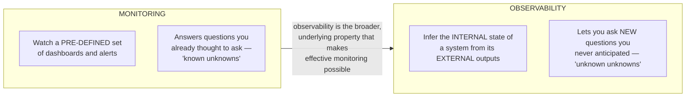
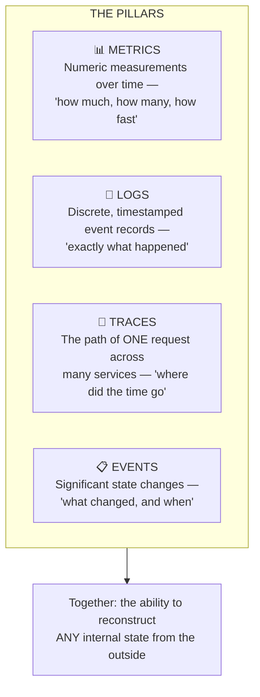
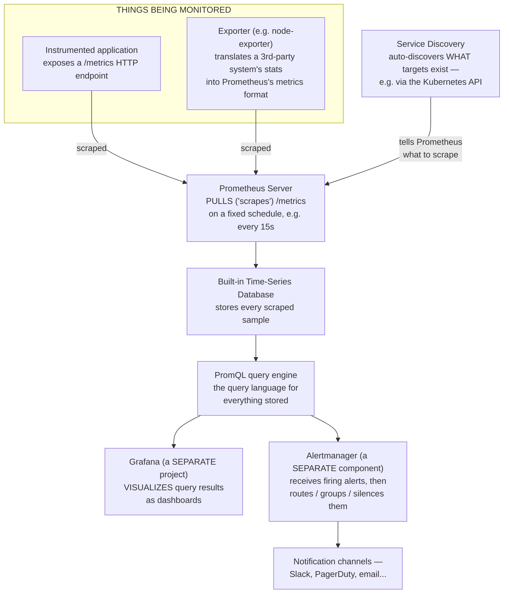
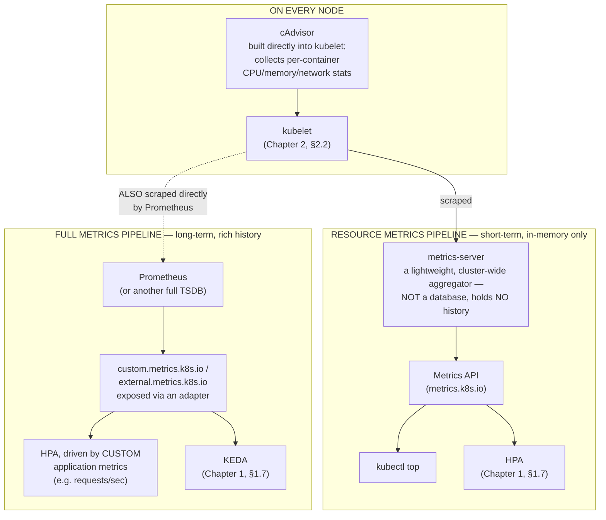
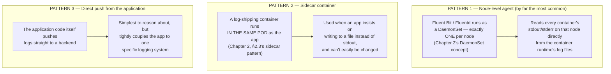
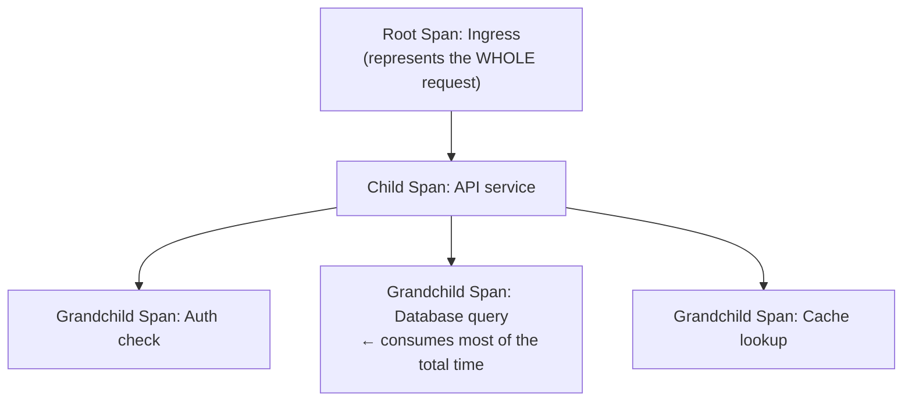
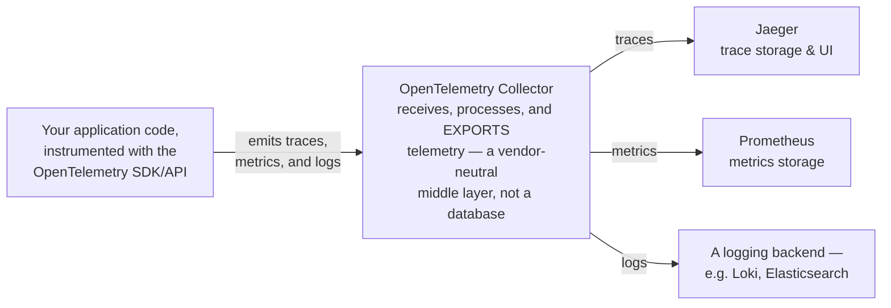
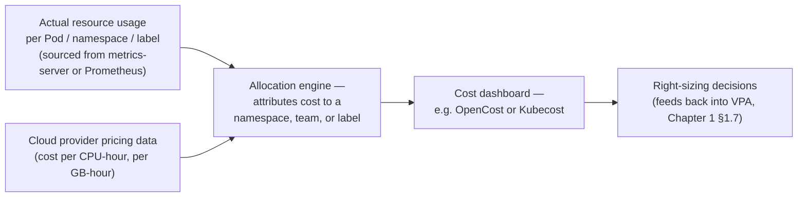
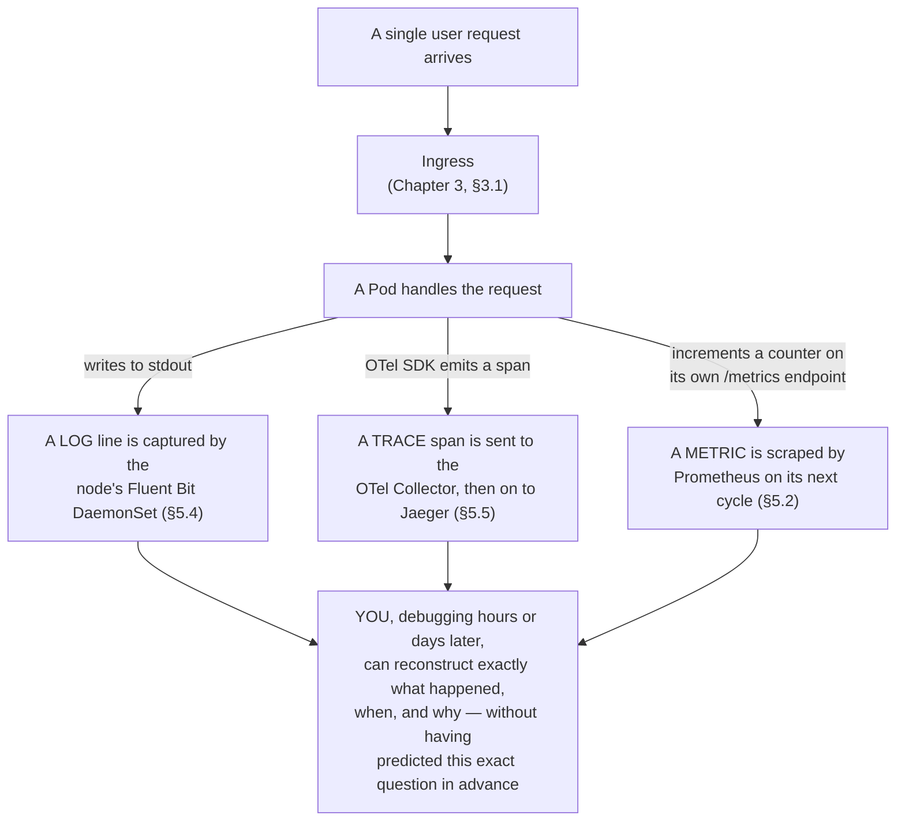

# Chapter 5: Observability — Understanding a System You Can't Just Look At

*KCNA Prep Guide Writer | Facts re-verified live against official Prometheus, OpenTelemetry, and CNCF sources on the date this chapter was written, including OpenCost's current CNCF maturity level.*

---

## 5.0 Chapter Orientation

### The promise this chapter pays off

Back in Chapter 1, §1.0, I flagged a deliberate reorganization: the official KCNA curriculum bundles **Observability** in as one of three competencies inside the **Cloud Native Architecture** domain (12%), alongside *Cloud Native Ecosystem and Principles* and *Cloud Native Community and Collaboration* — both of which Chapter 1 covered in full. This chapter is where Observability itself finally gets the dedicated depth it deserves, rather than being rushed as a subsection.

> **Official domain accounting, restated for clarity:** the 12% weight for Cloud Native Architecture spans *all three* competencies together — Chapter 1 and this chapter jointly cover that single domain, split by topic rather than by chapter-to-domain weight. Don't double-count this chapter's content as a separate slice of the exam; it's the second half of the same 12%.

### Why observability is its own discipline, not just "logging but fancier"

A cluster running dozens of microservices, autoscaling constantly (Chapter 1, §1.7), scheduled dynamically (Chapter 2, §2.6), is fundamentally **too complex to reason about by staring at it**. You can't SSH into "the system" — there is no single system, just a constantly shifting swarm of Pods. Observability is the discipline of instrumenting that swarm so its internal state can be reconstructed from what it emits, after the fact, without needing to have predicted the exact question in advance.

**Figure 5-1: Monitoring vs. Observability — a real, testable distinction**



| | Monitoring | Observability |
|---|---|---|
| **Mental model** | A fixed set of gauges on a dashboard | A rich enough data trail to answer *any* question after the fact |
| **Good at** | "Is CPU usage above 80%?" (a question you already anticipated) | "Why did *this one specific user's* checkout fail at 3:14am, and nothing else looks wrong?" (a question you never built a dashboard for) |
| **Fails when** | Something genuinely novel breaks, with no pre-built dashboard for it | Rarely fails outright — but it's more expensive to build and requires discipline (consistent instrumentation) |

### The pillars — and a genuine discrepancy worth naming outright

Different sources genuinely disagree on how many "pillars" observability has, and rather than picking one silently, it's worth showing you both framings so neither surprises you.

**Figure 5-2: The Pillars of Observability**



> **Confusion alert — "three pillars" vs. "M.E.L.T." are both legitimate framings you'll see in different resources, and neither is wrong.** The most widely cited modern framing is the **"three pillars of observability": Metrics, Logs, and Traces**. Some material — including a well-regarded 2024 KCNA study guide — instead uses **"M.E.L.T."**, a four-part framing that adds **Events** as its own distinct pillar rather than folding it into Logs. There isn't a single, universally agreed-upon official answer here, and reasonable practitioners disagree. What actually matters for the exam is understanding what *each individual pillar does and doesn't tell you* (covered in §5.2 through §5.5 below) — if you encounter a question naming three pillars versus four, don't panic over the exact count; focus on correctly matching each named pillar to its purpose.

---

## 5.2 Metrics — Prometheus Architecture

### Why Prometheus scrapes instead of receiving

Recall Prometheus from Chapter 1's landscape table: a CNCF **graduated** project (in fact, the *second* project ever to graduate CNCF, right after Kubernetes itself) that has become the de facto standard for cloud native metrics.

**Figure 5-3: The Full Prometheus Architecture**



| Component | Its one job |
|---|---|
| **Instrumented app / Exporter** | Expose current metric values at a `/metrics` HTTP endpoint, in Prometheus's plain-text exposition format |
| **Service Discovery** | Keep Prometheus's list of scrape targets current automatically, so nobody hand-edits a target list every time a Pod is created or destroyed |
| **Prometheus Server** | Pull ("scrape") every target's `/metrics` endpoint on a schedule, and store the results |
| **TSDB (Time-Series Database)** | Prometheus's own built-in storage engine, purpose-built for timestamped numeric data |
| **PromQL** | The query language used for everything — dashboards, alert rules, ad-hoc investigation |
| **Alertmanager** | A genuinely separate component/binary — receives *already-firing* alerts from Prometheus and handles the human-facing side: grouping related alerts, silencing known issues, routing to the right team |
| **Grafana** | A genuinely separate open source project (not part of Prometheus at all) that turns PromQL query results into dashboards |

> **Confusion alert — Prometheus and Grafana are not the same thing, and mixing up their responsibilities is one of the most common real-world (and exam) errors.** Prometheus **collects, stores, and evaluates alert rules against** metrics — it has no meaningful dashboarding UI of its own beyond a bare-bones built-in graph for debugging queries. Grafana **visualizes** — it has no metrics collection or storage capability of its own; it's a query client that can point at Prometheus, or at many other data sources entirely (logs, traces, even spreadsheets). They are almost always deployed together, which is exactly why people conflate them, but "which tool actually scrapes and stores the data" (Prometheus) versus "which tool draws the pretty graph" (Grafana) is a clean, testable distinction.

> **Confusion alert — pull-based scraping is the default, but Prometheus does have a push-based escape hatch, and knowing when it's used matters.** Prometheus's whole architecture assumes a target that's alive long enough to be scraped periodically. A **short-lived batch job** (Chapter 2's `Job`/`CronJob` concept) might finish and terminate *between* scrape intervals, meaning Prometheus would never successfully pull its metrics at all. For exactly this case, Prometheus ships a companion component called the **Pushgateway** — the batch job pushes its final metrics to the Pushgateway before exiting, and Prometheus then scrapes the *Pushgateway* (still pull-based from Prometheus's perspective) rather than the job itself. This is the one legitimate exception to "Prometheus always pulls," and it exists specifically to handle ephemeral workloads, not as a general-purpose alternative ingestion path.

### The four core metric types

| Type | What it represents | Can it go down? | Example |
|---|---|---|---|
| **Counter** | A cumulative value that only ever increases (until a restart resets it to 0) | No | Total HTTP requests served |
| **Gauge** | A value that can go up or down freely | Yes | Current memory usage, current queue depth |
| **Histogram** | Samples grouped into configurable buckets, enabling percentile/distribution analysis | N/A — bucketed counts | Request latency distribution (e.g., "how many requests took 100–200ms") |
| **Summary** | Similar to a Histogram, but calculates quantiles client-side rather than via buckets | N/A | Similar latency use cases, different trade-offs |

```promql
# A representative PromQL query: the per-second rate of HTTP requests,
# averaged over the last 5 minutes, broken down by status code
rate(http_requests_total[5m])
```

---

## 5.3 Kubernetes' Own Metrics Surfaces

Kubernetes ships with its *own* lightweight metrics story, entirely separate from (but able to feed into) the full Prometheus stack above. This is exactly the mechanism underneath the Horizontal Pod Autoscaler introduced back in Chapter 1, §1.7 — worth seeing in full now.

**Figure 5-4: The Two Kubernetes Metrics Pipelines**



| Pipeline | Storage | Powers | History retained |
|---|---|---|---|
| **Resource metrics pipeline** | None — `metrics-server` holds only the latest snapshot in memory | `kubectl top nodes` / `kubectl top pods`, and CPU/memory-based HPA scaling | None — ask it about 5 minutes ago and it has no idea |
| **Full metrics pipeline** | A real time-series database (typically Prometheus) | Custom/external-metrics-driven HPA and KEDA, dashboards, alerting, long-term trend analysis | As long as you configure retention for |

> **Confusion alert — `metrics-server` is not a small Prometheus, and assuming it is will cost you both exam points and real debugging time.** They look superficially similar (both expose current CPU/memory numbers), but they solve genuinely different problems. `metrics-server` exists for **one purpose**: feed the built-in Kubernetes Metrics API quickly enough for `kubectl top` and the standard HPA to work — it deliberately holds no history, has no query language, and cannot power a dashboard or an alert about "average memory usage over the last 24 hours," because it simply doesn't retain that data at all. If you need history, trends, alerting, or anything beyond "what's the value *right now*," you need the full pipeline (Prometheus), not `metrics-server`. Trying to build a Grafana dashboard directly against `metrics-server` is a dead end — that's precisely why the "full metrics pipeline" in Figure 5-4 exists as a genuinely separate path.

---

## 5.4 Logs — Collection Patterns and the Unified Logging Layer

### Why logs need a collection strategy at all

Recall a load-bearing fact from Chapter 2, §2.3: **a "restarted" Pod is not the same Pod.** By direct extension: whatever a container printed to its own `stdout`/`stderr` is captured by the container runtime and held only as long as that specific container instance exists. Once a Pod is deleted — which happens constantly, by design, in a self-healing system — its logs are gone unless something already shipped them elsewhere. This is exactly the problem centralized logging solves.

**Figure 5-5: Three Log Collection Patterns**



| Pattern | Resource cost | Typical use case |
|---|---|---|
| **Node-level DaemonSet agent** | Low — one agent per node, regardless of Pod count | The default, standard approach for nearly every cluster |
| **Sidecar** | Higher — one extra container per Pod that needs it | Legacy apps that only write to a local file, not stdout |
| **Direct push** | Depends on the app | Simple setups, or apps that already have a logging library for a specific backend |

Recall from Chapter 1's landscape (§1.4) that **Fluentd** — and its lighter-weight sibling, **Fluent Bit** — is exactly this: CNCF's graduated project providing a "unified logging layer" that decouples *where logs come from* from *where they end up*, so the same collector can fan logs out to Elasticsearch, S3, a SIEM, or anywhere else without the application ever needing to know.

*(For the practical `kubectl logs` mechanics of reading a container's captured output right now — including the crucial `--previous` flag for a crashed container — see Chapter 3, §3.4's troubleshooting toolkit. This section is about the architecture that makes logs survive a Pod's death; that section is about reading them while debugging one.)*

---

## 5.5 Traces — Following One Request Across Many Services

### The problem microservices create for themselves

Recall the microservices pillar from Chapter 1, §1.1: one user request might now touch a dozen independently deployed services instead of one monolith. A single slow request could be slow because of *any one* of those dozen hops — and logs and metrics alone won't tell you *which* one, because neither is naturally structured around "the full journey of a single request." That's the gap **distributed tracing** fills.

**Figure 5-6: One Trace, as a Timeline (ASCII waterfall)**

```
TRACE: the full journey of ONE request (total: 320ms)

Time →     0ms         100ms        200ms        300ms   320ms
           |------------|------------|------------|-------|
Ingress    [=====================================================]  0–320ms   (root span)
API svc      [===============================================]        10–280ms
Auth check     [=====]                                                 15–45ms
DB query               [=========================================]     60–250ms  ← the slow part
Cache lookup                                              [====]        255–265ms
```

**Figure 5-7: The Same Trace, as a Parent-Child Structure**



| Term | Meaning |
|---|---|
| **Span** | One unit of work with a start time, an end time, and a name — "the auth check took 30ms" |
| **Trace** | A tree of spans, all sharing one trace ID, representing one end-to-end request |
| **Parent/child span** | How spans nest — a parent span's duration typically encompasses all its children's durations |

### OpenTelemetry: the instrumentation standard, not the storage

Recall from Chapter 1, §1.4: **OpenTelemetry graduated CNCF in May 2026** — genuinely recent, and a good reminder to treat its maturity as current rather than assumed. Its job is narrowly, deliberately scoped:

**Figure 5-8: OpenTelemetry's Architecture**



> **Confusion alert — OpenTelemetry does not store or display anything on its own, and expecting it to is a very natural first mistake.** OpenTelemetry provides the **SDKs/APIs** your code uses to *generate* traces, metrics, and logs in a consistent, vendor-neutral format, plus the **Collector** that receives and forwards that telemetry onward. It deliberately has **no built-in storage backend and no built-in UI**. You still need a destination — **Jaeger** for traces (introduced as a CNCF graduated project back in Chapter 1's landscape table), Prometheus for metrics, something like Loki or Elasticsearch for logs. The entire point of OpenTelemetry is that your *application code* only ever needs to be instrumented once, against one vendor-neutral standard — and you can swap out Jaeger for a different tracing backend later without touching the application at all. Confusing OpenTelemetry for "a tracing backend" is roughly the same category of mistake as confusing the CRI (Chapter 1, §1.5) for a specific container runtime — one is the standard interface, the other is a specific, swappable implementation behind it.

---

## 5.6 Cost Management — Observability Applied to Spend

Recall the **FinOps engineer** persona from Chapter 1, §1.6: "optimizing cloud spend and resource efficiency." Cost visibility in Kubernetes is, structurally, just another observability problem — you're reconstructing an internal state (*"what is this actually costing us, broken down by team"*) from external signals (resource usage data), the same way you'd reconstruct request latency from trace spans.

**Figure 5-9: The Cost Visibility Pipeline**



**A current, verified fact worth anchoring this section on:** **OpenCost** was accepted into CNCF as a Sandbox project on June 17, 2022, and **advanced to Incubating status on October 25, 2024** — it was originally created by Kubecost and continues to be maintained by IBM Kubecost, Randoli, and a wider community including major cloud providers. **Kubecost** itself is the commercial product built around the same underlying engine; **OpenCost** is the open, CNCF-governed core.

| Concept | What it means |
|---|---|
| **Cost attribution** | Tagging workloads (via labels — Chapter 2's label mechanics) with `team:`, `cost-center:`, or similar, so spend can be sliced by who's responsible for it |
| **Right-sizing** | Comparing actual usage against configured `requests`/`limits` (Chapter 2, §2.6) to catch over-provisioned workloads |
| **Idle resource identification** | Finding Pods, PVCs, or entire namespaces that are provisioned but effectively unused |
| **Requests vs. actual cost** | A crucial nuance: cloud providers typically bill for the node capacity you've provisioned, not the CPU/memory a Pod is *actually* using at any moment — so a Pod requesting far more than it uses is a hidden cost even if it never gets throttled or OOMKilled (Chapter 2, §2.6) |

---

## 5.7 Putting It Together: One Request, All Four Pillars at Once

A capstone worth sitting with, since every prior figure in this chapter has looked at one pillar in isolation.

**Figure 5-10: A Single Request, Observed Four Ways Simultaneously**



This is observability's actual payoff, made concrete: none of these three pillars alone tells the full story, but *together*, generated automatically by infrastructure you set up once, they let you answer a question tomorrow that you never thought to ask today.

---

## 5.8 Chapter Cheat Sheet

| Term | One-line definition |
|---|---|
| Monitoring | Watching pre-defined dashboards for anticipated failure modes ("known unknowns") |
| Observability | The ability to infer internal state from external outputs, including questions never anticipated ("unknown unknowns") |
| Metrics / Logs / Traces (/ Events) | The "three pillars" (or M.E.L.T.'s four) — numeric measurement, discrete records, per-request journeys, (state changes) |
| Prometheus | CNCF graduated; pull-based metrics collection, storage, and alert-rule evaluation |
| Grafana | A separate project; visualizes query results as dashboards — collects and stores nothing itself |
| Alertmanager | A separate component; routes, groups, and silences already-firing Prometheus alerts |
| Pushgateway | The one legitimate pull-vs-push exception, for short-lived batch jobs |
| Counter / Gauge / Histogram / Summary | The four Prometheus metric types — only-increases / up-or-down / bucketed distribution / client-side quantiles |
| cAdvisor | Built into kubelet; collects per-container resource stats on every node |
| metrics-server | Lightweight, in-memory-only aggregator powering `kubectl top` and standard HPA — holds no history |
| Full metrics pipeline | Prometheus (or similar) powering custom/external-metrics HPA, KEDA, dashboards, and long-term trends |
| Fluentd / Fluent Bit | CNCF graduated; the unified logging layer, most commonly run as a per-node DaemonSet |
| Span | One unit of work with a start/end time and a name |
| Trace | A tree of spans sharing one trace ID — one request's full journey |
| OpenTelemetry | The vendor-neutral instrumentation + collection standard — **not** a storage backend or UI itself |
| Jaeger | CNCF graduated; a tracing storage backend and UI — a legitimate destination for OpenTelemetry's output |
| OpenCost | CNCF Incubating (since Oct 2024); the open cost-visibility engine underneath Kubecost |

---

## 5.9 Practice Questions (Original, Unofficial)

**These are original questions written for this guide, in the style and difficulty range of the public KCNA curriculum. They are not real exam questions, and reproducing or soliciting actual exam content would violate the Linux Foundation's Certification Agreement.**

---

**Q1.** A team has a dashboard that alerts when CPU usage exceeds 80%, but they were caught off guard by an outage caused by a scenario they had never anticipated or built a dashboard for. What does this scenario best illustrate?

A. Monitoring alone is sufficient for any production system
B. The difference between monitoring (known unknowns) and observability (the ability to answer unanticipated questions)
C. Prometheus was misconfigured
D. Logs are unnecessary if metrics are in place

<details>
<summary>Answer & explanation</summary>

**Correct answer: B.** Monitoring watches a pre-defined set of conditions — it's excellent at catching problems you already thought to build a dashboard for, but structurally can't catch a scenario nobody anticipated. Observability aims at the broader goal of being able to reconstruct what happened after the fact, even for entirely novel failure modes.
</details>

---

**Q2.** Which statement correctly describes the default relationship between Prometheus and the systems it monitors?

A. Prometheus pushes its own agent onto every target, which then reports back
B. Prometheus pulls (scrapes) metrics from targets' HTTP endpoints on a schedule
C. Targets are required to push metrics to Prometheus over gRPC
D. Prometheus has no defined ingestion model

<details>
<summary>Answer & explanation</summary>

**Correct answer: B.** Prometheus's core model is pull-based scraping — it periodically fetches metrics from each target's exposed endpoint. The one common exception is short-lived batch jobs, which push to an intermediary Pushgateway that Prometheus then scrapes instead.
</details>

---

**Q3.** What is the correct division of responsibility between Prometheus and Grafana?

A. They are interchangeable and perform identical functions
B. Grafana collects and stores metrics; Prometheus only visualizes them
C. Prometheus collects, stores, and evaluates alerts on metrics; Grafana visualizes query results as dashboards
D. Prometheus is only used for logs, and Grafana is only used for metrics

<details>
<summary>Answer & explanation</summary>

**Correct answer: C.** Prometheus is the collection, storage, and alert-evaluation engine. Grafana is a separate visualization tool that queries data sources like Prometheus (and others) to render dashboards — it has no metrics collection or storage capability of its own.
</details>

---

**Q4.** What is the key architectural difference between Kubernetes' `metrics-server` and a full Prometheus deployment?

A. They are functionally identical and interchangeable
B. `metrics-server` retains long-term history; Prometheus does not
C. `metrics-server` holds only the current snapshot in memory with no history, while Prometheus persists time-series data for trend analysis and alerting
D. `metrics-server` is used only for logs

<details>
<summary>Answer & explanation</summary>

**Correct answer: C.** `metrics-server` is a lightweight aggregator built specifically to power `kubectl top` and standard CPU/memory-based HPA scaling — it holds no historical data at all. A full Prometheus deployment persists time-series data, enabling dashboards, alerting, and long-term trend analysis that `metrics-server` structurally cannot provide.
</details>

---

**Q5.** Which log collection pattern is most common in production Kubernetes clusters, and how is it typically deployed?

A. A sidecar container in every Pod
B. A node-level agent (e.g., Fluent Bit) deployed as a DaemonSet, one per node
C. Direct application push to a backend in all cases
D. Kubernetes automatically centralizes all logs with no additional tooling required

<details>
<summary>Answer & explanation</summary>

**Correct answer: B.** The most common and resource-efficient pattern is a node-level log-collecting agent, typically Fluent Bit or Fluentd, deployed as a DaemonSet so exactly one instance runs per node and reads every container's stdout/stderr on that node.
</details>

---

**Q6.** In distributed tracing terminology, what is the relationship between a "trace" and a "span"?

A. They are synonyms
B. A trace is a single unit of work; a span is the full request journey
C. A span is one unit of work with a start and end time; a trace is a tree of spans sharing one trace ID, representing one full request
D. Traces are used only for metrics, not for request tracking

<details>
<summary>Answer & explanation</summary>

**Correct answer: C.** A span represents one discrete unit of work with a defined start and end time. A trace is the complete collection of related spans — often nested in a parent-child structure — that together represent the full journey of a single request across multiple services.
</details>

---

**Q7.** Which statement correctly describes OpenTelemetry's role in an observability stack?

A. It is a storage backend that replaces the need for Jaeger or Prometheus
B. It provides vendor-neutral instrumentation and a collection pipeline, but requires a separate backend like Jaeger or Prometheus to actually store and display the data
C. It is exclusively for logs and cannot handle traces or metrics
D. It is a Kubernetes-only tool that cannot be used outside of a cluster

<details>
<summary>Answer & explanation</summary>

**Correct answer: B.** OpenTelemetry provides the SDKs/APIs for generating telemetry and the Collector for receiving and forwarding it, in a vendor-neutral format — but it deliberately includes no storage backend or UI of its own. A separate destination, such as Jaeger for traces or Prometheus for metrics, is still required.
</details>

---

**Q8.** What is the correct relationship between OpenCost and Kubecost?

A. They are unrelated, competing projects
B. OpenCost is the CNCF-governed open source engine originally created by Kubecost; Kubecost is the commercial product built around it
C. Kubecost is a CNCF graduated project, and OpenCost is a proprietary tool built on top of it
D. Both terms refer to the exact same single project with no distinction

<details>
<summary>Answer & explanation</summary>

**Correct answer: B.** OpenCost was created by Kubecost and contributed to CNCF, where it currently holds Incubating status. Kubecost is the commercial product built around the same underlying cost-visibility engine, while OpenCost remains the open, community-governed core.
</details>

---

## 5.10 Sources & Further Reading

**Tier 1 — Official, authoritative for exam facts**
- [KCNA certification page — domains, weights, price, policy](https://training.linuxfoundation.org/certification/kubernetes-cloud-native-associate/)
- [Official CNCF curriculum PDF](https://github.com/cncf/curriculum/blob/master/KCNA_Curriculum.pdf)

**Tier 2 — Primary technical documentation**
- [Prometheus documentation](https://prometheus.io/docs/introduction/overview/)
- [Prometheus metric types](https://prometheus.io/docs/concepts/metric_types/)
- [Prometheus Pushgateway](https://prometheus.io/docs/instrumenting/pushing/)
- [Alertmanager documentation](https://prometheus.io/docs/alerting/latest/alertmanager/)
- [Grafana documentation](https://grafana.com/docs/grafana/latest/)
- [Kubernetes Metrics Server](https://kubernetes.io/docs/tasks/debug/debug-cluster/resource-metrics-pipeline/)
- [kubectl top](https://kubernetes.io/docs/reference/generated/kubectl/kubectl-commands#top)
- [OpenTelemetry documentation](https://opentelemetry.io/docs/)
- [Jaeger documentation](https://www.jaegertracing.io/docs/latest/)
- [Fluent Bit documentation](https://docs.fluentbit.io/manual)
- [OpenCost project page — CNCF](https://www.cncf.io/projects/opencost/)
- [OpenCost documentation](https://www.opencost.io/docs/)

**Real-time examples cited in this chapter (accountable, dated sources)**
- ["OpenCost | CNCF" — current maturity status](https://www.cncf.io/projects/opencost/)
- ["OpenCost Advances to CNCF Incubation," OpenCost Blog, October 2024](https://opencost.io/blog/cncf-incubation/)
- ["OpenCost: Reflecting on 2025 and looking ahead to 2026," CNCF Blog, January 2026](https://www.cncf.io/blog/2026/01/12/opencost-reflecting-on-2025-and-looking-ahead-to-2026/)

---

## 5.11 What I Assumed, and Questions Back to You

1. **On the still-open practice-question-count question** (flagged in Chapters 3 and 4): rather than ask again, I'm making a standing decision — **8 questions per chapter by default**, scaling up only for exceptionally broad domains like Chapter 2's Kubernetes Fundamentals (44%, 10 questions). I'll keep applying this consistently unless you tell me otherwise; no need to keep re-litigating it chapter by chapter.
2. **I explicitly named the "three pillars vs. M.E.L.T." discrepancy** (§5.1) rather than silently picking one framing, since I noticed it's a genuine, unresolved difference between commonly used resources — including the reference material available for this project. If you'd rather I commit to one framing as "the" answer instead of presenting both, tell me which.
3. **Cost Management (§5.6) is treated as a natural extension of Observability** — visibility into spend, using the same underlying data — even though the current official curriculum page doesn't spell out "Cost Management" as its own named sub-topic the way the older, five-domain curriculum did. I kept it because it ties directly to the FinOps persona from Chapter 1 and to real exam-relevant concepts (right-sizing, requests vs. billed capacity), but flag it if you'd rather I cut it as out-of-scope.
4. **The trace section uses an ASCII waterfall instead of a Mermaid Gantt diagram** (§5.5) — Mermaid does support Gantt charts, but the date-based syntax is less reliable across renderers for this kind of relative-millisecond timeline, so I chose the more universally-rendering ASCII version deliberately. Say so if you'd like me to attempt the Mermaid Gantt version as well.

This closes the four domain-weighted content chapters (1 through 5, covering all official competencies). Say "continue" and I'll move on to **Chapter 6: Hands-On Lab Walkthroughs** — where the guide shifts from concepts to guided practice in a free sandbox, per §0.5's recommendation.
