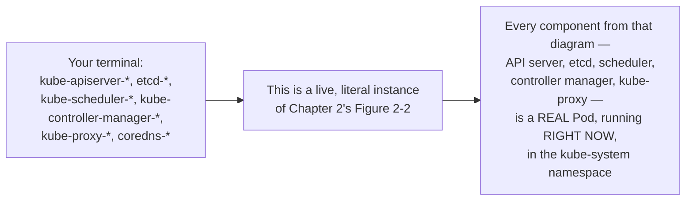
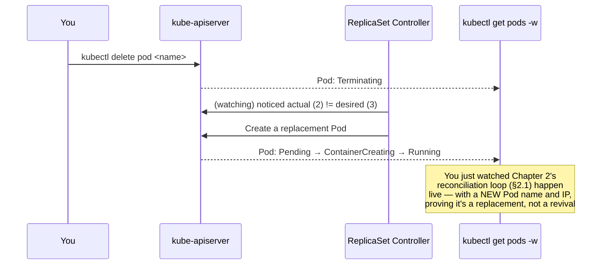
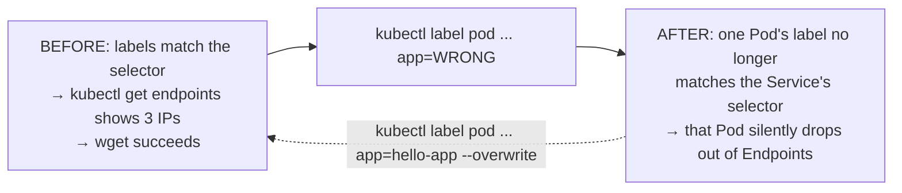
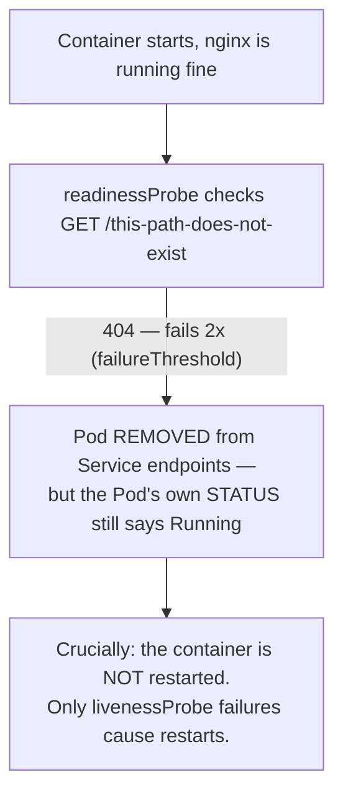
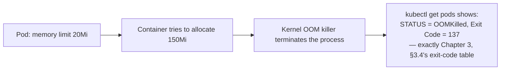
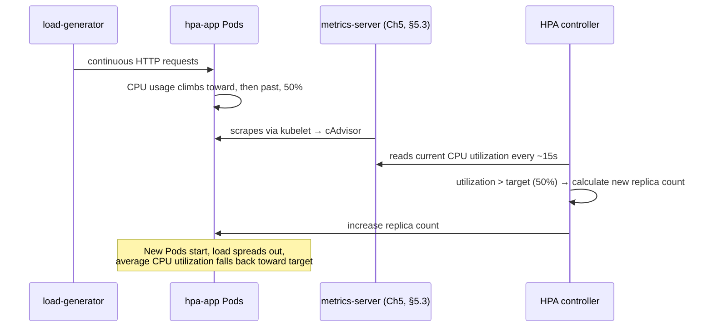

# Chapter 6: Hands-On Lab Walkthroughs — Watching the Architecture Move

*KCNA Prep Guide Writer | All commands verified against current Kubernetes tooling conventions. Sandbox-specific behavior (session limits, default CNI capabilities) is called out explicitly where it affects whether a lab step will actually work as written.*

---

## 6.0 Chapter Orientation

### Why a hands-on chapter for a multiple-choice-only exam

Restating a promise from Chapter 0, §0.5, now that you have five chapters of architecture behind you: **the KCNA exam itself has no lab component** — it's 60 multiple-choice questions, nothing you type into a terminal gets graded. So why does this chapter exist?

Because every diagram in Chapters 1 through 5 described something *real*. `kube-scheduler`, the reconciliation loop, an empty `Endpoints` object, an `OOMKilled` exit code — these aren't exam abstractions, they're things you can watch happen on your own screen in about the time it takes to read this sentence twice. A multiple-choice question that says *"a container's memory usage exceeds its limit — what happens?"* is trivial to answer correctly once you've actually watched it happen once, rather than only read about it. This chapter's job is to convert the last five chapters from *facts you memorized* into *things you've seen with your own eyes*.

### Choosing your sandbox

You don't need a cloud account or a credit card for any of this. Pick based on what you have available right now:

| Option | Setup effort | Session limit | Persists between sessions? | Best for |
|---|---|---|---|---|
| **[Killercoda](https://killercoda.com/)** | Zero — browser only | Sessions typically time out after ~1–2 hours of inactivity | No — environment resets | Quick, no-install practice; doing one lab in a single sitting |
| **[Play with Kubernetes](https://labs.play-with-k8s.com/)** | Zero — browser only | 4-hour hard session limit, then the whole environment disappears | No | Multi-node cluster experiments; short, focused sessions |
| **[minikube](https://minikube.sigs.k8s.io/docs/start/)** | Requires Docker (or another driver) installed locally | None — it's your machine | **Yes** | Working through this entire chapter over multiple days |
| **[kind](https://kind.sigs.k8s.io/)** (Kubernetes-in-Docker) | Requires Docker installed locally | None | Yes | Multi-node clusters on your own machine, fast to recreate |

**My recommendation for working through this whole chapter:** install **minikube** locally. The browser-based options are genuinely great for a single quick lab, but this chapter is built to be worked through progressively — Lab 2 depends on the Deployment from Lab 1 still existing — and losing your cluster to a 4-hour timeout mid-chapter is a frustrating, avoidable interruption.

```bash
# Starting point for the entire chapter (minikube)
minikube start
kubectl get nodes          # confirm you're connected before proceeding
```

### How each lab is structured

Every lab below follows the same shape: an **Objective** tying it to specific earlier chapters, **Steps** with real commands, a **What Just Happened** section connecting your terminal output back to a specific diagram, and a **Clean Up** so labs don't interfere with each other.

---

## 6.1 Lab 0: Meeting the Cluster You Already Studied

**Objective:** confirm that Chapter 2's Figure 2-2 (the full control plane + worker node architecture) isn't a diagram of an abstract concept — it's a diagram of the exact Pods running in front of you right now.

**Steps:**

```bash
kubectl get nodes -o wide
kubectl cluster-info
kubectl get pods -n kube-system
```

**Expected output (abbreviated):**

```
NAME                       READY   STATUS    NAMESPACE
etcd-minikube               1/1     Running   kube-system
kube-apiserver-minikube     1/1     Running   kube-system
kube-controller-manager-*   1/1     Running   kube-system
kube-scheduler-minikube     1/1     Running   kube-system
kube-proxy-*                1/1     Running   kube-system
coredns-*                   1/1     Running   kube-system
```

**Figure 6-1: What You're Actually Looking At**



**What just happened:** in a single-node learning cluster like minikube, every control plane component from Chapter 2, Figure 2-2 runs as an ordinary Pod in the `kube-system` namespace, right alongside your own applications. (In a real production cluster, these typically run on dedicated control plane nodes, not mixed in with your workloads — but the components and their jobs are identical.) You can even `kubectl describe pod etcd-minikube -n kube-system` and see it's a completely normal Pod object, exactly like the ones you'll create yourself in the next lab.

```bash
kubectl api-resources | head -20      # every resource type this cluster understands
kubectl explain deployment.spec       # recall Chapter 2, §2.4's kubectl explain
```

---

## 6.2 Lab 1: The Workload Hierarchy, Watched Live

**Objective:** build the Namespace → Deployment → ReplicaSet → Pod hierarchy from Chapter 2, §2.5, and watch the reconciliation loop (Chapter 2, §2.1) self-heal a deleted Pod in real time.

**Steps:**

```bash
kubectl create namespace kcna-lab
kubectl config set-context --current --namespace=kcna-lab

# Declarative, per Chapter 2's dual-style teaching
cat <<EOF > deployment.yaml
apiVersion: apps/v1
kind: Deployment
metadata:
  name: hello-app
spec:
  replicas: 3
  selector:
    matchLabels: { app: hello-app }
  template:
    metadata:
      labels: { app: hello-app }
    spec:
      containers:
        - name: hello
          image: nginx:1.25
          ports: [{ containerPort: 80 }]
EOF
kubectl apply -f deployment.yaml

kubectl get deployments,replicasets,pods
```

Now, open a **second terminal** and leave this running:

```bash
kubectl get pods -w
```

Back in your first terminal, delete one Pod by name (get the exact name from the output above):

```bash
kubectl delete pod <one-of-the-three-pod-names>
```

**Figure 6-2: What Your Watching Terminal Just Showed You**



**What just happened:** the moment you deleted a Pod, the ReplicaSet controller — a real, running process inside `kube-controller-manager` (Lab 0!) — noticed the mismatch between desired (3) and actual (2) replicas within moments, and created a replacement. Look closely at the new Pod's name: it's different from the one you deleted. This is Chapter 2's warning made concrete — *a "restarted" Pod is not the same Pod.*

**Now try a rolling update and a rollback:**

```bash
kubectl set image deployment/hello-app hello=nginx:1.26
kubectl rollout status deployment/hello-app
kubectl rollout history deployment/hello-app
kubectl rollout undo deployment/hello-app       # back to nginx:1.25
```

**Clean up:** keep `hello-app` running — Lab 2 uses it.

---

## 6.3 Lab 2: Making It Reachable, Then Breaking It On Purpose

**Objective:** create a Service, confirm it works, then **deliberately reproduce** the label-selector confusion alert from Chapters 2 and 3 with your own hands, so you recognize the symptom instantly on the exam.

**Steps:**

```bash
kubectl expose deployment hello-app --port=80 --name=hello-svc
kubectl get endpoints hello-svc          # should show 3 Pod IPs
```

Confirm it actually works, from inside the cluster:

```bash
kubectl run debug --rm -it --image=busybox:1.28 --restart=Never -- wget -qO- hello-svc
# should print nginx's default HTML page
```

**Now, break it on purpose:**

```bash
kubectl get pods -l app=hello-app -o name | head -1
kubectl label pod <that-pod-name> app=WRONG --overwrite
kubectl get endpoints hello-svc
```

**Figure 6-3: Reproducing the Empty-Endpoints Confusion Alert**



**What just happened:** notice that `kubectl apply`/`kubectl label` **did not error** — Kubernetes happily accepted the label change, because a Service's selector-to-Pod relationship is *loose*, exactly as flagged back in Chapter 2, §2.5. One Pod silently vanished from `hello-svc`'s Endpoints. If you'd relabeled *every* Pod matching `app=hello-app`, `kubectl get endpoints hello-svc` would show `<none>` entirely — the exact symptom Chapter 3, Figure 3-13's decision tree opens with.

```bash
# Fix it
kubectl label pod <that-pod-name> app=hello-app --overwrite
kubectl get endpoints hello-svc      # back to 3 IPs
```

### Bonus: NetworkPolicy, with an honest caveat

```yaml
# deny-all.yaml — the default-deny pattern from Chapter 3, §3.1
apiVersion: networking.k8s.io/v1
kind: NetworkPolicy
metadata:
  name: default-deny-all
spec:
  podSelector: {}
  policyTypes: ["Ingress"]
```

```bash
kubectl apply -f deny-all.yaml
kubectl run debug2 --rm -it --image=busybox:1.28 --restart=Never -- wget -qO- --timeout=5 hello-svc
```

> **An honest, important caveat before you try this:** **`kubectl apply`-ing a NetworkPolicy does nothing at all unless your cluster's CNI plugin (Chapter 1, §1.5) actually implements NetworkPolicy enforcement.** Standard `minikube start` uses a default network setup that does **not** enforce NetworkPolicy — the object will be created successfully, but traffic will keep flowing exactly as before, which will look like the policy "isn't working" when actually it was never being enforced at all. To genuinely test this lab, start minikube with a NetworkPolicy-capable CNI instead: `minikube start --cni=calico` (or enable it on an existing cluster via `minikube addons enable calico`, if supported by your version). This isn't a minor footnote — it's a completely realistic thing to hit in a real job, too: **not every CNI plugin implements NetworkPolicy**, so "I applied a NetworkPolicy and nothing changed" is sometimes a policy-writing bug, and sometimes a CNI-capability gap. Knowing to check which one you're looking at is a genuinely valuable, exam-relevant instinct.

```bash
kubectl delete networkpolicy default-deny-all       # clean up before Lab 3
```

---

## 6.4 Lab 3: Storage That Survives a Pod's Death

**Objective:** prove Chapter 3, §3.3's central claim — that a `PersistentVolumeClaim` genuinely outlives the Pod that mounts it, unlike a container's own local filesystem.

**Steps:**

```yaml
# pvc-pod.yaml
apiVersion: v1
kind: PersistentVolumeClaim
metadata:
  name: lab-pvc
spec:
  accessModes: ["ReadWriteOnce"]
  resources:
    requests: { storage: 1Gi }
---
apiVersion: v1
kind: Pod
metadata:
  name: storage-writer
spec:
  containers:
    - name: writer
      image: busybox:1.28
      command: ["sh", "-c", "sleep 3600"]
      volumeMounts:
        - name: data
          mountPath: /data
  volumes:
    - name: data
      persistentVolumeClaim:
        claimName: lab-pvc
```

```bash
kubectl apply -f pvc-pod.yaml
kubectl get pvc lab-pvc          # STATUS should become Bound
kubectl exec storage-writer -- sh -c "echo 'I was here' > /data/proof.txt"
kubectl exec storage-writer -- cat /data/proof.txt

kubectl delete pod storage-writer         # the Pod is now completely gone
kubectl apply -f pvc-pod.yaml             # recreate it — SAME PVC, brand-new Pod
kubectl exec storage-writer -- cat /data/proof.txt   # the file is still there
```

**What just happened:** you deleted the Pod entirely — the exact same kind of event that, back in Lab 1, produced a brand-new Pod with none of the old one's memory. This time, `/data/proof.txt` survived, because it never actually lived *in* the Pod at all — it lived in the storage that Figure 3-8's PV/PVC architecture provisioned, which the new Pod simply re-attached to. This is precisely why StatefulSets (Chapter 3, §3.3) exist for anything that can't tolerate this "clean slate on every restart" behavior for its *compute*, while relying on exactly this mechanism for its *storage*.

```bash
kubectl delete pod storage-writer
kubectl delete pvc lab-pvc
```

---

## 6.5 Lab 4: Production-Readiness — Probes, and the Cascading-Failure Trap

**Objective:** watch a failing readiness probe pull a Pod out of Service rotation without killing it, and understand — even without fully simulating it — the single most dangerous probe misconfiguration in real production systems.

```yaml
# probe-lab.yaml
apiVersion: apps/v1
kind: Deployment
metadata:
  name: probe-app
spec:
  replicas: 1
  selector:
    matchLabels: { app: probe-app }
  template:
    metadata:
      labels: { app: probe-app }
    spec:
      containers:
        - name: app
          image: nginx:1.25
          readinessProbe:
            httpGet: { path: /this-path-does-not-exist, port: 80 }
            periodSeconds: 5
            failureThreshold: 2
```

```bash
kubectl apply -f probe-lab.yaml
kubectl get pods -l app=probe-app        # STATUS: Running — the container itself is fine
kubectl expose deployment probe-app --port=80 --name=probe-svc
kubectl get endpoints probe-svc          # after ~10 seconds: <none>
```

**Figure 6-4: The Readiness Probe You Just Watched Fail**



**What just happened:** notice the Pod's own `STATUS` column never changed from `Running` — only `kubectl get endpoints` reflected the failure. This is Chapter 3's `readinessProbe`-vs-`livenessProbe` distinction (mirrored in the `kubernetes-deploy-scale` skill's own probe-priority rule), made undeniable: a failing readiness probe silently pulls traffic away without touching the container itself.

> **Confusion alert — the single most dangerous, genuinely common probe mistake in real production Kubernetes: never let a `livenessProbe` check a downstream dependency.** It's extremely tempting to write a liveness probe that checks "is my database connection healthy?" — it feels like a thorough health check. **Don't.** If the database goes down, *every single replica's* liveness probe fails simultaneously, and Kubernetes restarts *all of them at once* — taking a downstream outage and turning it into a full application outage, guaranteed. The correct pattern: `livenessProbe` should check **only** the process's own internal state (is the event loop responsive, is there an unrecoverable deadlock) — something a restart could plausibly fix. `readinessProbe`, by contrast, is the *right* place to check a database connection: a failed check there just pulls that one Pod out of traffic rotation gracefully, without killing anything, and it recovers automatically the moment the dependency comes back.

```bash
kubectl delete deployment probe-app
kubectl delete service probe-svc
```

---

## 6.6 Lab 5: The Troubleshooting Gym

**Objective:** deliberately reproduce all three of Chapter 3, §3.4's decision-tree scenarios, on purpose, so recognizing them on the exam takes zero effort.

### `ImagePullBackOff`

```bash
kubectl run bad-image --image=nginx:this-tag-does-not-exist-v99
kubectl get pods bad-image
kubectl describe pod bad-image | tail -15    # find the exact Events message
kubectl delete pod bad-image
```

### `Pending` (unschedulable)

```bash
kubectl run too-big --image=nginx --requests='cpu=999,memory=999Gi'
kubectl get pods too-big
kubectl describe pod too-big | grep -A3 Events   # "Insufficient cpu" / "Insufficient memory"
kubectl delete pod too-big
```

### `CrashLoopBackOff`

```yaml
# crash-lab.yaml
apiVersion: v1
kind: Pod
metadata:
  name: crash-lab
spec:
  containers:
    - name: crasher
      image: busybox:1.28
      command: ["sh", "-c", "echo 'I am about to fail on purpose' && exit 1"]
```

```bash
kubectl apply -f crash-lab.yaml
kubectl get pods -w                        # watch it cycle: Running → Error → CrashLoopBackOff
kubectl logs crash-lab --previous          # exactly Chapter 3's first diagnostic step
kubectl delete pod crash-lab
```

### `OOMKilled` (exit code 137)

```yaml
# oom-lab.yaml
apiVersion: v1
kind: Pod
metadata:
  name: oom-lab
spec:
  containers:
    - name: hog
      image: polinux/stress
      resources:
        limits: { memory: "20Mi" }
      command: ["stress", "--vm", "1", "--vm-bytes", "150M"]
```

```bash
kubectl apply -f oom-lab.yaml
kubectl get pod oom-lab                    # STATUS: OOMKilled
kubectl describe pod oom-lab | grep -A2 "Last State"    # Exit Code: 137
kubectl delete pod oom-lab
```

**Figure 6-5: What You Just Confirmed, Hands-On**



**What just happened, across all four:** every single message you just read in `kubectl describe`'s Events section is one you already know how to interpret, *because you already learned it as a decision tree in Chapter 3*. That's deliberate — this lab isn't teaching new facts, it's converting facts you already hold into pattern-recognition you can execute in under a second on exam day.

---

## 6.7 Lab 6: Autoscaling, Watched Live

**Objective:** trigger the Horizontal Pod Autoscaler for real, and observe the exact mechanism from Chapter 1, §1.7 and Chapter 5, §5.3 (the resource metrics pipeline) working together.

```bash
# metrics-server is required for HPA — confirm it's present, install if not
kubectl top nodes || kubectl apply -f https://github.com/kubernetes-sigs/metrics-server/releases/latest/download/components.yaml
```

```yaml
# hpa-lab.yaml — note: resource requests are MANDATORY, see the confusion alert below
apiVersion: apps/v1
kind: Deployment
metadata:
  name: hpa-app
spec:
  replicas: 1
  selector: { matchLabels: { app: hpa-app } }
  template:
    metadata: { labels: { app: hpa-app } }
    spec:
      containers:
        - name: app
          image: registry.k8s.io/hpa-example
          resources:
            requests: { cpu: "200m" }
---
apiVersion: v1
kind: Service
metadata:
  name: hpa-app-svc
spec:
  selector: { app: hpa-app }
  ports: [{ port: 80 }]
---
apiVersion: autoscaling/v2
kind: HorizontalPodAutoscaler
metadata:
  name: hpa-app-hpa
spec:
  scaleTargetRef: { apiVersion: apps/v1, kind: Deployment, name: hpa-app }
  minReplicas: 1
  maxReplicas: 6
  metrics:
    - type: Resource
      resource: { name: cpu, target: { type: Utilization, averageUtilization: 50 } }
```

```bash
kubectl apply -f hpa-lab.yaml
kubectl get hpa hpa-app-hpa -w        # leave this running in a second terminal
```

In a third terminal, generate sustained load:

```bash
kubectl run load-generator --rm -it --image=busybox:1.28 --restart=Never -- \
  /bin/sh -c "while true; do wget -q -O- http://hpa-app-svc; done"
```

**Figure 6-6: What's Happening While You Watch `TARGETS` Climb**



Stop the load (`Ctrl+C` in the load-generator terminal), and keep watching `kubectl get hpa -w` — you'll see `TARGETS` fall, but replicas won't drop immediately.

> **Confusion alert — two things that trip people up in this exact lab, both worth internalizing.** First: **HPA requires `resources.requests.cpu` to be set on the Deployment, or it cannot function at all** — HPA's utilization percentage is calculated as *(actual CPU used) ÷ (CPU requested)*, so with no `requests` set, there's no denominator and HPA has nothing to divide by. This is exactly why `hpa-lab.yaml` above sets `requests: { cpu: "200m" }` deliberately, not as an afterthought. Second: **scale-down is intentionally slower than scale-up.** After you stop the load, you'll watch `TARGETS` drop immediately, but the replica count stays elevated for several minutes — this is the `scaleDown.stabilizationWindowSeconds` behavior (defaulting to a multi-minute cooldown) working exactly as designed, specifically to prevent "flapping" — rapidly scaling down and then immediately back up again on a brief, temporary dip in traffic.

```bash
kubectl delete -f hpa-lab.yaml
```

---

## 6.8 Lab 7: Reading the Cluster's Own Telemetry

**Objective:** use the Kubernetes-native observability surfaces from Chapter 5, §5.3 directly, and understand honestly where a shared, low-resource sandbox stops being the right tool for the job.

```bash
kubectl top nodes                    # cluster-wide resource snapshot
kubectl top pods -A                  # every Pod, every namespace
kubectl get events -A --sort-by=.lastTimestamp | tail -20     # cluster-wide, time-ordered
```

Recreate the Deployment from Lab 1 if it's gone, then:

```bash
kubectl logs -l app=hello-app --tail=20 --prefix     # logs from every matching Pod at once
```

> **An honest scoping note, in the same spirit as the NetworkPolicy caveat in Lab 2:** this chapter deliberately does **not** walk you through installing a full Prometheus + Grafana stack in a shared or resource-constrained sandbox. It's genuinely possible (via the `kube-prometheus-stack` Helm chart, applying Chapter 4's packaging knowledge directly), but it's also a meaningfully heavier install that can strain a free Killercoda/Play-with-Kubernetes session or an under-resourced minikube VM, and troubleshooting a slow Helm install isn't the goal of this chapter. If you want to go further: `minikube addons enable metrics-server` gets you what Lab 6 needs, and `helm install prometheus prometheus-community/kube-prometheus-stack` (from Chapter 4, §4.4's Helm mechanics) is the well-trodden next step once you're comfortable — just budget real resources (4+ CPU, 8+ GB RAM for minikube) before attempting it.

---

## 6.9 Lab Command Quick Reference

| Task | Command |
|---|---|
| Start a local cluster | `minikube start` |
| See control plane Pods | `kubectl get pods -n kube-system` |
| Watch Pods live | `kubectl get pods -w` |
| Roll out an image update | `kubectl set image deployment/NAME container=image:tag` |
| Roll back | `kubectl rollout undo deployment/NAME` |
| Check Service→Pod wiring | `kubectl get endpoints SVC_NAME` |
| Debug from inside the cluster | `kubectl run debug --rm -it --image=busybox:1.28 --restart=Never -- sh` |
| First troubleshooting step, always | `kubectl describe pod NAME` (read Events) |
| Second troubleshooting step | `kubectl logs NAME --previous` |
| Confirm metrics-server is present | `kubectl top nodes` |
| Watch HPA respond | `kubectl get hpa -w` |
| Cluster-wide, time-ordered events | `kubectl get events -A --sort-by=.lastTimestamp` |

---

## 6.10 Practice Questions (Original, Unofficial)

**These are original questions written for this guide. Unlike prior chapters, these are "predict the observed behavior" scenario questions — testing the same conceptual understanding the exam tests, reinforced by what you just did hands-on. They are not real exam questions.**

---

**Q1.** After running `kubectl delete pod` on one Pod managed by a Deployment with `replicas: 3`, what will `kubectl get pods` show a few seconds later?

A. Only 2 Pods, permanently
B. The original 3, with the deleted Pod's exact name and IP restored
C. 3 Pods total, but the replacement has a different name and IP than the one deleted
D. The Deployment enters a permanent Pending state

<details>
<summary>Answer & explanation</summary>

**Correct answer: C.** The ReplicaSet controller notices the replica-count mismatch and creates a brand-new Pod object — with a new name and IP — rather than reviving the deleted one, exactly as observed in Lab 1 and as taught in Chapter 2, §2.3.
</details>

---

**Q2.** A Pod's labels are changed such that they no longer match its Service's selector. What is the immediate, correct outcome?

A. `kubectl label` fails with a validation error
B. The label change succeeds silently, and the Pod's IP disappears from the Service's Endpoints
C. The Pod is automatically deleted
D. The Service is automatically deleted

<details>
<summary>Answer & explanation</summary>

**Correct answer: B.** As reproduced in Lab 2, a Service-to-Pod selector relationship is loose — Kubernetes accepts the label change without error, and the Pod simply drops out of the Service's Endpoints, matching Chapter 2 and Chapter 3's confusion alerts on this exact behavior.
</details>

---

**Q3.** A Pod's `readinessProbe` starts failing, while its `livenessProbe` continues to pass. What happens to the container?

A. It is restarted immediately
B. It is deleted permanently
C. It keeps running unchanged, but is removed from any Service's Endpoints until the probe passes again
D. Nothing happens at all — readiness probes have no effect

<details>
<summary>Answer & explanation</summary>

**Correct answer: C.** As observed in Lab 4, a failing readiness probe never touches the container itself — only a failing *liveness* probe triggers a restart. Readiness failures only affect Service traffic routing.
</details>

---

**Q4.** Why is it considered a dangerous anti-pattern for a `livenessProbe` to check a downstream dependency like a database connection?

A. Liveness probes cannot make network calls
B. If the dependency goes down, every replica's liveness probe fails simultaneously, causing all of them to restart at once and turning a downstream outage into a full application outage
C. It has no real downside and is the recommended best practice
D. Liveness probes are only evaluated once, at container startup

<details>
<summary>Answer & explanation</summary>

**Correct answer: B.** Because liveness failures trigger a restart, checking a shared external dependency there means a single downstream outage restarts every replica simultaneously — the correct pattern is checking dependencies in the readinessProbe instead, which only pulls a Pod out of traffic without killing it.
</details>

---

**Q5.** A Deployment has no `resources.requests.cpu` set on its Pods, and an HPA is configured to scale based on CPU utilization. What happens?

A. HPA scales normally using default assumed request values
B. HPA cannot calculate utilization at all, since it has no denominator to compute a percentage against
C. HPA automatically scales to the maximum replica count as a safe default
D. Kubernetes automatically adds a default CPU request

<details>
<summary>Answer & explanation</summary>

**Correct answer: B.** HPA's CPU utilization percentage is calculated as actual usage divided by the requested amount. With no request set, there's no denominator, and CPU-based HPA scaling cannot function — this is exactly why Lab 6's Deployment explicitly sets `requests.cpu`.
</details>

---

**Q6.** After a sustained load spike ends, an HPA-managed Deployment's `TARGETS` column immediately shows reduced utilization, but the replica count stays elevated for several minutes before decreasing. What explains this?

A. This is a bug — replicas should decrease immediately
B. The default scale-down stabilization window intentionally delays scale-down to prevent flapping on brief traffic dips
C. HPA only checks metrics once per hour
D. The Deployment must be manually scaled down; HPA never scales down automatically

<details>
<summary>Answer & explanation</summary>

**Correct answer: B.** HPA's default behavior includes a multi-minute stabilization window before scaling down, specifically to avoid rapidly oscillating replica counts in response to short-lived dips in load — scale-up is intentionally much faster than scale-down.
</details>

---

## 6.11 Sources & Further Reading

**Sandbox environments**
- [Killercoda](https://killercoda.com/)
- [Play with Kubernetes](https://labs.play-with-k8s.com/)
- [minikube](https://minikube.sigs.k8s.io/docs/start/)
- [kind](https://kind.sigs.k8s.io/)

**Tier 2 — Primary technical documentation**
- [Official Horizontal Pod Autoscaler walkthrough](https://kubernetes.io/docs/tasks/run-application/horizontal-pod-autoscale-walkthrough/) (the source of Lab 6's exact pattern)
- [Configure Liveness, Readiness, and Startup Probes](https://kubernetes.io/docs/tasks/configure-pod-container/configure-liveness-readiness-startup-probes/)
- [Debug Running Pods](https://kubernetes.io/docs/tasks/debug/debug-application/debug-running-pod/)
- [minikube addons](https://minikube.sigs.k8s.io/docs/handbook/addons/)
- [minikube CNI configuration](https://minikube.sigs.k8s.io/docs/handbook/network_policy/)
- [Metrics Server GitHub](https://github.com/kubernetes-sigs/metrics-server)

---

## 6.12 What I Assumed, and Questions Back to You

1. **I recommended minikube over the zero-install browser sandboxes** as the primary environment for working through this whole chapter, specifically because of session-timeout risk mid-chapter — but I gave both fairly, with an honest comparison table, since your actual setup (whether you can install Docker locally) reasonably decides this for you, not me.
2. **Two "honesty callouts"** — the NetworkPolicy CNI-enforcement caveat (§6.3) and the "we're deliberately not installing full Prometheus/Grafana here" scoping note (§6.8) — were judgment calls to flag a real limitation rather than write a lab step that would silently fail or overwhelm a small sandbox. Tell me if you'd rather I write the full Prometheus install anyway, with appropriate resource-sizing warnings, instead of pointing to it as a "next step."
3. **Practice questions dropped to 6** for this chapter, breaking from the "8 by default" rule I set in Chapter 5 — I judged that appropriate since this chapter isn't tied to a specific exam-domain weight the way Chapters 1–5 are; it's reinforcement, not new tested content. Flag it if you'd like it held at 8 regardless.
4. **All commands assume a Linux/macOS-style shell.** If you're working from Windows PowerShell rather than WSL/bash, several of the inline `cat <<EOF` heredoc patterns and `sh -c` constructs will need adjusting — let me know if you want a PowerShell-adapted version of this chapter's commands.

This closes the practical core of the guide. Say "continue" and I'll move on to **Chapter 7: Full-Length Practice Exam** — 60 original questions, weighted exactly to the live domain percentages (44/28/16/12), simulating the real 90-minute format.
