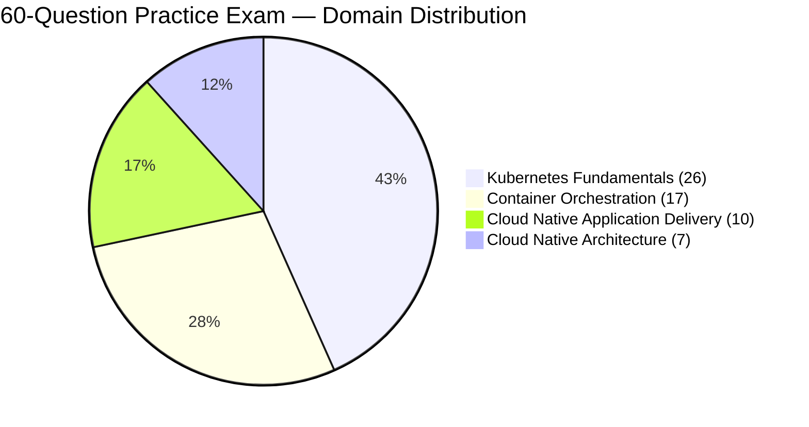
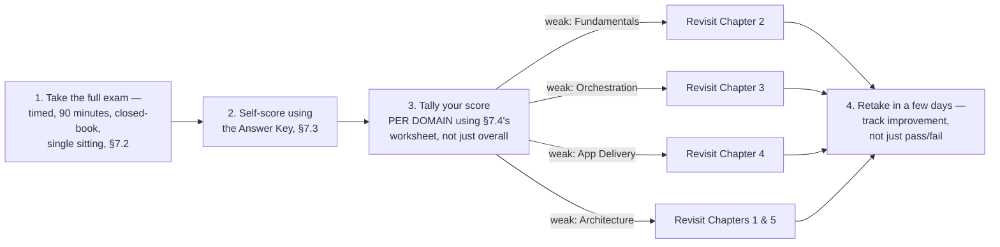

# Chapter 7: Full-Length Practice Exam

*KCNA Prep Guide Writer | This is an original, unofficial practice exam written for this guide. It reproduces the real exam's format, length, and live-verified domain weighting — but not its actual questions, which would violate the Linux Foundation's Certification Agreement. Every question below is grounded in material actually taught in Chapters 0 through 6 of this guide.*

---

## 7.0 Chapter Orientation

### What makes this different from every practice question so far

Chapters 1 through 6 each ended with a small set of practice questions, scoped to that chapter's own content, meant to be answered right after learning the material — low-stakes, immediate reinforcement. This chapter is a different exercise entirely: **60 questions, weighted to the exact live domain percentages, meant to be taken in one sitting, under real timed conditions, cold** — simulating exam day itself before you've committed to a real registration.

**Figure 7-1: This Exam's Domain Distribution**

These counts come directly from applying the live, re-verified domain weights (Chapter 0, §0.4) to 60 total questions: 44% → 26.4, 28% → 16.8, 16% → 9.6, 12% → 7.2, each rounded to the nearest whole question, summing back to exactly 60.

### An honest note on this exam's one deliberate departure from realism

The real KCNA exam interleaves questions from all four domains in random order — you won't get 26 Kubernetes Fundamentals questions in a row. **This practice exam groups questions by domain instead, in four clearly labeled sections.** That's a deliberate trade-off, not an oversight: grouping makes the exam far easier to hand-build accurately, and — more importantly — it makes **self-diagnosis after grading dramatically easier**, since a weak section maps directly to "you struggled with Container Orchestration" rather than requiring you to cross-reference a domain column for 60 individual questions. If you want a fully randomized run closer to real exam conditions, copy the questions into a spreadsheet or quiz tool and shuffle them yourself before attempting it a second time.

**Figure 7-2: How to Use This Chapter**

---

## 7.1 Before You Start: Timing This Exam Honestly

Give yourself the full **90 minutes**, uninterrupted, no notes, no re-opening earlier chapters mid-attempt — the value of this exercise depends entirely on simulating real conditions, including the discomfort of not being sure and having to move on anyway.

| Rough time budget | For |
|---|---|
| ~2 minutes | Read this orientation, get a timer running |
| ~78 minutes | The 60 questions — roughly 1.3 minutes each, unevenly, since some will take 10 seconds and others 3 minutes |
| ~10 minutes | A final pass over anything you flagged as uncertain |

Answer every question, even a pure guess — an unanswered question is guaranteed wrong, while a guess at least has a chance. Mark questions you're unsure of and move on rather than stalling; you can return to them if time allows.

*(Full exam-day logistics — the actual proctoring rules, ID requirements, and environment checks for the real exam — are covered in Chapter 8, not here. This section is only about running this specific practice attempt honestly.)*

---

## 7.2 The Exam

### Section A — Kubernetes Fundamentals (Questions 1–26)

**Q1.** You run `kubectl apply -f deployment.yaml` twice in a row, with no changes to the file between runs. What happens the second time?

A. An error is returned, since the resource already exists
B. Kubernetes creates a duplicate Deployment
C. Nothing changes — the declared state already matches the actual state, so there's nothing to reconcile
D. The Deployment is deleted and recreated

**Q2.** Which control plane component is the cluster's single, persistent source of truth for all state?

A. `kube-scheduler`
B. `kube-apiserver`
C. `etcd`
D. `kubelet`

**Q3.** A cluster administrator wants Kubernetes to automatically provision a cloud provider's external load balancer when a `LoadBalancer`-type Service is created. Which optional control plane component enables this integration?

A. `kube-controller-manager`
B. `cloud-controller-manager`
C. `kube-proxy`
D. `kube-scheduler`

**Q4.** Which statement correctly distinguishes the responsibilities of `kube-scheduler` and `kubelet`?

A. `kube-scheduler` starts containers; `kubelet` decides which node they run on
B. `kube-scheduler` decides which node a Pod runs on; `kubelet` actually starts the containers on that node
C. They perform the identical function and either can substitute for the other
D. `kube-scheduler` only operates on worker nodes; `kubelet` only operates on the control plane

**Q5.** On a worker node, which component actually pulls a container image and starts the container, invoked via the CRI?

A. `kube-proxy`
B. `kubelet` itself, directly
C. The container runtime (e.g., containerd or CRI-O)
D. `kube-apiserver`

**Q6.** What is the currently preferred term for the node that hosts the control plane components, replacing the older "master node" terminology?

A. "Head node"
B. "Primary node"
C. "Control plane node"
D. "Root node"

**Q7.** What is the correct order of `kube-scheduler`'s Pod-placement decision pipeline?

A. Score → Filter → Bind
B. Bind → Filter → Score
C. Filter → Score → Bind
D. Filter → Bind → Score

**Q8.** What does the Open Container Initiative (OCI) standardize?

A. How Pods are assigned IP addresses
B. The container image format and the low-level container runtime specification
C. How `kubelet` communicates with the API server
D. How persistent storage volumes are provisioned

**Q9.** Two containers within the same Pod need to exchange data over the network. What is the simplest, correct mechanism?

A. Through a Kubernetes Service object
B. Over `localhost`, since they share one network namespace
C. Through an Ingress controller
D. They must use a shared volume; direct network communication is not possible

**Q10.** A Deployment replaces a failed Pod with a new one. What is true of the new Pod's IP address compared to the old one's?

A. It is guaranteed to be identical
B. It is typically different — the new Pod is a distinct object, not a revival of the old one
C. IP addresses are not assigned to Pods at all
D. It depends solely on the `restartPolicy` setting

**Q11.** Which `apiVersion` is correct for a `Job` object?

A. `v1`
B. `apps/v1`
C. `batch/v1`
D. `jobs/v1`

**Q12.** Which `apiVersion` is correct for a `Pod` object?

A. `apps/v1`
B. `v1`
C. `core/v1`
D. `pods/v1`

**Q13.** Which file bundles together a cluster's API server address, a user's credentials, and a default namespace into a single, switchable configuration?

A. `Dockerfile`
B. `kustomization.yaml`
C. The kubeconfig file
D. `Chart.yaml`

**Q14.** Which flag combination lets you generate correctly structured YAML from an imperative `kubectl create` command, without actually creating anything in the cluster?

A. `--validate-only`
B. `--dry-run=client -o yaml`
C. `--preview`
D. `--no-apply`

**Q15.** If you create a Pod without specifying a namespace, which namespace does it land in?

A. `kube-system`
B. `kube-public`
C. `default`
D. It fails validation and is rejected

**Q16.** By default, does placing two Pods in different Namespaces prevent them from communicating over the network?

A. Yes, Namespaces are a network isolation boundary by default
B. No — Namespaces are an organizational/naming boundary; network isolation requires a NetworkPolicy
C. Only if both Pods are in the `kube-system` namespace
D. Only for Pods created via a Deployment, not a bare Pod

**Q17.** Which of the following is **not** one of the five official Kubernetes Pod lifecycle phases?

A. `Pending`
B. `Running`
C. `CrashLoopBackOff`
D. `Succeeded`

**Q18.** Why is it generally discouraged to create a bare `ReplicaSet` directly in production, rather than a `Deployment`?

A. ReplicaSets cannot guarantee a replica count
B. A ReplicaSet provides no built-in mechanism for safe rolling updates or rollback — a Deployment adds that on top
C. ReplicaSets are deprecated and will be removed in a future release
D. ReplicaSets can only run a single replica

**Q19.** A `Deployment`'s `spec.selector.matchLabels` does not match its own `spec.template.metadata.labels`. What happens when you attempt to apply it?

A. It's created successfully, but manages zero Pods
B. Kubernetes rejects it outright with a validation error
C. Kubernetes silently corrects the mismatched labels
D. It's created, and Pods are assigned random labels

**Q20.** A Deployment's rolling update is configured with `maxSurge: 1` and `maxUnavailable: 0`. What does this combination achieve?

A. Guaranteed downtime during every rollout
B. A true zero-downtime rollout, at the cost of briefly running one extra Pod
C. The rollout is paused indefinitely
D. All old Pods are deleted before any new ones are created

**Q21.** After a Deployment rollout completes, why is the previous, now-zeroed-out ReplicaSet typically kept around rather than deleted immediately?

A. It's a bug that will eventually be patched
B. It enables an instant rollback via `kubectl rollout undo`, by simply scaling it back up
C. Kubernetes requires a minimum of two ReplicaSets to exist at all times
D. It's used to calculate the next rollout's `maxSurge` value

**Q22.** A Pod specifies `nodeSelector: { disktype: ssd }`, but no node in the cluster carries that label. What results?

A. The Pod is scheduled onto a random node anyway
B. The Pod remains stuck in `Pending`, since no node satisfies the hard constraint
C. Kubernetes automatically labels a node to satisfy the request
D. The Pod fails validation at creation time

**Q23.** What is the functional difference between taints/tolerations and node affinity?

A. They are functionally identical mechanisms with different syntax
B. Taints/tolerations repel Pods from a node unless explicitly tolerated; node affinity attracts Pods toward specific nodes
C. Taints/tolerations control storage, not scheduling
D. Node affinity is deprecated in favor of taints and tolerations

**Q24.** A container exceeds its configured CPU `limit`. What happens?

A. The container is immediately killed (OOMKilled)
B. The container is throttled — slowed down — but keeps running
C. The Pod is evicted from the node
D. Nothing; CPU limits are purely advisory

**Q25.** When deciding whether a node has enough room to accept a new Pod, does the scheduler evaluate the Pod's `requests` or its `limits`?

A. `limits`
B. `requests`
C. Both, averaged together
D. Neither — node capacity is unrelated to scheduling

**Q26.** In Kubernetes API terminology, what is an "API group"?

A. A single running instance of a resource, such as one specific Pod
B. A named collection of related resource types, such as `apps` or `batch`
C. A list of every resource of one type in a namespace
D. A synonym for "namespace"

---

### Section B — Container Orchestration (Questions 27–43)

**Q27.** Given that every Pod already has its own IP address, why does a Service still need to exist?

A. Services are required for a Pod to have any IP address at all
B. Pod IPs change whenever a Pod is replaced; a Service provides one stable virtual IP and DNS name in front of a changing set of Pods
C. Services exist purely for external, internet-facing traffic
D. Services replace the need for a container runtime

**Q28.** Which Service type is the default, and is reachable only from inside the cluster?

A. `NodePort`
B. `LoadBalancer`
C. `ClusterIP`
D. `ExternalName`

**Q29.** Which Service type opens a static port in the 30000–32767 range on every node in the cluster?

A. `ClusterIP`
B. `NodePort`
C. `ExternalName`
D. Headless

**Q30.** What distinguishes a Headless Service (`clusterIP: None`) from a standard Service?

A. It provides no DNS entry at all
B. It disables load balancing — DNS returns each matching Pod's individual IP instead of one shared virtual IP
C. It can only be used with the `LoadBalancer` type
D. It is only usable for external traffic, never internal

**Q31.** Which object holds the live, continuously updated list of Pod IPs currently matching a Service's selector?

A. `ConfigMap`
B. `Endpoints` (or `EndpointSlice`)
C. `Ingress`
D. `NetworkPolicy`

**Q32.** What is the correct fully qualified DNS name format for a Service inside the cluster?

A. `service-name.cluster.svc.namespace`
B. `service-name.namespace.svc.cluster.local`
C. `namespace.service-name.local.cluster`
D. `svc://service-name.namespace`

**Q33.** An `Ingress` object has been successfully applied with `kubectl apply`, but requests to its configured host fail entirely. What is the most likely cause?

A. Ingress objects are deprecated
B. No Ingress controller is deployed in the cluster to act on the Ingress object
C. Ingress only supports the `NodePort` Service type
D. The Ingress object must be recreated every 24 hours

**Q34.** With zero `NetworkPolicy` objects applied anywhere in a cluster, what is the default network behavior between two Pods, even across different namespaces?

A. All traffic is denied by default
B. All traffic is allowed by default
C. Only DNS traffic is allowed by default
D. It depends entirely on RBAC configuration

**Q35.** In the "4 Cs" of cloud native security, what is the correct order from outermost (broadest) layer to innermost (most specific)?

A. Code → Container → Cluster → Cloud
B. Cluster → Cloud → Code → Container
C. Cloud → Cluster → Container → Code
D. Container → Code → Cloud → Cluster

**Q36.** In the API server's request-handling pipeline, which stage determines whether an already-authenticated identity is permitted to perform a specific action on a specific resource?

A. Authentication
B. Authorization (evaluated via RBAC)
C. Admission control
D. Scheduling

**Q37.** A `ClusterRole` named `viewer` is bound to a subject using a `RoleBinding` created in the `team-a` namespace. What is the effective scope of the granted permissions?

A. Cluster-wide, across every namespace
B. Limited to the `team-a` namespace only
C. No permissions are granted, since ClusterRoles require a ClusterRoleBinding
D. Limited to the `kube-system` namespace only

**Q38.** What is the primary risk of leaving every Pod in a namespace on that namespace's automatically created `default` ServiceAccount?

A. Pods without an explicit ServiceAccount will fail to start
B. It's a shared, unscoped identity used by every unconfigured Pod, rather than a least-privilege identity dedicated to one application
C. The `default` ServiceAccount always has full cluster-admin access
D. It has no practical risk at all

**Q39.** Which `securityContext` setting specifically prevents a container from writing to its own filesystem at runtime?

A. `runAsNonRoot: true`
B. `allowPrivilegeEscalation: false`
C. `readOnlyRootFilesystem: true`
D. `capabilities.drop: ["ALL"]`

**Q40.** PodSecurityPolicy (PSP) was fully removed from Kubernetes as of which release, and what replaced it?

A. Removed in v1.18; replaced by RBAC
B. Removed in v1.25; replaced by Pod Security Admission
C. It was never removed and remains the current standard
D. Removed in v1.30; replaced by NetworkPolicy

**Q41.** Why does base64-encoding the values in a Kubernetes `Secret` object fail to provide meaningful confidentiality?

A. Base64 is a reversible encoding, not an encryption algorithm — anyone with read access can trivially decode it
B. Base64 only works for numeric values
C. Kubernetes actually uses AES-256 internally despite displaying base64
D. Secrets are not base64-encoded at all; they are stored in plain text

**Q42.** Which Kubernetes volume type exists only for the lifetime of its Pod and is wiped entirely if the Pod is deleted?

A. `persistentVolumeClaim`
B. `emptyDir`
C. `configMap`
D. `hostPath`, in all cases

**Q43.** What is the correct distinction between a `PersistentVolume` and a `PersistentVolumeClaim`?

A. A PersistentVolumeClaim is the actual storage resource; a PersistentVolume is a request for it
B. A PersistentVolume is the actual storage resource; a PersistentVolumeClaim is a developer's request for storage matching certain criteria
C. They are interchangeable terms
D. A PersistentVolumeClaim can only be created by a cluster administrator, never a developer

---

### Section C — Cloud Native Application Delivery (Questions 44–53)

**Q44.** Which two values are natively supported by a Kubernetes `Deployment`'s `spec.strategy.type` field?

A. `BlueGreen` and `Canary`
B. `Recreate` and `RollingUpdate`
C. `Canary` and `RollingUpdate`
D. `Recreate` and `BlueGreen`

**Q45.** In a Canary deployment, how is traffic typically split between the stable and new versions?

A. Kubernetes' native Deployment object handles the traffic split automatically
B. Through a mechanism external to the Deployment object itself — a weighted Service/Ingress, a service mesh, or a tool like Argo Rollouts or Flagger
C. DNS records are manually updated for each user
D. It is not possible to split traffic between two versions in Kubernetes

**Q46.** What is the key difference between "Continuous Delivery" and "Continuous Deployment"?

A. They are entirely synonymous
B. Continuous Delivery keeps a human decision point before production release; Continuous Deployment removes that gate and releases automatically
C. Continuous Deployment requires manual testing; Continuous Delivery does not
D. Continuous Delivery only applies to database migrations

**Q47.** In GitOps, what does the principle of state being "pulled automatically" actually mean, architecturally?

A. An external CI/CD pipeline pushes changes into the cluster using stored credentials
B. An agent running inside the cluster retrieves the desired state from Git itself, rather than an external system pushing changes in
C. Developers must manually pull changes onto their local machines before every deploy
D. Kubernetes automatically pulls container images on a schedule

**Q48.** Why is GitOps' pull-based model considered a meaningful security improvement over a traditional push-based CD pipeline?

A. Pull-based systems are inherently faster
B. No external system needs to hold live, powerful cluster-write credentials, since the in-cluster agent is the only thing with write access
C. Push-based pipelines cannot use Git at all
D. Pull-based systems do not require any authentication

**Q49.** In a GitOps tool like ArgoCD or Flux, what does "self-heal" refer to?

A. A Pod automatically restarting after a crash
B. The GitOps agent automatically reverting manual, out-of-Git changes made directly against the live cluster, to match Git's declared state
C. A cluster automatically repairing hardware failures
D. Automatic rollback of a failed CI pipeline

**Q50.** In Helm terminology, what is a single, named, installed instance of a Chart called?

A. A Repository
B. A Template
C. A Release
D. A Bundle

**Q51.** What is the core philosophical difference between Helm and Kustomize?

A. Helm patches plain YAML with no templating language; Kustomize uses Go-template placeholders
B. Helm renders manifests from a templating language with placeholder values; Kustomize patches complete, valid, plain YAML with no templating syntax at all
C. They solve completely unrelated problems and are never used together
D. Kustomize can only be used to install third-party packages, never your own YAML

**Q52.** A GitOps tool reports an application as `Synced` and `Healthy`, but users are experiencing errors in production. What does this scenario best indicate?

A. The GitOps tool has a critical bug
B. A successfully applied manifest doesn't guarantee application-level correctness — the next step is cluster-level troubleshooting (Chapter 3's toolkit), not further GitOps debugging
C. This situation is impossible in a correctly configured GitOps setup
D. The cluster must be rebuilt from scratch

**Q53.** A container image was built successfully and pushed to the registry, but nothing in the environment ever changed to reference the new image tag. At which stage of the delivery pipeline did the failure most likely occur?

A. The CI build/test stage
B. The image registry push stage
C. The stage responsible for updating the deployment manifest to reference the new tag
D. The live production stage

---

### Section D — Cloud Native Architecture (Questions 54–60)

**Q54.** Which CNCF governance body is responsible for approving a project's promotion from Incubating to Graduated status?

A. The Governing Board
B. The End User Community
C. The Technical Oversight Committee (TOC)
D. The CNCF marketing team

**Q55.** What is the key distinction between a foundation-level TAG and a project-level SIG?

A. There is no meaningful difference; the terms are fully interchangeable today
B. A TAG provides technical guidance across the whole CNCF ecosystem; a SIG operates within a single project, such as Kubernetes' own SIG-Networking
C. SIGs only exist for archived projects
D. TAGs are elected by popular vote among end users

**Q56.** Which open standard was archived by the CNCF TOC in October 2023, with its functionality absorbed into the Kubernetes Gateway API's GAMMA initiative?

A. CSI
B. CRI
C. SMI (Service Mesh Interface)
D. CNI

**Q57.** Which autoscaling project is purpose-built to scale Kubernetes workload replicas — including scaling all the way to and from zero — based on external event sources like message queue depth?

A. The Vertical Pod Autoscaler (VPA)
B. The Cluster Autoscaler
C. KEDA
D. The standard Horizontal Pod Autoscaler (HPA) alone

**Q58.** What is the fundamental distinction between monitoring and observability?

A. They are synonyms with no practical difference
B. Monitoring watches pre-defined conditions ("known unknowns"); observability is the broader ability to reconstruct and answer previously unanticipated questions ("unknown unknowns") from a system's outputs
C. Observability applies only to logs; monitoring applies only to metrics
D. Monitoring requires Prometheus; observability does not

**Q59.** Why can't Kubernetes' built-in `metrics-server` be used to power a dashboard showing average memory usage over the last 24 hours?

A. `metrics-server` only reports CPU, never memory
B. `metrics-server` holds no historical data at all — only the current, in-memory snapshot
C. `metrics-server` requires a paid license for historical queries
D. Dashboards are technically impossible in Kubernetes

**Q60.** What is OpenTelemetry's actual role within an observability stack?

A. It is itself a storage backend that replaces the need for tools like Jaeger or Prometheus
B. It provides vendor-neutral instrumentation and a collection pipeline for traces, metrics, and logs, but requires a separate backend (such as Jaeger or Prometheus) to actually store and display the data
C. It is exclusively for capturing logs, and cannot handle traces or metrics
D. It only functions outside of Kubernetes environments

---

## 7.3 Answer Key & Explanations

**Section A — Kubernetes Fundamentals**

| # | Answer | Explanation |
|---|---|---|
| 1 | **C** | Declarative reconciliation only acts on a mismatch between desired and actual state; with nothing changed, there's nothing to reconcile. *(Ch2, §2.1)* |
| 2 | **C** | `etcd` is the sole persistent store; every other component reads/writes through the API server. *(Ch2, §2.2)* |
| 3 | **B** | `cloud-controller-manager` is the optional component that integrates with a specific cloud provider's own APIs. *(Ch2, §2.2)* |
| 4 | **B** | Scheduler decides the node; kubelet executes by actually starting containers. *(Ch2, §2.2)* |
| 5 | **C** | The container runtime, invoked via the CRI, actually pulls images and runs containers. *(Ch1, §1.5; Ch2, §2.2)* |
| 6 | **C** | "Control plane node" is current terminology, replacing the deprecated "master node" label. *(Ch2, §2.2)* |
| 7 | **C** | Filter removes infeasible nodes, Score ranks the rest, Bind writes the final decision. *(Ch2, §2.6)* |
| 8 | **B** | OCI standardizes the container image format and low-level runtime spec. *(Ch1, §1.5)* |
| 9 | **B** | Containers in one Pod share a network namespace and reach each other via `localhost`. *(Ch2, §2.3)* |
| 10 | **B** | A replacement Pod is a new object with a new identity, typically including a new IP. *(Ch2, §2.3)* |
| 11 | **C** | `Job` and `CronJob` live in the `batch/v1` API group. *(Ch2, §2.4)* |
| 12 | **B** | `Pod` is a core-group object, using plain `v1` with no prefix. *(Ch2, §2.4)* |
| 13 | **C** | The kubeconfig file bundles cluster, user, and context (including namespace) together. *(Ch2, §2.4)* |
| 14 | **B** | `--dry-run=client -o yaml` renders YAML locally without creating anything. *(Ch2, §2.4)* |
| 15 | **C** | `default` is the namespace used when none is specified. *(Ch2, §2.5)* |
| 16 | **B** | Namespaces are organizational, not a network boundary, absent a NetworkPolicy. *(Ch2, §2.5)* |
| 17 | **C** | `CrashLoopBackOff` is a container status *reason*, not one of the five official Pod phases. *(Ch2, §2.5; Ch3, §3.4)* |
| 18 | **B** | A bare ReplicaSet has no safe update/rollback mechanism; Deployment adds that. *(Ch2, §2.5)* |
| 19 | **B** | A Deployment must be able to select its own Pods; a mismatch is rejected outright. *(Ch2, §2.5)* |
| 20 | **B** | `maxUnavailable: 0` guarantees no Pod capacity is ever lost during rollout, at the cost of a brief surge. *(Ch2, §2.5)* |
| 21 | **B** | Keeping the old ReplicaSet at zero replicas enables an instant rollback by re-scaling it. *(Ch2, §2.5)* |
| 22 | **B** | `nodeSelector` is a hard requirement; with no matching node, the Pod stays `Pending`. *(Ch2, §2.6)* |
| 23 | **B** | Taints/tolerations repel unless tolerated; affinity/`nodeSelector` attract. *(Ch2, §2.6)* |
| 24 | **B** | CPU is compressible — exceeding a limit results in throttling, not termination. *(Ch2, §2.6)* |
| 25 | **B** | The scheduler's Filter phase uses `requests`, not `limits`, to judge node capacity. *(Ch2, §2.6)* |
| 26 | **B** | An API group is a named collection of related resource types, like `apps` or `batch`. *(Ch2, §2.4)* |

**Section B — Container Orchestration**

| # | Answer | Explanation |
|---|---|---|
| 27 | **B** | Pod IPs are unstable across replacements; a Service provides one stable virtual IP/DNS name. *(Ch3, §3.1)* |
| 28 | **C** | `ClusterIP` is the default, internal-only Service type. *(Ch3, §3.1)* |
| 29 | **B** | `NodePort` opens a static port (30000–32767) on every node. *(Ch3, §3.1)* |
| 30 | **B** | A Headless Service disables load balancing; DNS returns individual Pod IPs instead. *(Ch3, §3.1)* |
| 31 | **B** | `Endpoints`/`EndpointSlice` holds the live, resolved list of matching Pod IPs. *(Ch3, §3.1)* |
| 32 | **B** | The correct FQDN pattern is `service-name.namespace.svc.cluster.local`. *(Ch3, §3.1)* |
| 33 | **B** | An Ingress object is inert without a separately deployed Ingress controller. *(Ch3, §3.1)* |
| 34 | **B** | With no NetworkPolicies applied, all Pod-to-Pod traffic is allowed by default, cluster-wide. *(Ch3, §3.1)* |
| 35 | **C** | The 4 Cs, outermost to innermost: Cloud → Cluster → Container → Code. *(Ch3, §3.2)* |
| 36 | **B** | Authorization (RBAC) determines whether an authenticated identity is permitted to act. *(Ch3, §3.2)* |
| 37 | **B** | A ClusterRole bound via a RoleBinding applies only within that RoleBinding's namespace. *(Ch3, §3.2)* |
| 38 | **B** | The `default` ServiceAccount is a shared, unscoped identity — not least-privilege. *(Ch3, §3.2)* |
| 39 | **C** | `readOnlyRootFilesystem: true` specifically blocks writes to the container's own filesystem. *(Ch3, §3.2)* |
| 40 | **B** | PSP was fully removed in Kubernetes v1.25, replaced by Pod Security Admission. *(Ch3, §3.2)* |
| 41 | **A** | Base64 is a reversible encoding, not encryption — it provides no confidentiality on its own. *(Ch3, §3.2)* |
| 42 | **B** | `emptyDir` exists only for the Pod's own lifetime and is wiped when the Pod is deleted. *(Ch3, §3.3)* |
| 43 | **B** | A PersistentVolume is the actual storage resource; a PersistentVolumeClaim is a request for it. *(Ch3, §3.3)* |

**Section C — Cloud Native Application Delivery**

| # | Answer | Explanation |
|---|---|---|
| 44 | **B** | `Recreate` and `RollingUpdate` are the only native `strategy.type` values. *(Ch4, §4.1)* |
| 45 | **B** | Canary requires external traffic-splitting tooling — Kubernetes has no native canary mechanism. *(Ch4, §4.1)* |
| 46 | **B** | Delivery keeps a human release gate; Deployment automates the release entirely. *(Ch4, §4.2)* |
| 47 | **B** | "Pulled automatically" means an in-cluster agent retrieves state from Git, not an external push. *(Ch4, §4.3)* |
| 48 | **B** | No external system holds cluster-write credentials in a pull-based model — the agent is the sole writer. *(Ch4, §4.3)* |
| 49 | **B** | Self-heal reverts manual, out-of-Git cluster drift back to match Git automatically. *(Ch4, §4.3)* |
| 50 | **C** | A Release is one specific, named, installed instance of a Chart. *(Ch4, §4.4)* |
| 51 | **B** | Helm templates with placeholders; Kustomize patches complete, valid YAML with no templating language. *(Ch4, §4.4)* |
| 52 | **B** | "Synced and Healthy" only confirms the manifest applied correctly, not application-level correctness. *(Ch4, §4.5)* |
| 53 | **C** | The failure is in the stage responsible for updating the manifest to reference the new image tag. *(Ch4, §4.5)* |

**Section D — Cloud Native Architecture**

| # | Answer | Explanation |
|---|---|---|
| 54 | **C** | The Technical Oversight Committee (TOC) owns and approves project lifecycle transitions. *(Ch1, §1.2)* |
| 55 | **B** | A TAG spans the whole CNCF ecosystem; a SIG is scoped to one project, like Kubernetes' own SIGs. *(Ch1, §1.2)* |
| 56 | **C** | SMI was archived October 2023; its role was absorbed by the Gateway API's GAMMA initiative. *(Ch1, §1.5)* |
| 57 | **C** | KEDA is purpose-built for event-driven scaling, including to and from zero. *(Ch1, §1.7)* |
| 58 | **B** | Monitoring covers anticipated conditions; observability enables answering unanticipated questions. *(Ch5, §5.1)* |
| 59 | **B** | `metrics-server` is intentionally history-free, holding only the current in-memory snapshot. *(Ch5, §5.3)* |
| 60 | **B** | OpenTelemetry is an instrumentation/collection standard, not a storage backend or UI itself. *(Ch5, §5.5)* |

---

## 7.4 Scoring Worksheet & Diagnostic Guide

| Domain | Questions | Your correct count | Out of | Your % |
|---|---|---|---|---|
| Kubernetes Fundamentals | 1–26 | ____ | 26 | ____% |
| Container Orchestration | 27–43 | ____ | 17 | ____% |
| Cloud Native Application Delivery | 44–53 | ____ | 10 | ____% |
| Cloud Native Architecture | 54–60 | ____ | 7 | ____% |
| **Overall** | 1–60 | ____ | 60 | ____% |

Recall from Chapter 0, §0.2: the real exam requires **75% overall** to pass. Use the table below to decide where to spend your remaining study time — a domain-level breakdown is far more actionable than a single overall percentage.

| Your score in a domain | What it suggests | Recommended action |
|---|---|---|
| Below 60% | A genuine gap, not just nerves | Reread that domain's full chapter(s) from the start, then redo that chapter's own end-of-chapter practice questions |
| 60–79% | The concepts are there, but shaky in specific spots | Go question-by-question through what you missed, jump to the exact cross-referenced section for each, then re-attempt only those topics |
| 80% and above | Solid — this is exam-ready territory | A light skim of that domain's cheat sheet (each chapter's final numbered section) is probably enough |

**A specific, honest note if your overall score is above 75% but one domain is well below it:** don't let a strong overall average hide a weak domain — the real exam draws questions proportionally from all four domains regardless of your overall trend, so a genuinely weak Container Orchestration score (for example) is exactly as risky on exam day as a weak overall score, even if your Kubernetes Fundamentals results are pulling the average up.

---

## 7.5 Sources & Further Reading

This chapter is a synthesis of material already sourced in full within Chapters 1 through 6 — rather than duplicate every citation here, each answer above links back to the specific chapter section where the full explanation, diagram, and original sourcing live. For the underlying exam-format facts referenced in §7.0–7.1 (domain weights, passing score, timing):

- [KCNA certification page — domains, weights, price, policy](https://training.linuxfoundation.org/certification/kubernetes-cloud-native-associate/)
- [Official CNCF curriculum PDF](https://github.com/cncf/curriculum/blob/master/KCNA_Curriculum.pdf)

---

## 7.6 What I Assumed, and Questions Back to You

1. **I grouped this exam by domain rather than randomly interleaving it**, and explained why in §7.0 — accurate hand-construction and easier self-diagnosis, at the cost of one piece of exam-day realism. If you'd like, I can also produce a second version of this same 60-question set in genuinely shuffled order (with an answer key that maps back to domains separately) for a more realistic second attempt — say the word and I'll generate it as an additional file.
2. **Every question was built strictly from material actually taught in Chapters 0–6** — I deliberately avoided introducing untaught facts (e.g., ResourceQuota/LimitRange specifics, which were only mentioned in passing) so this exam is a fair, coherent self-assessment of *this guide specifically*, not a trap testing outside knowledge. Flag it if you'd rather I expand the guide's coverage first and then produce a broader follow-up exam.
3. **Explanations in the Answer Key are intentionally concise** (one to two sentences plus a cross-reference) rather than the fuller inline explanations used in Chapters 1–6's practice questions — I judged that appropriate at 60-question scale, trusting the cross-reference to do the heavy lifting if you need the full explanation. Tell me if you'd prefer the fuller explanation style even at this length.
4. **I did not include a second, fully-randomized copy of this exam** as a companion "retake" — mentioned as an option in point 1 above rather than generated automatically, since it would roughly double this chapter's length. Say so if you want it now rather than as a later add-on.

Say "continue" and I'll move on to **Chapter 8: Exam-Day Logistics** — the proctoring checklist, timing strategy, and what actually happens after you click "Finish Exam."
