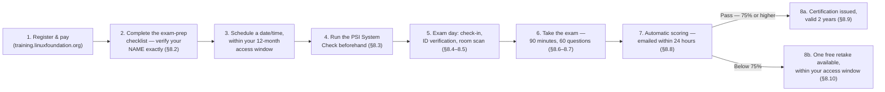
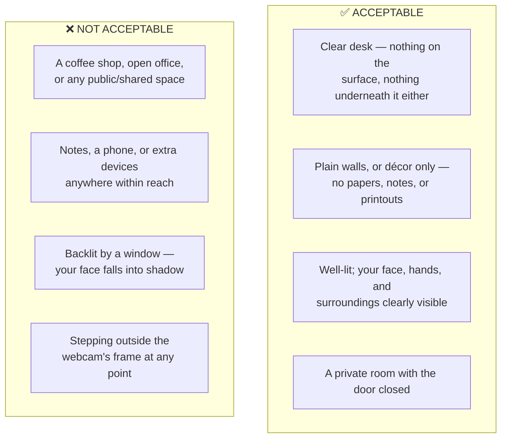
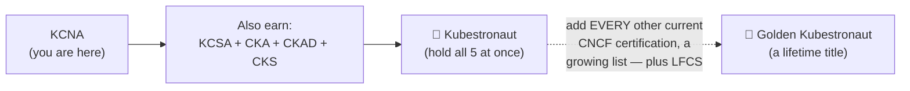

# Chapter 8: Exam-Day Logistics — From Scheduling to Certification

*KCNA Prep Guide Writer | Every policy in this chapter was re-fetched live from the official Linux Foundation documentation while writing it — including a genuinely recent change to the Golden Kubestronaut requirements, confirmed down to the exact effective dates.*

---

## 8.0 Chapter Orientation

This is the guide's final chapter, and it closes a loop that opened in Chapter 0: back then, you learned *what* the exam is. Now you'll learn exactly *what happens* on the day you take it — from the moment you click "schedule" to the moment a certificate with your name on it exists, plus the honest, practical version of what comes after, whether that's a passing score or a second attempt.

**Figure 8-1: The Full Exam Lifecycle**

---

## 8.1 Everything in This Chapter Was Re-Verified Live, and Here's Why That Mattered

Before the logistics themselves, one honest note on method: exam-day policy is exactly the category of fact where being *confidently wrong* could cost you a real, paid exam attempt — not just a wrong answer on a quiz. So rather than reuse Chapter 0's original research, I re-fetched the Linux Foundation's own **[Important Instructions](https://docs.linuxfoundation.org/tc-docs/certification/important-instructions-mc)** and **[FAQ](https://docs.linuxfoundation.org/tc-docs/certification/faq-mc)** pages fresh while writing this specific chapter. It was worth it: I also re-checked the Kubestronaut program page from Chapter 0's source list, and found its requirements have genuinely changed — details in §8.9. Treat that as a standing reminder, not just for me but for you too: **before you actually schedule**, do the same 30-second check against the live pages linked throughout this chapter, since policy can shift between when this guide was written and when you sit the exam.

---

## 8.2 Before You Schedule: the One Detail That Trips Up Honest People

Somewhere between registering and scheduling, you'll fill out an exam checklist that records your **name exactly as you intend to present it on exam day.**

> **Confusion alert — this is one of the highest-stakes, easiest-to-avoid mistakes in the entire process, and it has nothing to do with Kubernetes.** Per the official ID requirements: *"the first and last name on the ID must **exactly match** the verified name entered on your exam checklist."* This sounds trivial until you consider how many people's day-to-day name differs subtly from their legal ID — a middle name included on your passport but omitted from your checklist entry, a hyphenated surname entered without the hyphen, a preferred first name that isn't your legal one. Any of these mismatches is grounds for being denied entry to a proctored exam you've already paid for. **The fix is simple and worth doing right now if you haven't yet:** pull out the exact government-issued ID you plan to use on exam day, and type your name into the checklist *character-for-character* as it appears there — not how you'd write it on a resume, not a nickname, not an anglicized version. This single five-minute check is the cheapest insurance in this entire guide.

---

## 8.3 System & Software Requirements

The exam runs on **PSI's "Bridge" proctoring platform**, through the **PSI Secure Browser** (a Chrome-based, purpose-built browser downloaded at exam launch time — not something you install days in advance). Run the **[PSI Online Proctoring System Check](https://syscheck.bridge.psiexams.com/)** before your scheduled time, not on the day itself, so any problems surface while you still have time to fix them.

| Requirement | Detail |
|---|---|
| **Monitors** | **Exactly one active monitor.** Dual monitors are explicitly *not* supported — disconnect a second display beforehand, don't just turn it off |
| **Browser** | Any browser can *schedule*, but the actual exam uses the PSI Secure Browser; the latest Google Chrome is recommended for compatibility |
| **Internet** | A wired connection is preferred over Wi-Fi; make sure nobody else on your network is streaming, gaming, or on a video call during your session |
| **Webcam** | Must be able to physically pan around the room — a fixed laptop camera you can't tilt or move may not satisfy the room-scan requirement |
| **Microphone** | Test it working *before* your session starts, not during check-in |
| **Background software** | Disable firewalls, antivirus scanning, and VPNs where possible — they're a common cause of secure-browser installation failures |
| **Virtual machines** | **Not allowed**, even if the system check doesn't flag an issue — you must test from the actual physical machine |
| **Power** | If using a laptop, keep it plugged in — a dead battery mid-exam is not a valid basis for a do-over |

> **Confusion alert — a work laptop "having a webcam and microphone" does not mean it's a safe choice, and the official guidance is unusually direct about this.** The Linux Foundation explicitly recommends **against** testing on an employer-issued device: corporate security software, endpoint management tools, and restricted user privileges frequently conflict with the Secure Browser's need to install itself and temporarily suspend other running processes. You need a machine on which you personally have permission to install software and end running processes — which a locked-down corporate laptop often, by design, does not allow.

---

## 8.4 The Physical Testing Environment

The proctor needs a clear, private view of you and your surroundings for the full 90 minutes.

**Figure 8-2: Acceptable vs. Unacceptable Testing Environments**

A few specifics worth calling out because they're stricter than people often assume: the "clutter-free" rule applies to **underneath** the desk as well as on top of it — a trash bin or a stack of papers on the floor near your feet is a real, documented reason a proctor can flag your space. Wall décor (paintings, plain decoration) is fine; anything with *text* on it — sticky notes, a whiteboard, a printed cheat sheet, even an innocuous to-do list — is not, and you may be asked to remove it before the exam is released to you.

---

## 8.5 ID Requirements

| Requirement | Detail |
|---|---|
| **Validity** | Must be current and unexpired — no exceptions |
| **Format** | An original, physical document — no photocopies, no photos of an ID, no digital/mobile ID |
| **Required fields** | Name, photo, and signature (government-issued biometric IDs without a signature field are accepted as an exception) |
| **Name match** | Must exactly match your exam checklist entry — see §8.2 |
| **Accepted forms** | International passport, government-issued driver's license/permit, government-issued local-language ID, national/state/province ID card, permanent resident (green) card |

**If you're a minor (16–18):** online proctored exams are permitted, but require a parent/guardian to submit a **Parental Release for Testing of Minors** form at least two weeks before the exam date, present valid ID and give verbal consent during check-in, alongside the minor's own valid student ID.

**A geographic note worth being aware of:** individuals from certain sanctioned countries (Cuba, Iran, Syria, North Korea, and the Crimea region of Ukraine, as of this writing) may still test, but only from *outside* that country, with both their registration and current ID showing an address outside it — this is a real, actively enforced policy, not a formality, and worth checking directly against the [official page](https://docs.linuxfoundation.org/tc-docs/certification/important-instructions-mc) if it could apply to you, since sanctions policy is exactly the kind of thing that changes without much notice.

---

## 8.6 Exam Day, Minute by Minute

1. **Log in** to your Training Portal and launch the exam at (or shortly before) your scheduled time — arrive within the appointment window; showing up more than 30 minutes late risks being treated as a no-show, forfeiting that attempt.
2. **Download and launch the PSI Secure Browser** — this happens right at launch time, not before, so don't expect to "pre-install" it days in advance.
3. **Self-check-in**: show your ID to the camera, pan your webcam around the room on request, and confirm your testing space meets the requirements in §8.4.
4. **A live proctor connects** via streaming audio, video, and screen share — their role is to facilitate check-in and monitor the session, *not* to help with technical exam content, so don't expect (or ask for) hints.
5. **The timer starts**, and you're in the exam itself — see §8.7 for how to actually spend those 90 minutes.

Everything from here forward is governed by the same testing-location and single-monitor rules from §8.3–8.4, continuously, for the full session — stepping out of frame, picking up your phone, or a second person entering the room mid-exam are all things a proctor can flag as a policy violation in real time.

---

## 8.7 Time Management Strategy for the Real Thing

Chapter 7 had you practice pacing on a low-stakes copy. Here's the same discipline, for the exam that counts.

| Time budget | For |
|---|---|
| First ~5 minutes | Read the interface, don't rush — get oriented, then start moving at a steady pace |
| ~78 minutes | The 60 questions themselves, weighted per Chapter 7's Figure 7-1 proportions — expect Kubernetes Fundamentals and Container Orchestration to occupy roughly 70% of your question count, and budget accordingly |
| Final ~7 minutes | A dedicated pass over anything flagged, before you commit |

**The flag-and-return strategy, restated for the real interface:** every question you're not immediately confident about gets flagged and skipped, not agonized over. Kubernetes exams (this one included) let you navigate freely between questions and mark them for review — use that. A question that would cost you four minutes of second-guessing now might resolve itself in ten seconds once your brain has had a break and moved through a dozen other, easier questions. **Never leave a question fully blank** — an unanswered question is a guaranteed zero, while even an uncertain guess has real odds on a four-option multiple choice question.

---

## 8.8 After You Click "Finish Exam"

Scoring is **fully automatic** — there's no human grading step, and barring a technical issue, your **score report is emailed within 24 hours** of completion. The report tells you whether you passed and your overall percentage; it does not, per official policy, provide a question-by-question breakdown of what you missed (unlike Chapter 7's self-graded practice exam, which deliberately *does* give you that granularity — one more reason the practice exam's diagnostic worksheet is worth taking seriously before the real attempt, since you won't get that same visibility afterward).

---

## 8.9 If You Pass: Your Badge, Validity, and What's Genuinely Next

Your certification is valid for **2 years** from the pass date. You'll be able to share a verifiable digital badge via **Credly**, using the same email you used for your Linux Foundation account (link a different email later from your Credly profile settings if needed) — shareable on LinkedIn, a resume, or anywhere an employer might want to independently confirm it's real.

### The path beyond KCNA — verified, and genuinely updated since Chapter 0 was written

**Figure 8-3: From KCNA to Kubestronaut, and Beyond**

| Program | Requirement | Notable perks |
|---|---|---|
| **Kubestronaut** | Hold all five: **KCNA, KCSA, CKA, CKAD, CKS** | An exclusive jacket, a Credly badge, a private Kubestronaut Slack, five 50%-off certification coupons per year, 20% off three CNCF events annually |
| **Golden Kubestronaut** | Hold *every current* CNCF certification — as of this writing: CKA, CKAD, CKS, KCNA, KCSA, PCA, ICA, CCA, CAPA, CGOA, CBA, OTCA, KCA, CNPA, CNPE — plus LFCS | A backpack and beanie, a THRIVE-ONE subscription (while the title is maintained), one free KCD ticket/year, 50% off one KubeCon/year, a 60% discount voucher for each new certification |

> **A live-verified example of exactly why "check before you commit" matters, right at the finish line of this guide:** the Golden Kubestronaut requirement list is not static. Per the Linux Foundation's own program page, **Certified Cloud Native Platform Engineering Associate (CNPA) became a requirement effective October 15, 2025**, and **Certified Cloud Native Platform Engineer (CNPE) became a requirement effective March 1, 2026** — both genuinely recent additions, reflecting the program's own stated intent to keep expanding as new CNCF certifications launch. If you're eyeing Golden Kubestronaut as a long-term goal, budget for that list to keep growing, and check the [live program page](https://training.linuxfoundation.org/resources/kubestronaut-program/) again immediately before you plan your final push toward it, rather than trusting any fixed list — including the one in this table.

### If you're deciding what's next right now, more modestly

| If you're... | Consider |
|---|---|
| Drawn to cluster administration, day-2 operations | **CKA** — hands-on, performance-based, no prerequisites |
| A developer building apps that run on Kubernetes | **CKAD** — hands-on, application-focused |
| Interested in the security angle you saw in Chapter 3 | **KCSA** first (associate-level, no prerequisite), then **CKS** (requires an active CKA) |
| Not sure yet | KCNA alone is a legitimate, complete, and respected credential — there's no obligation to keep going immediately |

---

## 8.10 If You Don't Pass: the Retake Path, Without the Shame Spiral

If your score lands below 75%, you have **one free retake** included with your original registration, usable within your original 12-month access window. This is a normal, expected part of the process, not a personal failing — recall Chris Aniszczyk's own figures cited in the original KCNA study guide's expert interview: even the hands-on CKA/CKAD exams see roughly a 50% first-attempt pass rate industry-wide, and KCNA candidates who prepared with genuine understanding rather than memorization tend to do meaningfully better than that baseline.

**The single most useful thing you can do before retaking:** don't just "study more" generically — go back to Chapter 7's scoring worksheet (§7.4), or the closest real equivalent you can reconstruct from what felt shaky on the actual exam, and identify **which domain**, specifically, pulled your score down. A 90% domain average dragged to a 60% overall by one genuinely weak area is a different, more fixable problem than uniform 75%-ish uncertainty everywhere — and it points you straight back to one specific chapter of this guide rather than a full re-read of everything.

---

## 8.11 The Final Cram Sheet — This Guide's Highest-Value Confusion Alerts, in One Place

Across eight chapters, certain "this looks like the same thing but isn't" traps came up as dedicated confusion alerts because they're genuinely the most commonly missed, highest-leverage distinctions in the whole curriculum. If you only have twenty minutes before your exam and nothing else, read this list.

1. **SMI is archived** (Oct 2023) — superseded by the Gateway API's GAMMA initiative. *(Ch1, §1.5)*
2. **TAG ≠ SIG** — TAG is foundation-wide; SIG is scoped to one project, like Kubernetes' own SIG-Networking. *(Ch1, §1.2)*
3. **Cloud computing ≠ cloud native** — one is about *where* infrastructure lives, the other about *how* software is architected. *(Ch1, §1.1)*
4. **"Master node" is outdated** — current terminology is "control plane node." *(Ch2, §2.2)*
5. **The scheduler decides; `kubelet` executes** — never conflate the two verbs. *(Ch2, §2.2)*
6. **CPU throttles, memory kills** — exceeding a CPU limit slows a container down; exceeding a memory limit terminates it (OOMKilled). *(Ch2, §2.6)*
7. **A Deployment selector mismatch is rejected outright; a Service selector mismatch fails silently** with empty Endpoints. *(Ch2, §2.5; Ch3, §3.1)*
8. **NetworkPolicies are allow-all by default** — a Pod only becomes default-deny once at least one policy selects it. *(Ch3, §3.1)*
9. **A ClusterRole's actual scope depends on its binding** — namespace-scoped via a RoleBinding, cluster-wide via a ClusterRoleBinding. *(Ch3, §3.2)*
10. **Base64 is encoding, not encryption** — Secrets are trivially decodable without additional protections. *(Ch3, §3.2)*
11. **PodSecurityPolicy is gone** (removed v1.25) — replaced by Pod Security Admission. *(Ch3, §3.2)*
12. **`CrashLoopBackOff`/`ImagePullBackOff` are container status reasons, not Pod phases** — the five official phases are Pending/Running/Succeeded/Failed/Unknown. *(Ch2, §2.5; Ch3, §3.4)*
13. **Blue/Green and Canary are not native `strategy.type` values** — only `Recreate` and `RollingUpdate` are. *(Ch4, §4.1)*
14. **GitOps "self-heal" reverts manual `kubectl` edits** back to match Git automatically. *(Ch4, §4.3)*
15. **`metrics-server` holds no history** — it's not a small Prometheus; it powers `kubectl top`/HPA only, with zero historical retention. *(Ch5, §5.3)*
16. **OpenTelemetry is not a storage backend** — it's a vendor-neutral instrumentation/collection layer; you still need Jaeger, Prometheus, or similar as the actual destination. *(Ch5, §5.5)*
17. **Never let a `livenessProbe` check a downstream dependency** — a shared outage would restart every replica simultaneously. *(Ch6, §6.5)*
18. **HPA needs `resources.requests.cpu` set** — utilization is calculated as usage ÷ requested amount; with no request, there's no denominator. *(Ch6, §6.7)*

---

## 8.12 A Closing Note

Chapter 0 opened with a promise: that this guide would take you from "never touched `kubectl`" to genuinely ready, through depth rather than memorization. Eight chapters, dozens of diagrams, over a hundred original practice questions, and several real, live-caught corrections to outdated material later, that's the guide you have in front of you.

The KCNA exam itself is a checkpoint, not the destination — a well-earned, respected signal that you understand how the cloud native ecosystem actually fits together, not just that you can recite acronyms. Whatever your score turns out to be, the understanding built along the way — the reconciliation loop, the pluggable interfaces, the reason a Service has to exist at all — doesn't expire in two years even if the certificate technically does.

Good luck. Go set a timer, and take Chapter 7's exam if you haven't yet.

---

## 8.13 Sources & Further Reading

**Tier 1 — Official, authoritative, re-verified live for this chapter**
- [Multiple Choice Exams: Important Instructions](https://docs.linuxfoundation.org/tc-docs/certification/important-instructions-mc)
- [Multiple Choice Exams: FAQ](https://docs.linuxfoundation.org/tc-docs/certification/faq-mc)
- [PSI Online Proctoring System Check](https://syscheck.bridge.psiexams.com/)
- [Kubestronaut & Golden Kubestronaut Program](https://training.linuxfoundation.org/resources/kubestronaut-program/)
- [Verify a Certification](https://training.linuxfoundation.org/certification/verify/)
- [KCNA certification page](https://training.linuxfoundation.org/certification/kubernetes-cloud-native-associate/)
- [Parental Release for Testing of Minors](https://training.linuxfoundation.org/parental-release-for-testing-of-minors/)

---

## 8.14 What I Assumed, and Where the Guide Goes From Here

1. **I corrected Chapter 0's original, looser Kubestronaut description** with the precise, current five-certification requirement and the recently-expanded Golden Kubestronaut list — flagging it explicitly as an update rather than silently changing an earlier chapter, in keeping with this guide's practice of never quietly fixing things.
2. **The "Final Cram Sheet" in §8.11 is a curated subset**, not exhaustive — I selected the 18 confusion alerts I judged highest-leverage across the whole guide, not all of them (there are meaningfully more spread across Chapters 1–6). Say the word if you'd like a genuinely complete, unabridged version compiled as an appendix.
3. **This closes the original 8-chapter roadmap from Chapter 0 in full.** A few natural next steps I haven't built unless you ask: (a) a standalone **glossary** file, since several source materials in this project referenced one and it's a genuinely useful quick-reference format this guide hasn't produced yet; (b) a single **merged master file** combining all 8 chapters plus Chapter 0 into one document, for offline/print use rather than eight separate files; (c) the **fully-shuffled second practice exam** offered back in Chapter 7, §7.6, still outstanding; (d) saving **Chapter 0 itself** as a matching `.md` file, since it's the one chapter that was only ever delivered inline in chat.

Tell me which of those (if any) you'd like next — or consider the guide complete as it stands.
